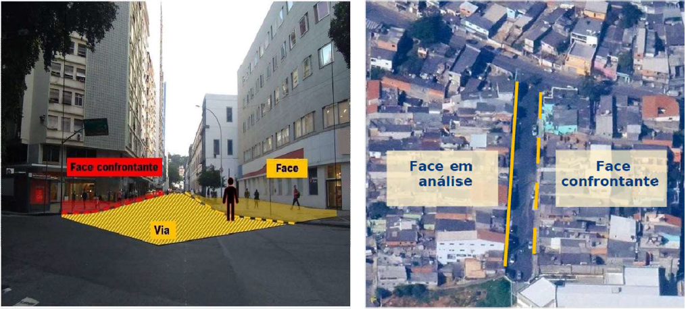
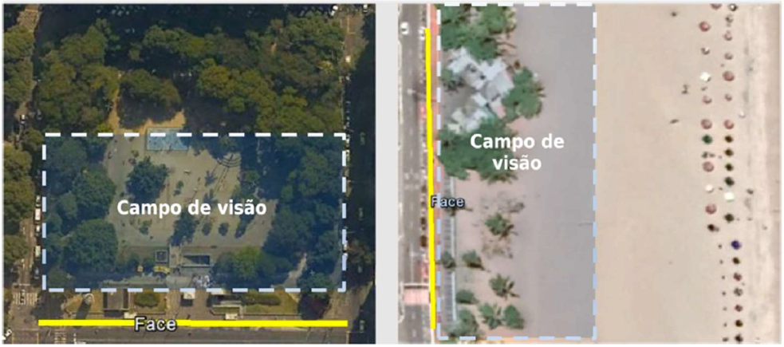
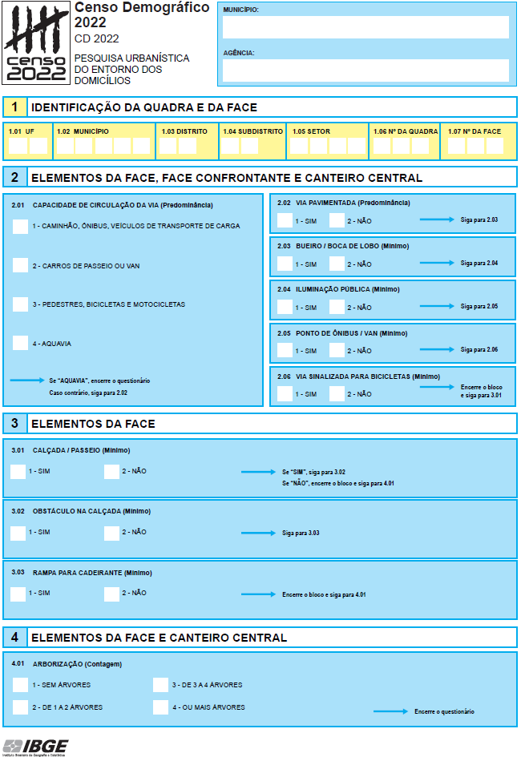

```{r}
#| label: setup
#| include: false
knitr::opts_chunk$set(cache = TRUE)
library(tidyverse)
library(censobr)
library(geobr)
library(sf)
library(patchwork)
```

## Introdução {#sec-entorno-intro}

Os quatro produtos do Censo apresentados até aqui têm algo em comum. Os Agregados por Setor Censitário, os Microdados da Amostra, a Grade Estatística e o CNEFE descrevem pessoas, domicílios e endereços, ou seja, aquilo que existe **dentro** do lote. A *Pesquisa Urbanística do Entorno dos Domicílios* faz o movimento inverso e descreve o que existe **fora** dele, na calçada, na via e no canteiro central. É o retrato do espaço público que cerca a moradia.

Essa inversão de foco vem acompanhada de uma mudança sutil de método. Enquanto todos os demais produtos nascem de uma resposta dada por um informante, as características do entorno nascem de **observação direta**, feita por um agente do IBGE que percorre a rua a pé e registra o que vê, sem entrevistar ninguém. Não há morador para dizer se a rua tem boca de lobo, mas sim um agente censitário olhando para a sarjeta e registrando "sim" ou "não" no questionário da pesquisa.

O interesse prático dessa informação é imediato para quem trabalha com o território. Saber quantos domicílios de um bairro estão em ruas sem calçada, sem rampa de acessibilidade, sem ponto de ônibus ou sem uma única árvore permite dimensionar carências de infraestrutura com a mesma granularidade com que se dimensiona população e renda. O próprio IBGE posiciona o produto como subsídio ao Estatuto da Cidade, à Agenda 2030 e à Nova Agenda Urbana, alinhando a estatística oficial às pautas de acessibilidade, drenagem pluvial, mobilidade ativa e enfrentamento das mudanças climáticas [@ibge_entorno2022]. <!-- São exatamente os temas que retomaremos na Parte 3 deste livro. -->  

### Histórico

A investigação do entorno começou no Censo 2000, mas o produto que usamos hoje só existe desde 2010, e mudou de forma substancial em 2022. Vale percorrer essa trajetória, porque cada etapa deixou marcas na estrutura dos dados que o leitor vai encontrar.

No **Censo 2000**, o levantamento contemplava apenas três itens, a identificação dos logradouros, a iluminação pública e o calçamento ou pavimentação. Nesta época, especialistas em habitação haviam concluído que os quesitos de material das paredes, do piso e da cobertura já não distinguiam sozinhos a qualidade da moradia, e que características do entorno a classificariam melhor. Decidiu-se então registrar os três itens nos instrumentos de listagem do setor via observação direta do recenseador, o que permitia estabelecer a correspondência entre cada domicílio e seu entorno e evitava o custo de acrescentar quesitos ao questionário [@ibge_metodologia2000]. A caracterização era feita de forma separada para o logradouro e para o setor censitário. Na Caderneta do Setor, ao encerrar seu trabalho, o recenseador indicava existência total, existência parcial ou inexistência de cada item. Na Folha de Coleta, usada para caracterizar o logradouro após percorrer a face ou o trecho, apenas o calçamento admitia a alternativa de existência parcial [@ibge_entorno2022; @ibge_metodologia2000]. Diferentemente dos censos de 2010 e 2022, esses resultados foram divulgados por meio dos microdados da amostra^[mais especificamente, na segunda edição dos microdados para o Censo de 2000].

No **Censo 2010**, o levantamento ganhou escopo e virou uma etapa estruturada da operação. Foram dez itens investigados durante a **pré-coleta**, operação de campo inédita que antecedeu o recenseamento e cuja finalidade principal era montar a lista de endereços de cada setor. Cerca de 22 mil agentes censitários supervisores percorreram 222.541 setores censitários urbanos, nas áreas urbanizadas dos 5.565 municípios então existentes [@ibge_entorno2010]. Como a coleta exigia percorrer faces de quadra, foram excluídos da pré-coleta os setores sem arruamento regular, o que deixou de fora tanto os setores rurais quanto os aglomerados subnormais sem quadras e faces identificáveis. Esses últimos foram caracterizados por um instrumento à parte, o Levantamento de Informações Territoriais (LIT), com metodologia própria e resultados que não podem ser confrontados com os do restante da cidade [@ibge_aglomerados2010].

No **Censo 2022**, a pesquisa manteve os dez itens, mas trocou quatro deles, migrou para questionário eletrônico e ampliou o universo para 340.965 setores. A mudança conceitualmente mais relevante foi a **unificação metodológica**. Favelas e comunidades urbanas passaram a ser pesquisadas com o mesmo instrumento aplicado ao resto da cidade, corrigindo justamente a lacuna que o LIT havia contornado em 2010 [@ibge_entorno2022]. Pela primeira vez, portanto, é possível comparar a infraestrutura de uma favela com a do bairro vizinho usando a mesma régua.

A @tbl-quesitos-censos resume quais itens foram investigados em cada edição, informação que costuma faltar aos quadros comparativos e que determina o que efetivamente dá para analisar. A marcação "só na amostra" indica os itens de 2000, que foram divulgados vinculados ao domicílio nos resultados amostrais e nunca agregados por setor.

```{r}
#| label: tbl-quesitos-censos
#| echo: false
#| tbl-cap: "Itens investigados pela Pesquisa Urbanística do Entorno dos Domicílios nos Censos de 2000, 2010 e 2022, e sua divulgação por setor censitário."

tibble::tribble(
  ~Quesito,                          ~`2000`, ~`2010`, ~`2022`,
  "Iluminação pública",              "X",     "X",     "X",
  "Identificação do logradouro",     "X",     "X",     "—",
  "Calçamento ou pavimentação",      "X",     "X",     "X",
  "Calçada ou passeio",              "—",     "X",     "X",
  "Rampa para cadeirante",           "—",     "X",     "X",
  "Bueiro ou boca de lobo",          "—",     "X",     "X",
  "Arborização",                     "—",     "X",     "X",
  "Meio-fio ou guia",                "—",     "X",     "—",
  "Lixo acumulado nos logradouros",  "—",     "X",     "—",
  "Esgoto a céu aberto",             "—",     "X",     "—",
  "Capacidade de circulação da via", "—",     "—",     "X",
  "Ponto de ônibus ou van",          "—",     "—",     "X",
  "Via sinalizada para bicicletas",  "—",     "—",     "X",
  "Obstáculo na calçada",            "—",     "—",     "X"
) |>
  knitr::kable(align = c("c", "c", "c", "c")) |>
  kableExtra::kable_styling(full_width = FALSE)
```

Duas leituras saltam do quadro. A primeira é que a continuidade temática é menor do que parece, já que apenas seis itens aparecem em 2010 e em 2022. A segunda é que 2022 deslocou o eixo do produto. Saíram os itens que descreviam **degradação** do espaço público, como lixo acumulado e esgoto a céu aberto, e entraram itens que descrevem **oferta de mobilidade e acessibilidade**, como capacidade da via, ponto de ônibus, ciclovia e obstáculo na calçada. Como veremos na @sec-entorno-variaveis, a semelhança de nomes entre os itens que sobreviveram esconde armadilhas de comparação, e há apenas dois casos em que o confronto direto entre 2010 e 2022 é legítimo.

As seções seguintes destrincham a metodologia da pesquisa, a estrutura das variáveis em cada censo e os níveis geográficos em que a informação é coletada e divulgada. Somente depois disso partiremos para a obtenção e a análise dos dados no R.

## Conceitos e metodologia {#sec-entorno-metodologia}

### A face de quadra como unidade de investigação {#sec-entorno-face}

Tudo na Pesquisa Urbanística gira em torno de uma unidade territorial que não aparece em nenhum outro capítulo deste livro como protagonista, a **face de quadra**. O IBGE a define como a linha que representa graficamente os alinhamentos das fachadas do parcelamento dos lotes distribuídos nas quadras. Em termos mais diretos, cada face é um dos lados de uma quadra, contenha ou não edificações [@ibge_entorno2022].

A face é a mesma âncora espacial que sustenta o CNEFE, visto na @sec-cnefe-intro. Lá, os campos `NUM_QUADRA` e `NUM_FACE` localizam cada endereço dentro do setor. Aqui, a face deixa de ser um atributo do endereço e passa a ser a própria unidade pesquisada. Cada questionário preenchido do entorno equivale a uma face percorrida.

Ao caminhar por uma face, o agente observa três elementos distintos, e é fundamental entender que **nem todos os itens usam a mesma área de observação**. Existem a face percorrida, a **face confrontante**, que é a face em frente, e o **canteiro central**, quando presente. A definição de face confrontante adotada em 2010 traz uma consequência que passa despercebida com facilidade, pois a face em frente é considerada independentemente de pertencer ao setor que está sendo trabalhado [@ibge_entorno2010]. Ou seja, para boa parte dos itens, o dado atribuído a um setor censitário incorpora observações feitas do outro lado da rua, que pode estar em outro setor. A @fig-face-quadra ilustra esses elementos.

```{r}
#| label: fig-face-quadra
#| echo: false
#| fig-cap: "Elementos observados na Pesquisa Urbanística do Entorno dos Domicílios. A face percorrida é a unidade de investigação, e a área observada varia conforme o item pesquisado."
#| fig-width: 7
#| fig-height: 4.2

# Faixas horizontais do esquema, de baixo para cima: quadra A, calçada,
# pista de rolamento, canteiro central, pista, calçada e quadra B
faixas <- tibble(
  ymin  = c(0.0, 2.2, 2.8, 4.1, 4.7, 6.0, 6.6),
  ymax  = c(2.2, 2.8, 4.1, 4.7, 6.0, 6.6, 8.8),
  cor   = c("grey90", "grey97", "grey82", "#cfe3c9", "grey82", "grey97", "grey90"),
  borda = c("grey55", "grey70", NA, "#7fae74", NA, "grey70", "grey55")
)

ggplot() +
  geom_rect(data = faixas,
            aes(xmin = 0, xmax = 12, ymin = ymin, ymax = ymax),
            fill = faixas$cor, colour = faixas$borda) +
  # rótulos das quadras
  annotate("text", x = 6, y = 1.1, label = "Quadra A",
           colour = "grey35", size = 3.6) +
  annotate("text", x = 6, y = 7.7, label = "Quadra B",
           colour = "grey35", size = 3.6) +
  annotate("text", x = 6, y = 4.4, label = "Canteiro central",
           colour = "#3f6b37", size = 3) +
  # as duas faces
  annotate("segment", x = 0.15, xend = 11.85, y = 2.2, yend = 2.2,
           colour = "#b2182b", linewidth = 1.7) +
  annotate("segment", x = 0.15, xend = 11.85, y = 6.6, yend = 6.6,
           colour = "#2166ac", linewidth = 1.7, linetype = "22") +
  annotate("text", x = 6, y = 3, label = "Face percorrida",
           colour = "#b2182b", size = 3.3, fontface = "bold") +
  annotate("text", x = 6, y = 5.85, label = "Face confrontante",
           colour = "#2166ac", size = 3.3, fontface = "bold") +
  # calçadas
  annotate("text", x = 9.15, y = 2.5, label = "calçada", size = 2.6, colour = "grey45") +
  annotate("text", x = 9.15, y = 6.3, label = "calçada", size = 2.6, colour = "grey45") +
  # sentido do percurso do agente, sobre a calçada da face percorrida
  annotate("text", x = 1.1, y = 2.5, label = "percurso do agente",
           size = 2.6, colour = "grey30") +
  annotate("segment", x = 2.5, xend = 3.5, y = 2.5, yend = 2.5,
           arrow = arrow(length = unit(0.16, "cm"), type = "closed"),
           colour = "grey30", linewidth = 0.5) +
  coord_equal(xlim = c(0, 12), ylim = c(0, 8.8), expand = FALSE) +
  theme_void()
```

Em campo, o agente precisa reconhecer os mesmos elementos em tecidos urbanos muito diferentes entre si, e a @fig-face-real mostra dois extremos desse espectro. À esquerda, a perspectiva de quem percorre uma via de traçado regular, com a face em amarelo, a face confrontante em vermelho e a via entre as duas. À direita, a leitura aérea de uma área densamente ocupada, em que as faces existem e podem ser delimitadas, ainda que os lotes e as edificações não sigam um parcelamento regular.

{#fig-face-real}

A definição de face não exige a presença de edificações, e é aí que aparece uma situação que o leitor precisa ter em mente ao interpretar os dados. Quando a face percorrida ou a confrontante corresponde ao limite de um espaço não edificado, como um parque, uma praça ou a orla de uma praia, não há fachadas para servir de alinhamento. Nesses casos, o IBGE orientou que fossem considerados os itens avistados pelo agente enquanto percorria o caminho adjacente ao espaço observado, de modo que a área de análise passa a ser a calçada somada ao **campo de visão** do agente [@ibge_entorno2022]. A @fig-face-nao-edificada ilustra as duas situações.

{#fig-face-nao-edificada}

Duas implicações decorrem disso. A primeira é que faces sem nenhum domicílio entram normalmente na contagem de faces do setor, o que ajuda a explicar por que os percentuais calculados sobre faces e sobre domicílios divergem, ponto que retomaremos na parte prática. A segunda é que, nesses trechos, o registro depende de um julgamento visual do agente sobre o que está ao alcance da vista, e não de um limite físico bem definido.

### O universo da pesquisa {#sec-entorno-universo}

A Pesquisa Urbanística não cobre o país inteiro, e entender quem fica de fora é pré-requisito para interpretar qualquer percentual calculado a partir dela. Em 2010, o critério era a existência de arruamento regular. Setores rurais e setores urbanos sem quadras e faces identificáveis ficaram fora da pré-coleta [@ibge_entorno2010]. Em 2022, o critério passou a ser a **morfologia urbana observada**, e não a classificação legal do setor. Além dos setores classificados como urbanos na Base Territorial, entraram setores com áreas urbanizadas mapeadas e setores que apresentassem concentração de estruturas, edificações e equipamentos urbanos ou sistema viário consolidado, independentemente de serem urbanos ou rurais. A identificação desses casos adicionais foi feita por análise de imagens de satélite de alta resolução [@ibge_entorno2022]. Nos setores rurais com pequenos núcleos de morfologia urbana ou situados em franja periurbana, a pesquisa alcançou apenas a porção urbanizada, onde havia faces definidas.

O resultado é uma cobertura alta dentro do universo escolhido e parcial em relação ao país. Em 2022, dos 202.083.020 moradores de domicílios particulares permanentes enumerados pelo Censo, 174.162.485 residiam em setores selecionados para a pesquisa, o equivalente a 86,2%. Dentro desses setores, a coleta alcançou 99,7% dos domicílios particulares permanentes ocupados, com variação entre 99,5% no Rio de Janeiro e em Rondônia e 100,0% no Amapá [@ibge_entorno2022]. Em 2010, a pesquisa alcançou 96,9% dos domicílios particulares permanentes **urbanos** do país, com variação regional entre 94,7% no Nordeste e 99,7% no Centro-Oeste [@ibge_entorno2010].

::: {.callout-warning}
## Os percentuais do entorno não são percentuais do Brasil

Quando este capítulo disser que determinado percentual de domicílios está em faces com calçada, o denominador serão sempre os domicílios **do universo da pesquisa** (ou seja, o total que teve suas características do entorno investigadas), e não todos os domicílios do município, do estado ou do país. Essa ressalva vale para 2010 e para 2022, com recortes de universo diferentes em cada ano.
:::

### O questionário e o momento da coleta {#sec-entorno-questionario}

Como visto na @sec-produtos_censo, a Pesquisa Urbanística corresponde à etapa de reconhecimento do setor censitário, anterior à coleta domiciliar. Antes de tratar de quem executou essa etapa e quando, vale conhecer o próprio instrumento, reproduzido na @fig-questionario.

{#fig-questionario width=88%}

O questionário cabe em uma única página e está organizado em quatro blocos. O bloco 1 apenas identifica a quadra e a face dentro do setor censitário. Os três seguintes agrupam os itens pelo **elemento que precisa ser observado** (face, canteiro central ou face confrontante) para respondê-los. Repare ainda em dois detalhes que o questionário revela de imediato. Ao lado de cada item aparece, entre parênteses, o critério que rege o registro, com as indicações de *Predominância*, *Mínimo* e *Contagem*. Já as setas azuis à direita explicitam o encadeamento das perguntas, incluindo as instruções de encerrar o questionário ou pular um bloco inteiro.

Quanto ao calendário da coleta, há consequências analíticas que convém registrar. Em 2010, a operação de pré-coleta começou em 12 de abril para os municípios com mais de 1.500 endereços residenciais urbanos e em 7 de maio para os demais, estendendo-se até junho. Uma parte residual do levantamento foi realizada já durante a coleta do Censo, iniciada em agosto de 2010, em setores com características mistas de regularidade e irregularidade urbanas [@ibge_entorno2010]. Em 2022, a coleta se deu prioritariamente na etapa de Reconhecimento do Setor Censitário, entre 20 de junho e 31 de julho, complementada por duas frentes. Durante as entrevistas domiciliares, os recenseadores puderam ajustar as informações registradas pelos agentes supervisores e indicar a inclusão de novas faces. Já a etapa conhecida como **Entorno pós-coleta** atendeu setores em que a pesquisa não pôde ser feita antes por razões logísticas, além das localidades de povos e comunidades tradicionais em áreas urbanas, onde se garantiu que o primeiro contato do IBGE com as lideranças fosse a reunião de abordagem do recenseador [@ibge_entorno2022].

Daí decorre uma característica que merece atenção. As informações do entorno têm como referência a **data efetiva da observação em campo**, enquanto os questionários domiciliares têm como referência a meia-noite de 31 de julho para 1º de agosto. Entorno e domicílio de um mesmo setor, portanto, não são estritamente contemporâneos. Em 2022, embora a maior parte da coleta se concentre em pouco mais de um mês (20 de junho a 31 de julho de 2022), o período a que se referem as informações do entorno estende-se de 20 de junho de 2022 a 28 de maio de 2023 [@ibge_entorno2022]. Em 2010 a defasagem também alcançava alguns meses, já que a pré-coleta antecedeu em cerca de um trimestre a data de referência do censo.

Três situações de campo fogem do padrão e explicam feições que o leitor encontrará nos dados. A primeira ocorre em favelas e comunidades urbanas muito adensadas, onde a ocorrência de faces era inexistente ou rarefeita. Nesses casos, a coleta se deu por captura de coordenadas geográficas, com um questionário aplicado a cada quinze edificações visíveis ao longo do percurso. A segunda é a inclusão de faces novas por rastreio^[*tracking*] georreferenciado, quando o mapa não correspondia ao encontrado em campo. A terceira é o Distrito Federal, cuja estrutura de quadras exigiu duas metodologias específicas, denominadas Blocos Superquadras e Faces-quadras, além das faces tradicionais, que seguem o padrão nacional [@ibge_entorno2022].

#### Critérios de análise e área de observação {#sec-entorno-criterios}

Chegamos ao ponto que mais afeta a interpretação dos resultados. Os dez itens de 2022 não foram registrados da mesma maneira. Cada um combina um **critério de análise**, que define o que basta para considerar o item existente, com um **local de investigação**, que define até onde vai o olhar do agente. Os três critérios são os seguintes.

- **Mínimo**, quando basta observar a existência do item em qualquer ponto da área analisada. Foi o critério de sete dos dez itens.
- **Contagem**, quando foi preciso quantificar o elemento observado. Aplicou-se apenas à arborização, registrada em quatro classes.
- **Predominância**, quando a característica precisava ser preponderante, ou seja, estar presente em mais de 50% do trecho. Aplicou-se à capacidade de circulação da via e à pavimentação.

A @tbl-criterios cruza esses critérios com a área observada em cada item.

```{r}
#| label: tbl-criterios
#| echo: false
#| tbl-cap: "Critério de análise e local de investigação de cada item da Pesquisa Urbanística do Entorno dos Domicílios no Censo 2022."

tibble::tribble(
  ~Quesito,                          ~Critério,                        ~`Local de investigação`,
  "Capacidade de circulação da via", "Predominância (mais de 50%)",    "Face, face confrontante e canteiro central",
  "Pavimentação da via",             "Predominância (mais de 50%)",    "Face, face confrontante e canteiro central",
  "Bueiro ou boca de lobo",          "Mínimo",                         "Face, face confrontante e canteiro central",
  "Iluminação pública",              "Mínimo",                         "Face, face confrontante e canteiro central",
  "Ponto de ônibus ou van",          "Mínimo",                         "Face, face confrontante e canteiro central",
  "Via sinalizada para bicicletas",  "Mínimo",                         "Face, face confrontante e canteiro central",
  "Calçada ou passeio",              "Mínimo",                         "Somente a face percorrida",
  "Obstáculo na calçada",            "Mínimo",                         "Somente a face percorrida",
  "Rampa para cadeirante",           "Mínimo",                         "Somente a face percorrida",
  "Arborização",                     "Contagem (0, 1 a 2, 3 a 4, 5+)", "Face percorrida e canteiro central"
) |>
  knitr::kable(align = c("l", "l", "l")) |>
  kableExtra::kable_styling(full_width = FALSE)
```

São três as consequências principais. Primeiro, os itens ligados à calçada olham **apenas para a face percorrida**, enquanto os itens ligados à via olham para os dois lados. Um percentual de calçadas e um percentual de iluminação, ainda que apresentados lado a lado, não descrevem a mesma extensão de espaço público. Segundo, a arborização é o único item que considera a face e o canteiro central sem considerar a face confrontante, escolha que, como veremos adiante, inviabiliza a comparação com 2010. Por fim, a pesquisa investiga **existência, não estado de conservação, funcionamento ou eficácia** [@ibge_entorno2022]. Um poste sem lâmpada conta como iluminação pública existente. Um bueiro entupido conta como bueiro existente. Os dados descrevem a presença do equipamento urbano, e não a sua qualidade.

#### O fluxo do questionário e seus saltos {#sec-entorno-fluxo}

O questionário de 2022 possui uma lógica condicional que faz com que certos itens deixem de ser aplicados em determinadas faces, e essa lógica é a origem de uma categoria de resposta que confunde muitos usuários dos dados. Há dois saltos, ambos visíveis nas instruções impressas na @fig-questionario. O primeiro ocorre quando a capacidade de circulação da via é registrada como **aquavia**, situação em que o rio ou canal constitui a própria face e é a forma de acesso direto às edificações. O formulário instrui a encerrar o questionário ali mesmo, e nenhum outro item é preenchido. O segundo, muito mais frequente, ocorre quando **não há calçada** na face. Como obstáculo e rampa são características da calçada, não faz sentido investigá-los onde ela não existe, e o item 3.01 manda seguir direto para o bloco de arborização. A @fig-fluxo-questionario resume esse encadeamento.

::: {#fig-fluxo-questionario}

```{mermaid}
%%| fig-width: 6.5
flowchart TD
    A["<b>2.01</b> Capacidade de circulação da via"] --> B{"Aquavia?"}
    B -- Sim --> Z(["Encerra o questionário"])
    B -- Não --> C["<b>2.02 a 2.06</b><br/>Pavimentação, bueiro, iluminação,<br/>ponto de ônibus e ciclovia"]
    C --> D["<b>3.01</b> Calçada ou passeio"]
    D --> E{"Existe calçada?"}
    E -- Não --> G["<b>4.01</b> Arborização"]
    E -- Sim --> F["<b>3.02</b> Obstáculo na calçada<br/><b>3.03</b> Rampa para cadeirante"]
    F --> G
    G --> H(["Encerra o questionário"])
```

Fluxo do questionário da Pesquisa Urbanística do Entorno dos Domicílios no Censo 2022, com os dois pontos de salto. Elaborado a partir do questionário reproduzido na @fig-questionario.
:::

Guarde este fluxograma, pois quando chegarmos aos dados, veremos que as faces que sofreram "salto" não desaparecem das tabelas. Elas são contabilizadas em categorias específicas de não resposta, e confundi-las com falhas de coleta produz percentuais errados.

### As variáveis e sua disponibilização {#sec-entorno-variaveis}

É importante salientar que as tabelas de 2010 e de 2022 **não diferem apenas nos itens investigados**. Elas têm arquiteturas incompatíveis, e quem tentar transportar o raciocínio de um ano para o outro vai errar. Vejamos cada uma.

#### Variáveis do Censo 2022 {#sec-entorno-var2022}

A tabela de 2022 organiza a informação em três blocos que medem os mesmos dez itens em **unidades de contagem diferentes**. O primeiro conta faces de quadra, ou seja, o dado como foi coletado. O segundo conta domicílios particulares permanentes ocupados situados naquelas faces. O terceiro conta os moradores desses domicílios. A @tbl-blocos-2022 resume a estrutura, já usando os nomes que o pacote `censobr` atribui às colunas.

```{r}
#| label: tbl-blocos-2022
#| echo: false
#| tbl-cap: "Blocos de variáveis do arquivo Entorno do Censo 2022 e suas respectivas variáveis de total."

tibble::tribble(
  ~Bloco,             ~`Prefixo no censobr`, ~`Variável de total`,  ~`Unidade contada`,
  "Faces de quadra",  "faces_V054xx",        "faces_V05400",        "Faces com questionário aplicado",
  "Domicílios",       "domicilios_V050xx",   "domicilios_V05000",   "Domicílios particulares permanentes ocupados com entorno pesquisado",
  "Moradores",        "moradores_V052xx",    "moradores_V05200",    "Moradores desses domicílios"
) |>
  knitr::kable(align = c("c", "c", "c", "c")) |>
  kableExtra::kable_styling(full_width = FALSE)
```

Os três blocos têm 35 variáveis cada e seguem exatamente o mesmo *layout*, com os itens na mesma ordem e na mesma posição relativa à variável de total. A existência de bueiro, por exemplo, ocupa o nono deslocamento nos três blocos, em `faces_V05409`, `domicilios_V05009` e `moradores_V05209`^[Essa regularidade é uma boa notícia para quem programa, porque permite escrever uma única rotina que atende aos três blocos.].

Dentro de cada bloco, os itens aparecem decompostos em categorias. Oito deles trazem a tríade **Sim**, **Não** e **Não Declarado**. Os dois restantes trazem classes múltiplas, pois a arborização é registrada em quatro faixas de contagem e a capacidade de circulação da via em quatro tipos de veículo, e ambos contam ainda com uma categoria reservada aos casos em que o item não chegou a ser perguntado. A propriedade que torna o cálculo simples é que, em todo item, **as categorias somam a variável de total do bloco**. O denominador de um percentual, portanto, é sempre a variável de total, e não uma soma que o analista precise montar.

Por outro lado, essa simplicidade é compensada pela existência da categoria "Não Declarado", que carrega dois significados distintos. Na maioria dos itens ela reúne um resíduo pequeno de inconsistências e não validações. Nos itens de obstáculo na calçada e rampa para cadeirante, ela absorve também as faces que sofreram o "salto" do questionário, ou seja, aquelas em que não existe calçada. O que parece uma não resposta é, na verdade, um "não se aplica". Voltaremos a esse ponto com números na parte prática, porque ele muda o resultado de forma perceptível.

#### Variáveis do Censo 2010 {#sec-entorno-var2010}

A organização dos dados de 2010 segue uma outra lógica. São 1.161 variáveis distribuídas em cinco arquivos, de `Entorno01` a `Entorno05`, e três diferenças estruturais a separam de 2022. A primeira é que **não existe contagem de faces**. Embora a coleta tenha sido feita por face, o produto divulgado conta apenas domicílios e moradores. Não há como saber, em 2010, qual proporção das faces de um setor tinha calçada. A segunda é que **não existe a categoria "Não Declarado"**, já que cada item aparece apenas como "Existe" ou "Não existe".

A terceira é a mais complexa para quem abre o arquivo pela primeira vez. Em 2010, os itens do entorno **nunca aparecem sozinhos**. Eles vêm sempre cruzados com um atributo do domicílio ou do morador. Não há uma variável que informe quantos domicílios estão em faces com iluminação pública. Há variáveis que informam quantos domicílios *próprios* estão em faces com iluminação, quantos *alugados*, quantos *com responsável do sexo feminino*, quantos *de renda per capita até um quarto de salário mínimo*, e assim por diante. O arquivo é, na prática, uma coleção de tabulações cruzadas [@ibge_base2010].

Essa organização em blocos gera uma complexidade prática, pois como não há uma variável de total de domicílios com entorno pesquisado, o denominador precisa ser reconstruído somando um bloco inteiro. E **nem todos os blocos são exaustivos**. Os blocos de condição de ocupação, de abastecimento de água e de existência de banheiro e esgotamento sanitário deixam categorias de fora, de modo que somá-los produz um total menor que o correto. Já os blocos de sexo do responsável, adequação da moradia, renda per capita, grupos de idade e cor ou raça cobrem todos os domicílios ou moradores pesquisados. A escolha do bloco de referência é, portanto, uma decisão metodológica importante. Trataremos disso com código na parte prática.

A @tbl-estrutura confronta estruturalmente os resultados do Entorno para ambos os censos e sintetiza o que muda de um censo para o outro.

```{r}
#| label: tbl-estrutura
#| echo: false
#| tbl-cap: "Diferenças estruturais entre os arquivos de entorno dos Censos de 2010 e 2022."

tibble::tribble(
  ~Aspecto,                       ~`Censo 2010`,                                          ~`Censo 2022`,
  "Contagem de faces",            "Ausente",                                              "Presente, em bloco próprio",
  "Unidades de contagem",         "Domicílios e moradores",                               "Faces, domicílios e moradores",
  "Categorias de resposta",       "Existe e Não existe",                                  "Sim, Não e Não Declarado",
  "Total de pesquisados",         "Não divulgado, precisa ser reconstruído",              "Variável explícita em cada bloco",
  "Forma de apresentação",        "Sempre cruzado com atributo do domicílio ou morador",  "Item isolado",
  "Número de variáveis",          "1.161, em cinco arquivos",                             "105, em um arquivo",
  "Itens com classes múltiplas",  "Nenhum",                                               "Arborização e capacidade da via"
) |>
  knitr::kable(align = c("c", "c", "c")) |>
  kableExtra::kable_styling(full_width = FALSE)
```

Para entender o que é possível ou não comparar, vale mencionar que seis itens aparecem nos dois censos, o que sugere uma série histórica confortável. No entanto, a realidade é bem mais restrita, já que o próprio IBGE alerta que apenas **dois** itens admitem comparação direta, e a @tbl-comparabilidade explica o motivo caso a caso.

```{r}
#| label: tbl-comparabilidade
#| echo: false
#| tbl-cap: "Comparabilidade dos itens investigados nos Censos de 2010 e 2022. Elaborado a partir da Tabela 2 de @ibge_entorno2022."

tibble::tribble(
  ~Quesito,                 ~`Comparável?`,   ~`Motivo`,
  "Iluminação pública",     "Sim",            "Mesmo conceito e mesmo critério de coleta nos dois censos",
  "Bueiro ou boca de lobo", "Sim",            "Mesmo conceito e mesmo critério de coleta nos dois censos",
  "Rampa para cadeirante",  "Com ressalva",   "Em 2010 foi investigada em todas as faces e em 2022 apenas nas faces com calçada",
  "Calçada ou passeio",     "Não",            "Em 2010 exigia caminho calçado ou pavimentado e em 2022 aceita calçada sem pavimentação",
  "Pavimentação da via",    "Não",            "Em 2010 bastava qualquer trecho pavimentado e em 2022 exige-se predominância",
  "Arborização",            "Não",            "Em 2010 considerava a face confrontante e em 2022 considera apenas a face e o canteiro central"
) |>
  knitr::kable(align = c("c", "c", "c")) |>
  kableExtra::kable_styling(full_width = FALSE)
```

Note que as três incomparabilidades apontam em direções previsíveis. A mudança no conceito de calçada tende a **inflar** o resultado de 2022, porque o conceito ficou mais abrangente. As mudanças em pavimentação e arborização tendem a **reduzi-lo**, porque o critério ficou mais exigente em um caso e a área observada diminuiu no outro. Uma queda aparente na arborização entre 2010 e 2022 pode ser inteiramente artefato metodológico.

::: {.callout-warning}
## O universo também mudou, e isso independe dos itens

Mesmo nos dois itens comparáveis, a comparação exige cautela adicional. O número de setores pesquisados passou de 223.666 em 2010 para 340.965 em 2022^[Esse total de 2010 é o que consta na Tabela 3 de @ibge_entorno2022. A publicação original de 2010 informa 222.541 setores [@ibge_entorno2010], diferença de pouco mais de mil setores que provavelmente decorre de revisões posteriores da base territorial. A ordem de grandeza da comparação não se altera.], crescimento de mais de 50% que decorre da expansão das cidades e, principalmente, da decisão de incluir áreas urbanizadas de setores rurais e setores de favelas e comunidades urbanas [@ibge_entorno2022]. Como essas áreas incorporadas tendem a apresentar infraestrutura mais precária, um percentual nacional que fique estável entre os dois censos pode estar escondendo uma melhora real, e uma piora aparente pode refletir apenas o alargamento do universo. Comparações por recortes territoriais estáveis são sempre preferíveis às comparações de médias nacionais.
:::

### Níveis geográficos de coleta e de divulgação {#sec-entorno-niveis}

Neste ponto, é importante esclarecer um aspecto bastante relevante sobre o produto: **a coleta ocorre na face, mas a divulgação é feita no nível do setor censitário**. Isso quer dizer que a face de quadra é a unidade de investigação, mas não é unidade de divulgação. Não existe, no conjunto de dados públicos, uma tabela que informe as características urbanísticas de uma face específica. O que se publica é a **contagem de faces por categoria dentro de cada setor censitário**, que passa a ser a maior resolução espacial disponível. Essa diferença tem uma implicação analítica que convém fixar desde já, pois o valor de um setor é uma síntese de faces que podem ser bastante heterogêneas entre si.

A partir do setor censitário, a informação pode ser agregada para os recortes já discutidos na @sec-recortes, na sequência bairro, subdistrito, distrito e município, e daí para concentração urbana, unidade da federação, grande região e Brasil. A publicação de 2022 apresenta resultados até o nível de município e de concentração urbana, além de uma leitura segundo a hierarquia urbana definida em Regiões de Influência das Cidades [@ibge_entorno2022].

Há três caminhos de acesso aos dados, com alcances distintos:

- **Agregados por Setor Censitário:** É o único caminho que chega ao setor e, por ser o mais desagregado espacialmente, é o que usaremos neste livro. Em 2022 as variáveis do entorno foram incorporadas ao conjunto dos Agregados. Em 2010 elas vinham em cinco planilhas por unidade da federação, de `Entorno01_UF` a `Entorno05_UF`, dentro do mesmo pacote. Nos dois casos, o acesso se dá pela função `read_tracts()` do pacote `censobr` [@censobr].
- **SIDRA:** Oferece tabelas prontas até o nível de município e de concentração urbana, incluindo os indicadores de cobertura da pesquisa. É a via mais rápida para consultas pontuais, sem a flexibilidade da manipulação programática.
- **Plataforma Geográfica Interativa (PGI):** Disponibiliza arquivos vetoriais e temas relacionados para *download*, voltada a quem trabalha diretamente em ambiente de geoprocessamento.

Com o terreno conceitual preparado, podemos partir para os dados. Na próxima seção obteremos os arquivos de entorno dos dois censos com o `censobr`, montaremos os indicadores respeitando os denominadores corretos de cada ano e levaremos os resultados ao mapa.

## Obtendo e integrando os dados {#sec-entorno-dados}

Usaremos **Fortaleza** como pano de fundo do restante do capítulo. O ponto de partida é a leitura dos arquivos de entorno dos dois censos com a função `read_tracts()`, já apresentada no @sec-obtendo. O argumento `dataset` recebe o valor `"Entorno"`, e o retorno é um *Dataset* do Arrow, e não um `data.frame`. Isso importa porque o arquivo de 2022 tem quase 345 mil linhas e o de 2010 tem 310 mil, com mais de mil colunas no caso de 2010. Filtrar antes de materializar evita carregar o país inteiro na memória.

```{r}
#| label: entorno-leitura
#| cache: true
#| message: false
# Código IBGE de Fortaleza (CE)
cod_for <- 2304400

# Os objetos abaixo ainda não são data.frames, e sim Datasets do Arrow
ent2010 <- read_tracts(year = 2010, dataset = "Entorno")
ent2022 <- read_tracts(year = 2022, dataset = "Entorno")

# O filtro é aplicado antes do collect(), que só então traz os dados à memória
ent_for2010 <- ent2010 |>
  filter(code_muni == cod_for) |>
  collect()

ent_for2022 <- ent2022 |>
  filter(code_muni == cod_for) |>
  collect()
```

::: {.callout-note}
## Por que não existe `read_tracts(year = 2000, dataset = "Entorno")`

Como registrado na @tbl-quesitos-censos, o Censo 2000 investigou três itens do entorno, mas os divulgou vinculados ao domicílio nos resultados da amostra, e não nos Agregados por Setor Censitário. Por isso o `censobr` não oferece o conjunto `Entorno` para aquele ano, e a chamada retorna erro. A série por setor começa em 2010.
:::

Antes de qualquer cálculo, o dicionário precisa estar aberto ao lado. Já se sabe dos capítulos anteriores que a função `data_dictionary()` cuida disso. Lembre-se que para 2010 ela abre um PDF, e nele podemos verificar que as seções 6.22 a 6.26 descrevem os cinco arquivos de entorno. Já para 2022, a função abre uma pasta de trabalho `.xlsx`, cuja última aba, chamada `Entorno`, traz as variáveis que nos interessam.

```{r}
#| label: entorno-dicionario
#| eval: false
data_dictionary(year = 2010, dataset = "tracts")  # abre um PDF
data_dictionary(year = 2022, dataset = "tracts")  # abre um .xlsx, ver aba "Entorno"
```

Recorde-se também que até a versão do `censobr` trabalhada no nosso texto (v0.6.0), os arquivos não vêm com uma coluna de geometria. Deste modo, precisamos obter os polígonos dos setores no `geobr`, com `read_census_tract()`. O argumento `code_tract` aceita o código do município para devolver todos os seus setores. Usamos `simplified = FALSE` para preservar o traçado original.

```{r}
#| label: entorno-geo
#| cache: true
#| message: false
geo_for2010 <- read_census_tract(year = 2010, code_tract = cod_for,
                                 simplified = FALSE)
geo_for2022 <- read_census_tract(year = 2022, code_tract = cod_for,
                                 simplified = FALSE)
```

### Nem todo setor tem dado de entorno {#sec-entorno-join}

Aqui aparece a primeira consequência prática da @sec-entorno-universo. O `geobr` devolve **todos** os setores do município, enquanto o arquivo de entorno traz apenas os que entraram no universo da pesquisa. Um `left_join()` entre os dois produz valores ausentes, e é muito melhor contá-los de forma deliberada do que descobri-los depois como buracos inexplicados no mapa.

```{r}
#| label: tbl-entorno-cobertura
#| tbl-cap: "Setores censitários de Fortaleza disponíveis na malha do `geobr` e no arquivo de entorno do `censobr`, nos dois censos."
tibble(
  Censo = c(2010, 2022),
  `Setores na malha` = c(nrow(geo_for2010), nrow(geo_for2022)),
  `Setores no Entorno` = c(nrow(ent_for2010), nrow(ent_for2022)),
  `Sem correspondência` = c(
    sum(!geo_for2010$code_tract %in% ent_for2010$code_tract),
    sum(!geo_for2022$code_tract %in% ent_for2022$code_tract)
  )
) |>
  knitr::kable(align = c("c", "c", "c", "c"),
               format.args = list(big.mark = ".", decimal.mark = ",")) |>
  kableExtra::kable_styling(full_width = FALSE)
```

Os 23 setores de 2010 e os 27 de 2022 que ficam sem par são setores que não foram selecionados para a pesquisa, **não consistindo em falha de dado**. Eles aparecerão nos mapas com a cor reservada a valores ausentes. Repare também que a malha de Fortaleza cresceu de 3.043 para 4.408 setores entre os dois censos, informação que será decisiva na @sec-entorno-comparacao.

Em 2022 existe ainda um segundo tipo de ausência, mais sutil, que não vem do `join` e sim do próprio arquivo. Abaixo, contabilizamos a quantidade de setores que possuem `NA` na variável de total de domicílios investigados com relação ao entorno:

```{r}
#| label: entorno-na-domicilios
sum(is.na(ent_for2022$domicilios_V05000))
```

São 111 setores com faces pesquisadas mas sem total de domicílios, tipicamente setores sem uso residencial, como grandes áreas de parque, equipamentos e concentrações de comércio. A consequência direta é que **um indicador calculado sobre faces existe nesses setores, enquanto o mesmo indicador calculado sobre domicílios não existe.** Somando os 27 setores não pareados aos 111 sem domicílios, um mapa por domicílios terá 138 setores em branco, contra apenas 27 de um mapa por faces.

## A escolha do denominador {#sec-entorno-denominador}

A @sec-entorno-var2022 estabeleceu a regra de cálculo de 2022, ou seja, as categorias de todo item somam a variável de total do bloco, de modo que o denominador é sempre essa variável. O que a regra não resolve é a pergunta anterior a ela, que é decidir **qual bloco usar**. Vamos medir os mesmos itens nas duas unidades e comparar.

```{r}
#| label: tbl-entorno-unidades
#| tbl-cap: "Os mesmos itens do entorno medidos sobre faces de quadra e sobre domicílios, Fortaleza (Censo 2022)."

# Função auxiliar para calcular percentuais com segurança. Se a variável de
# total (o denominador) for 0 ou ausente, ela é substituída por NA_real_, e a
# divisão 100 * numerador / total devolve NA em vez de Inf ou NaN. Aqui, com
# totais municipais, isso nunca acontece, mas será decisivo nos cálculos por
# setor logo adiante, onde há os 111 setores sem domicílios investigados.
perc <- function(numerador, total) {
  total <- ifelse(is.na(total) | total == 0, NA_real_, total)
  100 * numerador / total
}

# Totais municipais de cada variável dos três blocos
# Obs.: mais explicações sobre as funções novas que aparecem abaixo na nota mais adiante.
tot_for2022 <- ent_for2022 |>
  summarize(across(starts_with(c("faces_", "domicilios_")),
                   \(x) sum(x, na.rm = TRUE)))

tibble(
  Item = c("Via pavimentada", "Iluminação pública",
           "Bueiro ou boca de lobo", "Calçada ou passeio",
           "Ponto de ônibus ou van", "Via sinalizada para bicicletas",
           "Rampa para cadeirante", "Sem árvores"),
  face = c("faces_V05406", "faces_V05412",
           "faces_V05409", "faces_V05421",
           "faces_V05415", "faces_V05418",
           "faces_V05427", "faces_V05430"),
  domicilio = c("domicilios_V05006", "domicilios_V05012",
                "domicilios_V05009", "domicilios_V05021",
                "domicilios_V05015", "domicilios_V05018",
                "domicilios_V05027", "domicilios_V05030")
) |>
  mutate(
    `% das faces`      = perc(as.numeric(tot_for2022[face]),
                              tot_for2022$faces_V05400),
    `% dos domicílios` = perc(as.numeric(tot_for2022[domicilio]),
                              tot_for2022$domicilios_V05000),
    face = NULL, domicilio = NULL
  ) |>
  knitr::kable(digits = 1, align = c("l", "c", "c"),
               format.args = list(decimal.mark = ",")) |>
  kableExtra::kable_styling(full_width = FALSE)
```

::: {.callout-note}
## Três novidades de sintaxe no código acima

- **`across()`** aplica a mesma operação a várias colunas de uma só vez, dentro de um `summarize()` ou de um `mutate()`. Sem ela, seria preciso escrever uma linha de `sum()` para cada uma das 70 variáveis dos blocos de faces e de domicílios.
- **`starts_with()`** é uma das funções de seleção auxiliar do `tidyselect`, que escolhe colunas por padrão no nome. Aqui ela captura de uma vez todas as colunas iniciadas por `faces_` e por `domicilios_`. Existem outras da mesma família, como `ends_with()`, `contains()` e `all_of()`, esta última usada mais adiante neste capítulo.
- **`\(x) sum(x, na.rm = TRUE)`** é a forma abreviada de escrever uma função anônima em R, equivalente a `function(x) sum(x, na.rm = TRUE)`. Ela é útil quando precisamos passar como argumento uma função que não existe pronta, no caso a soma que ignora valores ausentes.
:::

A tabela revela um padrão sistemático, pois em quase todos os itens o percentual medido sobre domicílios é **maior** que o medido sobre faces, e a diferença chega a quase dez pontos no caso da calçada. Isso ocorre pois as faces mais bem servidas de infraestrutura concentram mais moradias, enquanto as faces mal servidas tendem a ser trechos de baixa densidade, terrenos vazios ou vias de borda. Ao contar domicílios, damos peso maior justamente às faces onde mais gente vive^[O item de sinalização cicloviária é a única exceção, com 7,9% das faces contra 7,2% dos domicílios. Isso ocorre provavelmente porque a sinalização para bicicletas se concentra em vias arteriais e orlas, onde há proporcionalmente menos residências]. A regra prática que decorre disso pode ser resumida assim: faces medem **oferta de infraestrutura no território** e domicílios medem **população atendida por ela**. Nenhuma das duas é mais correta, mas responder à pergunta errada com a unidade errada é um erro comum, e a escolha precisa ser declarada explicitamente em qualquer análise.

### Quando "Não Declarado" significa "não se aplica" {#sec-entorno-nd}

A @sec-entorno-fluxo antecipou que os saltos do questionário não fazem as faces sumirem das tabelas. Chegou o momento de verificar isso nos dados. Vamos comparar o tamanho da categoria "Não Declarado" em um item comum e nos dois itens que dependem da existência de calçada.

```{r}
#| label: entorno-nao-declarado
ent_for2022 |>
  summarize(
    total          = sum(domicilios_V05000, na.rm = TRUE),
    com_calcada    = sum(domicilios_V05021, na.rm = TRUE),
    nd_bueiro      = sum(domicilios_V05011, na.rm = TRUE),
    nd_obstaculo   = sum(domicilios_V05026, na.rm = TRUE),
    nd_rampa       = sum(domicilios_V05029, na.rm = TRUE)
  ) |>
  mutate(sem_calcada = total - com_calcada) |>
  glimpse()
```

Veja como o contraste é significativo. No item de bueiro, o "Não Declarado" reúne somente 794 domicílios, representando 0,1% do total, indicando inconsistências de coleta. Nos itens de obstáculo e de rampa, ele reúne 94.526 domicílios, justamente a diferença entre o total de domicílios e os que estão em faces com calçada. Trata-se de domicílios para os quais a pergunta não fazia sentido (pois foi saltada) e não informação perdida.

Daí decorrem duas taxas legítimas e bem diferentes para a rampa de acessibilidade em Fortaleza.

```{r}
#| label: entorno-rampa-duas-taxas
ent_for2022 |>
  summarize(
    rampa_sobre_total       = perc(sum(domicilios_V05027, na.rm = TRUE),
                                   sum(domicilios_V05000, na.rm = TRUE)),
    rampa_sobre_com_calcada = perc(sum(domicilios_V05027, na.rm = TRUE),
                                   sum(domicilios_V05021, na.rm = TRUE))
  ) |>
  round(1)
```

A primeira, de 12,2%, é a que o IBGE publica e responde à pergunta "que parcela da população mora em rua com rampa?". A segunda, de 13,8%, responde a "onde há calçada, com que frequência ela é acessível?". Um relatório de acessibilidade urbana pode precisar das duas, mas apresentar uma no lugar da outra distorce o diagnóstico. Novamente, o essencial é declarar qual está sendo usada.

## Mapeando os indicadores de 2022 {#sec-entorno-mapas2022}

Com os denominadores resolvidos, o caminho até o mapa é curto. Basta calcular o indicador no objeto tabular, uni-lo à geometria e passar a variável ao `fill`. Começamos pelo percentual de faces com calçada, medido sobre faces por se tratar de uma pergunta sobre oferta de infraestrutura no território.

```{r}
#| label: fig-for-calcada
#| fig-cap: "Percentual de faces de quadra com calçada ou passeio, por setor censitário, Fortaleza (Censo 2022). Setores em cinza não integram o universo da pesquisa."
#| fig-height: 4.6
#| message: false
geo_for2022 |>
  left_join(
    ent_for2022 |>
      transmute(code_tract, perc_calcada = perc(faces_V05421, faces_V05400)),
    by = "code_tract"
  ) |>
  ggplot() +
  geom_sf(aes(fill = perc_calcada), color = NA) +
  scale_fill_distiller(palette = "YlGnBu", direction = 1,
                       name = "% das faces",
                       na.value = "gray90", limits = c(0, 100)) +
  coord_sf(expand = FALSE) +
  theme_minimal() +
  theme(axis.text = element_blank(),
        axis.ticks = element_blank(),
        panel.grid = element_blank())
```

::: {.callout-note}
Lembre-se de que o `transmute()`, visto no Capítulo 3, é um `mutate()` que preserva apenas as variáveis calculadas ou mencionadas. Aqui isso é conveniente, pois o objeto `ent_for2022` tem 134 colunas e queremos levar para o `left_join()` somente o `code_tract`, necessário para a união, e o indicador recém-calculado. Usar `mutate()` no lugar funcionaria, mas arrastaria as outras 133 colunas para dentro do objeto espacial sem qualquer utilidade.
:::

O mapa mostra uma cidade majoritariamente calçada com bolsões bem definidos de carência. A mediana municipal é de 91,7% das faces por setor e 53,4% dos setores têm 90% ou mais de suas faces calçadas, mas 554 setores, ou 12,6% do total, ficam abaixo da metade. Observe como obter esses resultados com o código abaixo:

```{r}
#| label: entorno-calcada-resumo
ent_for2022 |>
  transmute(perc_calcada = perc(faces_V05421, faces_V05400)) |>
  summarize(
    mediana           = median(perc_calcada),
    perc_acima_90     = 100 * sum(perc_calcada >= 90) / n(),
    setores_abaixo_50 = sum(perc_calcada < 50),
    perc_abaixo_50    = 100 * sum(perc_calcada < 50) / n()
  )
```


Vale insistir na leitura correta de um valor intermediário, retomando a @sec-entorno-niveis. Um setor com 60% de faces calçadas não é um setor com calçadas de má qualidade, e sim um setor em que quatro de cada dez trechos de rua não têm por onde caminhar.

O mapa sugere um padrão espacial, e a agregação por bairro permite nomeá-lo. O arquivo de entorno já traz a coluna `name_neighborhood`, ao lado de todo o encadeamento de recortes discutido na @sec-recortes, de modo que basta agrupar por ela. Um cuidado é decisivo nesse passo: o percentual do bairro **não é a média dos percentuais de seus setores**, e sim a razão entre a soma das faces com calçada e a soma de todas as faces do bairro. Setores têm quantidades muito diferentes de faces, e tratar todos com o mesmo peso distorce o resultado^[Em Manuel Dias Branco, por exemplo, a média simples dos setores dá 51,0%, contra 38,5% do cálculo correto]. A @tbl-for-calcada-bairros traz os cinco bairros de cada extremo.

```{r}
#| label: tbl-for-calcada-bairros
#| tbl-cap: "Bairros de Fortaleza com maior e com menor percentual de faces de quadra com calçada ou passeio (Censo 2022)."

## Sumarizando os resultados por bairro (name_neighborhood):
calcada_bairro <- ent_for2022 |>
  group_by(name_neighborhood) |>
  summarize(setores = n(),
            perc_calcada = perc(sum(faces_V05421, na.rm = TRUE),
                                sum(faces_V05400, na.rm = TRUE)))

# O código abaixo seleciona os 5 melhores e piores bairros com relação à percentual
# de calçadas (mais detalhes sobre as funções na nota abaixo):
bind_rows(
  calcada_bairro |>
    slice_max(perc_calcada, n = 5),
  calcada_bairro |>
    slice_min(perc_calcada, n = 5)
) |>
  arrange(desc(perc_calcada)) |>
  knitr::kable(col.names = c("Bairro", "Setores", "% das faces c/ calçada"),
               digits = 1, align = c("c", "c", "c"),
               format.args = list(decimal.mark = ",")) |>
  kableExtra::kable_styling(full_width = FALSE)
```

::: {.callout-note}
## Extraindo os extremos de uma tabela

- **`slice_max()`** e **`slice_min()`** retornam as `n` linhas com os maiores e os menores valores da coluna indicada, já ordenadas. Elas dispensam a dupla `arrange()` mais `head()` e, ao contrário dela, tratam empates de forma explícita pelo argumento `with_ties`, que por padrão devolve todas as linhas empatadas na última posição.
- **`bind_rows()`** empilha tabelas, casando as colunas pelo nome. É a operação usada aqui para reunir os dois extremos em um único quadro, e não deve ser confundida com os `joins` da @sec-entorno-dados, que unem tabelas lado a lado por uma chave.
:::

Os extremos superiores reúnem bairros com praticamente toda a sua extensão calçada, com Varjota em 99,0%, Parque Santa Rosa em 98,0% e Dionísio Torres em 97,8%. Os três últimos colocados se concentram na frente de expansão a leste e sudeste, com Sabiaguaba em 19,1%, Manuel Dias Branco em 38,5% e Praia do Futuro II em 42,6%. É essa faixa leste que aparece em tons claros na ponta direita do mapa.

O segundo mapa muda de unidade e de sentido. Ele mostra o percentual de domicílios em faces sem nenhuma árvore, medido sobre domicílios por ser uma pergunta sobre exposição da população, e aqui valores altos são ruins, o que justifica uma paleta em tons quentes.

```{r}
#| label: fig-for-arvores
#| fig-cap: "Percentual de domicílios em faces de quadra sem nenhuma árvore, por setor censitário, Fortaleza (Censo 2022). Valores altos indicam pior situação."
#| fig-height: 4.6
#| message: false
geo_for2022 |>
  left_join(
    ent_for2022 |>
      transmute(code_tract,
                perc_sem_arvore = perc(domicilios_V05030, domicilios_V05000)),
    by = "code_tract"
  ) |>
  ggplot() +
  geom_sf(aes(fill = perc_sem_arvore), color = NA) +
  scale_fill_distiller(palette = "OrRd", direction = 1,
                       name = "% dos\ndomicílios",
                       na.value = "gray90", limits = c(0, 100)) +
  coord_sf(expand = FALSE) +
  theme_minimal() +
  theme(axis.text = element_blank(),
        axis.ticks = element_blank(),
        panel.grid = element_blank())
```

Compare a quantidade de cinza nos dois mapas. O primeiro tem 27 setores sem valor e o segundo tem 138, exatamente a diferença antecipada na @sec-entorno-join. Trocar o denominador de faces para domicílios não muda apenas a escala do indicador, mas também a **cobertura** do mapa.

## Recuperando os dados de 2010 {#sec-entorno-r2010}

Passamos agora ao censo anterior, e o primeiro obstáculo aparece antes de qualquer cálculo. Enquanto em 2022 os nomes de coluna já indicam o bloco, em 2010 eles não dizem absolutamente nada.

```{r}
#| label: entorno-nomes-2010
names(ent_for2010)[c(30, 100, 500, 900)]
```

A @sec-entorno-var2010 descreveu a lógica que organiza essas 1.161 variáveis. Vamos agora convertê-la em código. A regra é que, dentro de cada bloco, os dez itens aparecem sempre na mesma ordem, e cada um ocupa `2 × número de categorias` colunas consecutivas. Adotaremos o bloco de **sexo do responsável**, do arquivo `Entorno02`, por duas razões. Ele é exaustivo, portanto serve de denominador, e é o mais econômico, com apenas duas categorias e quatro colunas por item.

Esse bloco começa em `V382`, e dentro de cada item a ordem é masculino-Existe, masculino-Não existe, feminino-Existe, feminino-Não existe. Em vez de digitar quarenta nomes de coluna, construímos o dicionário por aritmética.

```{r}
#| label: entorno-dic2010
quesitos_2010 <- c(
  "Identificação do logradouro", "Iluminação pública", "Pavimentação",
  "Calçada", "Meio-fio ou guia", "Bueiro ou boca de lobo",
  "Rampa para cadeirante", "Arborização", "Esgoto a céu aberto",
  "Lixo acumulado nos logradouros"
)

dic_2010 <- tibble(
  quesito = quesitos_2010,
  inicio  = 382 + 4 * (seq_along(quesitos_2010) - 1)
) |>
  mutate(
    masc_existe = sprintf("entorno02_V%03d", inicio),
    masc_nao    = sprintf("entorno02_V%03d", inicio + 1),
    fem_existe  = sprintf("entorno02_V%03d", inicio + 2),
    fem_nao     = sprintf("entorno02_V%03d", inicio + 3),
    inicio      = NULL
  )

dic_2010
```

::: {.callout-note}
## `seq_along()` e `sprintf()` para montar nomes de coluna

A função **`seq_along()`** recebe um vetor e devolve a sequência das posições que ele ocupa, ou seja, `1, 2, ..., n`. Aqui `seq_along(quesitos_2010)` devolve os números de 1 a 10, um para cada item da pesquisa. A conta `382 + 4 * (seq_along(quesitos_2010) - 1)` transforma essas posições nos códigos de início de cada item. A subtração de 1 faz o primeiro item começar no próprio 382, e a multiplicação por 4 avança de quatro em quatro colunas, produzindo 382, 386, 390 e assim por diante até 418.

Poderíamos ter escrito `1:10` no lugar, mas `seq_along()` é preferível por duas razões. A sequência se ajusta sozinha caso o vetor de quesitos mude de tamanho, e ela nunca produz uma contagem invertida, problema clássico de `1:length(x)` quando o vetor está vazio, situação em que essa expressão devolve `1 0` em vez de sequência nenhuma.

A função **`sprintf()`**, por sua vez, monta textos a partir de um molde com marcadores de posição, estando disponível em praticamente toda linguagem de programação. O molde `"entorno02_V%03d"` tem duas partes. O trecho literal `entorno02_V` é copiado como está, e o marcador `%03d` é substituído pelo número passado adiante, formatado como inteiro (`d`) com três dígitos (`3`) e preenchido com zeros à esquerda (`0`).

É esse preenchimento que interessa aqui. O código 382 vira `V382` naturalmente, mas o número 9 precisaria virar `V009`, e não `V9`, para casar com os nomes reais das colunas. Escrever `paste0("entorno02_V", inicio)` produziria `entorno02_V9` e a coluna não seria encontrada. Como `sprintf()` é vetorizada, os dez códigos são gerados de uma vez.
:::

Antes de prosseguir, teste o mapa de códigos construído. Se o bloco é realmente exaustivo e a ordem dos itens está correta, a soma das quatro colunas tem de dar **exatamente o mesmo total** nos dez itens, porque todas elas repartem o mesmo conjunto de domicílios. Se algum total destoar, o mapeamento está errado.

```{r}
#| label: tbl-entorno-2010
#| tbl-cap: "Características do entorno dos domicílios em Fortaleza no Censo 2010, reconstruídas a partir do bloco de sexo do responsável do arquivo Entorno02."
# Para cada um dos dez itens, soma ao longo de todos os setores de Fortaleza os
# domicílios das duas colunas de "Existe", masculino e feminino, e acrescenta as
# duas de "Não existe" para chegar ao total de domicílios investigados
resumo_2010 <- dic_2010 |>
  rowwise() |>
  mutate(
    existe = sum(ent_for2010[[masc_existe]], ent_for2010[[fem_existe]],
                 na.rm = TRUE),
    total  = existe + sum(ent_for2010[[masc_nao]], ent_for2010[[fem_nao]],
                          na.rm = TRUE)
  ) |>
  ungroup()

resumo_2010

# Um único valor de total significa que o mapeamento está consistente
n_distinct(resumo_2010$total)

resumo_2010 |>
  transmute(Quesito = quesito,
            `Domicílios` = total,
            `% com o item` = perc(existe, total)) |>
  knitr::kable(digits = 1, align = c("l", "c", "c"),
               format.args = list(big.mark = ".", decimal.mark = ",")) |>
  kableExtra::kable_styling(full_width = FALSE)
```

::: {.callout-note}
## `rowwise()`, `ungroup()` e `n_distinct()`

- **`rowwise()`** faz o `dplyr` processar a tabela **uma linha por vez**, em vez de operar sobre colunas inteiras como de costume. Precisamos disso porque cada linha de `dic_2010` guarda nomes de coluna diferentes, e a expressão `ent_for2010[[masc_existe]]` precisa ser avaliada com o valor daquela linha específica. Sem `rowwise()`, o R tentaria usar os dez nomes de uma vez e devolveria erro.
- **`ungroup()`**, visto no Capítulo 3, desfaz esse comportamento e devolve a tabela ao processamento normal. Vale encerrar sempre um `rowwise()` ou um `group_by()` com ele, pois o agrupamento fica pendurado no objeto e afeta em silêncio as operações seguintes.
- **`n_distinct()`** conta quantos valores diferentes existem em um vetor, e é a forma curta de escrever `length(unique(x))`. Aqui ela é o teste em si, já que o resultado 1 significa que os dez itens compartilham o mesmo total.

Vale registrar que o `rowwise()` é conveniente para tabelas pequenas como esta, com dez linhas, e não é a ferramenta indicada para grandes volumes, porque processar linha a linha é bem mais lento que a operação vetorizada padrão do R.
:::

O teste passa, com um único total de 684.389 domicílios nos dez itens. Esse hábito de validar mapeamentos deduzidos vale muito além deste capítulo, e é o que separa uma leitura confiável de um palpite bem-intencionado.

Os resultados de 2010 já antecipam o que veremos adiante. A iluminação pública alcançava 97,9% dos domicílios, praticamente saturada, enquanto o bueiro chegava a apenas 16,5%. Note ainda que aparecem aqui os quatro itens que não sobreviveram a 2022, e o esgoto a céu aberto, presente no entorno de 19,3% dos domicílios de Fortaleza em 2010, é um retrato que o Censo 2022 simplesmente não permite refazer.

Um último detalhe a ser discutido é a **armadilha do denominador zero** para 2010. Em 2022, o denominador podia estar ausente, mas nunca era zero. Em 2010, o arquivo inclui setores com domicílios registrados na variável `entorno01_V001` cujas faces não foram pesquisadas, e neles a soma do bloco dá zero.

```{r}
#| label: entorno-zeros-2010
# Nomes das quatro colunas de um item qualquer do bloco, aqui o da iluminação
# pública, já que os dez itens repartem o mesmo total de domicílios
cols_total <- dic_2010 |>
  filter(quesito == "Iluminação pública") |>
  select(masc_existe, masc_nao, fem_existe, fem_nao) |>
  unlist(use.names = FALSE)   # converte a linha da tabela em um vetor de texto

cols_total

# Enquanto até aqui somamos colunas inteiras, obtendo totais municipais, o
# rowSums() soma as quatro colunas dentro de cada linha, produzindo o
# denominador setor a setor, que é onde o zero pode aparecer
ent_for2010 <- ent_for2010 |>
  mutate(total_entorno = rowSums(across(all_of(cols_total)), na.rm = TRUE))

# Diagnóstico do problema, contando os setores com denominador zero e medindo
# quanto dos domicílios do arquivo o entorno de fato cobre
tibble(
  setores                = nrow(ent_for2010),
  denominador_zero       = sum(ent_for2010$total_entorno == 0),
  domicilios_no_arquivo  = sum(ent_for2010$entorno01_V001, na.rm = TRUE),
  domicilios_pesquisados = sum(ent_for2010$total_entorno)
)
```

::: {.callout-note}
## `unlist()` e `rowSums()`

- **`unlist()`** achata uma estrutura aninhada em um vetor simples. Aqui ela é necessária porque o `select()` devolve uma tabela de uma linha e quatro colunas, enquanto o `all_of()` da linha seguinte espera um vetor de textos com os nomes das colunas. O argumento `use.names = FALSE` descarta os nomes das colunas de origem, que só atrapalhariam.
- **`rowSums()`** soma valores **ao longo da linha**, devolvendo um resultado por linha da tabela. É a operação complementar ao `sum()` usado até aqui, que reduz tudo a um único número. Vem do R base e por isso não entende nomes de coluna soltos, o que explica o `across(all_of(...))` em volta, cuja função é traduzir os nomes em um bloco de colunas.

:::

São 119 setores com denominador igual a zero, e a diferença entre os 709.680 domicílios do arquivo e os 684.389 com entorno pesquisado corresponde a 96,4% de cobertura, coerente com os 96,9% que o IBGE reporta para o conjunto do país [@ibge_entorno2010]. Uma divisão ingênua nesses 119 setores devolveria `NaN`, que o `ggplot2` pinta com a cor de ausente sem emitir aviso algum. O erro passaria despercebido. É justamente para isso que serve a função `perc()` definida na @sec-entorno-denominador, que converte o denominador zero em ausente antes de dividir, tornando a ausência explícita em vez de acidental.

## Comparando 2010 e 2022 {#sec-entorno-comparacao}

Para finalizar, iremos comparar alguns resultados entre os Censos de 2010 e 2022. Antes de sobrepor qualquer resultado, três cuidados precisam ser levados em consideração. O primeiro vem da @tbl-comparabilidade, ou seja, apenas **iluminação pública** e **bueiro** mantiveram conceito e critério nos dois censos. Calçada, pavimentação e arborização mudaram e não devem ser confrontadas.

O segundo decorre da @sec-entorno-var2010, pois 2010 não tem contagem de faces. A comparação tem de ser feita **por domicílios** nos dois anos. Confrontar o percentual de faces de 2022 com o percentual de domicílios de 2010 seria um erro grosseiro, e a @tbl-entorno-unidades mostra que a distância entre as duas unidades chega a dez pontos percentuais, mais que suficiente para inventar uma tendência inexistente.

O terceiro é de natureza geográfica. A malha de Fortaleza passou de 3.043 para 4.408 setores, de modo que os setores de 2010 e de 2022 **não são as mesmas unidades**. Isso inviabiliza um mapa de diferença por setor, recurso que no @sec-ge-maceio foi possível justamente porque as células da Grade Estatística permanecem estáveis entre as edições. Aqui o caminho é apresentar dois mapas independentes lado a lado.

Começamos pelo retrato municipal dos dois itens comparáveis. Lembre-se que não existe tabela pronta com os dois censos lado a lado, então montamos o quadro manualmente, com uma linha por item comparável e uma coluna por ano. Note que em 2010, o numerador exige somar as colunas masculina e feminina de "Existe", sobre o `total_entorno` calculado no bloco anterior, enquanto em 2022 uma única coluna já traz os domicílios com o item, sobre a variável de total do próprio bloco:

```{r}
#| label: tbl-entorno-comparacao
#| tbl-cap: "Percentual de domicílios com entorno pesquisado segundo os dois itens comparáveis entre os Censos de 2010 e 2022, Fortaleza."

# Preparação do quadro comparativo entre 2010 e 2022 para Fortaleza:
tibble(
  Item = c("Iluminação pública", "Bueiro ou boca de lobo"),
  `2010` = c(
    perc(sum(ent_for2010$entorno02_V386, na.rm = TRUE) + 
           sum(ent_for2010$entorno02_V388, na.rm = TRUE),
         sum(ent_for2010$total_entorno, na.rm = TRUE)),
    perc(sum(ent_for2010$entorno02_V402, na.rm = TRUE) +
           sum(ent_for2010$entorno02_V404, na.rm = TRUE),
         sum(ent_for2010$total_entorno, na.rm = TRUE))
  ),
  `2022` = c(
    perc(sum(ent_for2022$domicilios_V05012, na.rm = TRUE),
         sum(ent_for2022$domicilios_V05000, na.rm = TRUE)),
    perc(sum(ent_for2022$domicilios_V05009, na.rm = TRUE), 
         sum(ent_for2022$domicilios_V05000, na.rm = TRUE))
  )
) |>
  mutate(`Variação (p.p.)` = `2022` - `2010`) |>
  knitr::kable(digits = 1, align = c("c", "c", "c", "c"),
               format.args = list(decimal.mark = ",")) |>
  kableExtra::kable_styling(full_width = FALSE)
```

Os dois itens que sobrevivem à comparação contam histórias opostas, e é essa oposição que torna o par interessante. A iluminação pública sobe apenas 1,1 ponto porque já estava perto do teto em 2010, sem para onde crescer. O bueiro dobra em doze anos, com um ganho de 16,6 pontos, e ainda assim os 33,1% de 2022 permanecem bem abaixo dos 55,0% da média nacional. O avanço é real e o passivo continua grande.

Para levar isso ao mapa, calculamos os dois indicadores em cada ano e já os unimos à geometria correspondente.

```{r}
#| label: entorno-ind-comparacao
#| message: false
mapa2010 <- geo_for2010 |>
  left_join(
    ent_for2010 |>
      transmute(
        code_tract,
        ilum   = perc(entorno02_V386 + entorno02_V388, total_entorno),
        bueiro = perc(entorno02_V402 + entorno02_V404, total_entorno)
      ),
    by = "code_tract"
  )

mapa2022 <- geo_for2022 |>
  left_join(
    ent_for2022 |>
      transmute(
        code_tract,
        ilum   = perc(domicilios_V05012, domicilios_V05000),
        bueiro = perc(domicilios_V05009, domicilios_V05000)
      ),
    by = "code_tract"
  )
```

Cada figura será composta por dois gráficos independentes, um para cada ano, unidos lado a lado pelo operador `|` do pacote `patchwork` para visualizar múltiplos gráficos/mapas^[para entender melhor, consulte a página do pacote e explore as opções: https://patchwork.data-imaginist.com/]. Há um cuidado que não pode ser negligenciado, pois os dois painéis precisam compartilhar **exatamente os mesmos limites de escala**. Se cada mapa ajustar a paleta ao próprio intervalo de valores, o mapa de 2010 ficará tão colorido quanto o de 2022 e a evolução desaparecerá da imagem. Por isso fixamos `limits = c(0, 100)` nos dois. Com `plot_layout(guides = "collect")`, recolhemos as duas legendas idênticas em uma só.

O primeiro par mostra a drenagem urbana, o item em que Fortaleza mais avançou.

```{r}
#| label: fig-for-comp-bueiro
#| fig-cap: "Percentual de domicílios em faces com bueiro ou boca de lobo, por setor censitário, Fortaleza. Escala de cor idêntica nos dois anos."
#| fig-width: 8
#| fig-height: 3.8
#| message: false

library(patchwork)

bueiro2010 <- ggplot(mapa2010) +
  geom_sf(aes(fill = bueiro), color = NA) +
  scale_fill_distiller(palette = "PuBu", direction = 1,
                       name = "% dos\ndomicílios",
                       na.value = "gray90", limits = c(0, 100)) +
  labs(subtitle = "Censo 2010") +
  coord_sf(expand = FALSE) +
  theme_void()

bueiro2022 <- ggplot(mapa2022) +
  geom_sf(aes(fill = bueiro), color = NA) +
  scale_fill_distiller(palette = "PuBu", direction = 1,
                       name = "% dos\ndomicílios",
                       na.value = "gray90", limits = c(0, 100)) +
  labs(subtitle = "Censo 2022") +
  coord_sf(expand = FALSE) +
  theme_void()

(bueiro2010 | bueiro2022) + plot_layout(guides = "collect")
```

::: {.callout-warning}
## Importância dos parênteses em torno do `|` no `patchwork`

Em R, o operador `+` tem precedência maior que o `|`. Sem os parênteses, a expressão `bueiro2010 | bueiro2022 + plot_layout(guides = "collect")` seria lida como `bueiro2010 | (bueiro2022 + plot_layout(...))`, ou seja, o ajuste de leiaute se aplicaria **apenas ao segundo gráfico**. O resultado não dá erro, os mapas aparecem lado a lado normalmente, mas as duas legendas continuam duplicadas. É um descuido fácil de cometer e difícil de perceber, já que a única pista é a legenda que não foi recolhida.
:::

O escurecimento geral entre os dois painéis é visível sem esforço, e o mapa acrescenta a natureza intraurbana dos dados censitários que a tabela sumarizada para todo o município não podia mostrar. O ganho de 16,6 pontos da média municipal não corresponde a uma frente territorial coerente, e sim a saltos localizados espalhados por certas regiões da cidade. Agregando por bairro, os dois maiores saltos ocorrem em De Lourdes, que passa de 16,0% para 96,4% dos domicílios, e no Conjunto Ceará II, no vetor oeste, que vai de 9,7% para 86,9%, mas ganhos expressivos aparecem igualmente na orla nordeste, no miolo e nos bairros do sul. Uma média municipal que sobe pode, portanto, esconder tanto avanços muito concentrados quanto áreas estagnadas, e é essa heterogeneidade que justifica descer ao setor censitário em vez de parar no agregado.

O segundo par mostra o contraste, ou seja, um item que praticamente não tinha para onde avançar:

```{r}
#| label: fig-for-comp-ilum
#| fig-cap: "Percentual de domicílios em faces com iluminação pública, por setor censitário, Fortaleza. Escala de cor idêntica nos dois anos."
#| fig-width: 8
#| fig-height: 3.8
#| message: false
ilum2010 <- ggplot(mapa2010) +
  geom_sf(aes(fill = ilum), color = NA) +
  scale_fill_distiller(palette = "YlOrBr", direction = 1,
                       name = "% dos\ndomicílios",
                       na.value = "gray90", limits = c(0, 100)) +
  labs(subtitle = "Censo 2010") +
  coord_sf(expand = FALSE) +
  theme_void()

ilum2022 <- ggplot(mapa2022) +
  geom_sf(aes(fill = ilum), color = NA) +
  scale_fill_distiller(palette = "YlOrBr", direction = 1,
                       name = "% dos\ndomicílios",
                       na.value = "gray90", limits = c(0, 100)) +
  labs(subtitle = "Censo 2022") +
  coord_sf(expand = FALSE) +
  theme_void()

(ilum2010 | ilum2022) + plot_layout(guides = "collect")
```

Os dois painéis são quase indistinguíveis, e essa ausência de mudança é a informação, já que um item universalizado produz um mapa sem gradiente. Isso costuma ser sinal de que a política pública correspondente cumpriu seu objetivo e o indicador perdeu poder discriminante.

Resta a ressalva final, que é independente dos itens escolhidos. Fortaleza passou de 3.020 para 4.381 setores pesquisados entre os dois censos, e a expansão recaiu sobre áreas que antes ficavam fora do universo da pesquisa. Parte da variação observada reflete esse alargamento. O efeito é verificável nos próprios dados, pois entre os 93 bairros de Fortaleza presentes nos dois censos, cinco registram **queda** no percentual de domicílios com bueiro, o que é contraintuitivo para um item de infraestrutura permanente medido por critério mínimo. Os dois maiores recuos ocorrem em bairros cujo universo pesquisado se expandiu bastante, com o Dendê triplicando o número de domicílios pesquisados e o Benfica quase dobrando. Não se trata de bueiros que desapareceram, e sim de áreas antes não pesquisadas que passaram a compor o denominador. Quando o objetivo for medir evolução com rigor, o caminho mais seguro é examinar a variação do universo antes de interpretar a variação do indicador.

## Exercícios {#sec-entorno-exercicios}

1. Fortaleza tem 1.321 dos seus 4.381 setores pesquisados classificados como Favela e Comunidade Urbana, identificáveis pela variável `code_type` igual a 1. Calcule, por faces, os percentuais de pavimentação, calçada, rampa e arborização nesses setores e nos demais, e compare os resultados. Em seguida, explique por que essa mesma comparação não poderia ser feita com os dados de 2010, retomando o que foi discutido na @sec-entorno-intro sobre o Levantamento de Informações Territoriais.

2. Calcule a taxa de rampa para cadeirante nas duas versões apresentadas na @sec-entorno-nd, sobre o total de domicílios e condicionada à existência de calçada, para os cinco maiores municípios de sua unidade da federação. Discuta qual das duas você apresentaria em um relatório de acessibilidade urbana e por quê.

3. Use o dicionário construído na @sec-entorno-r2010 para mapear, por setor censitário, o percentual de domicílios com esgoto a céu aberto no entorno em Fortaleza em 2010. Esse item não existe no Censo 2022, o que impede qualquer comparação temporal, mas não impede a análise do retrato de 2010. Compare o padrão espacial obtido com o do bueiro no mesmo ano e comente a relação entre os dois.
