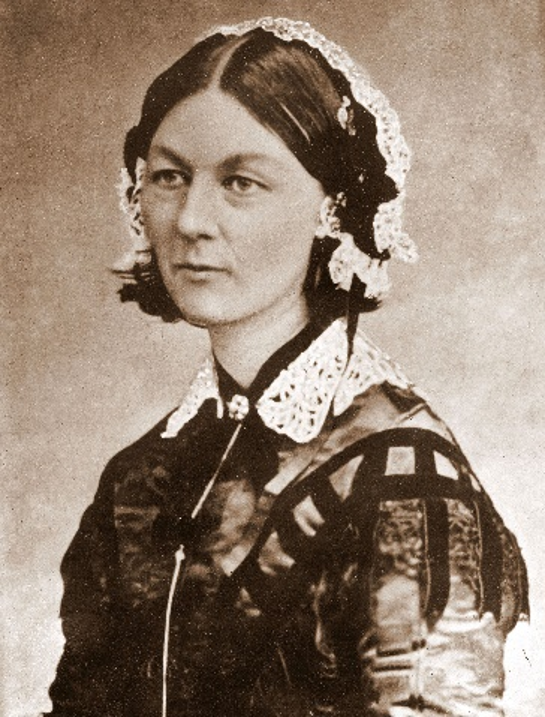
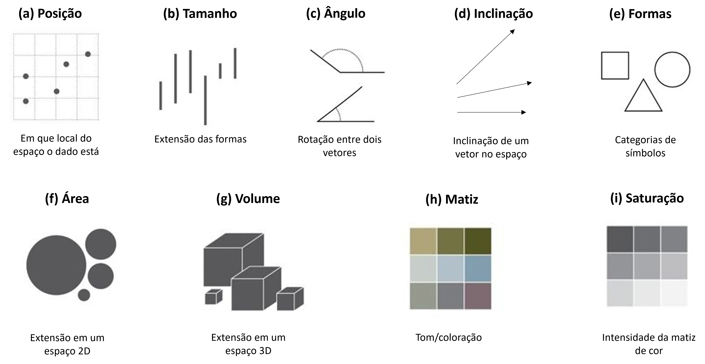
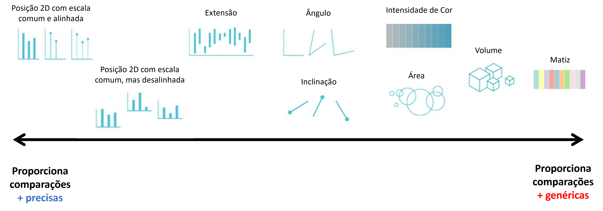
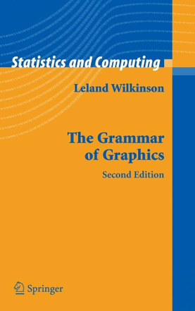
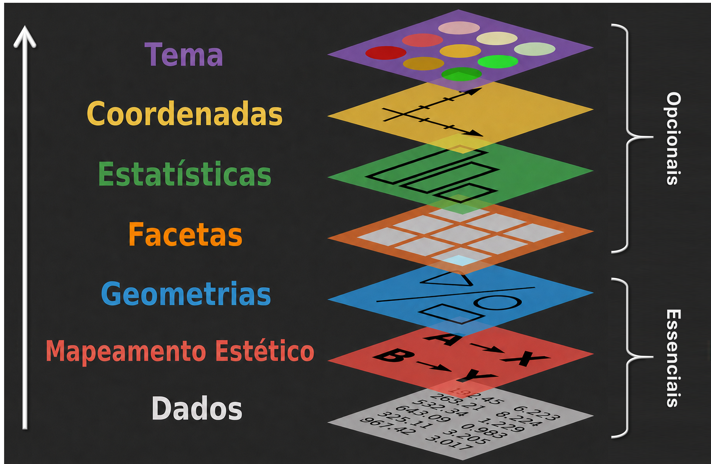
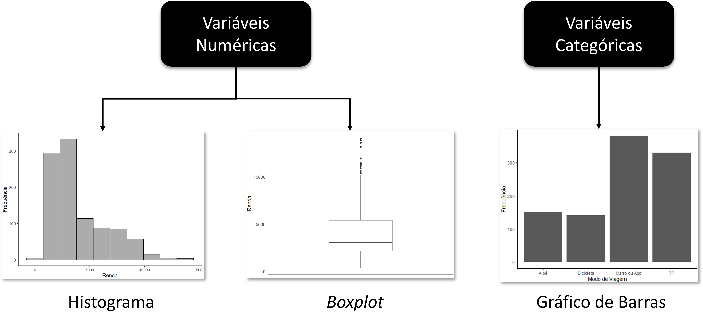
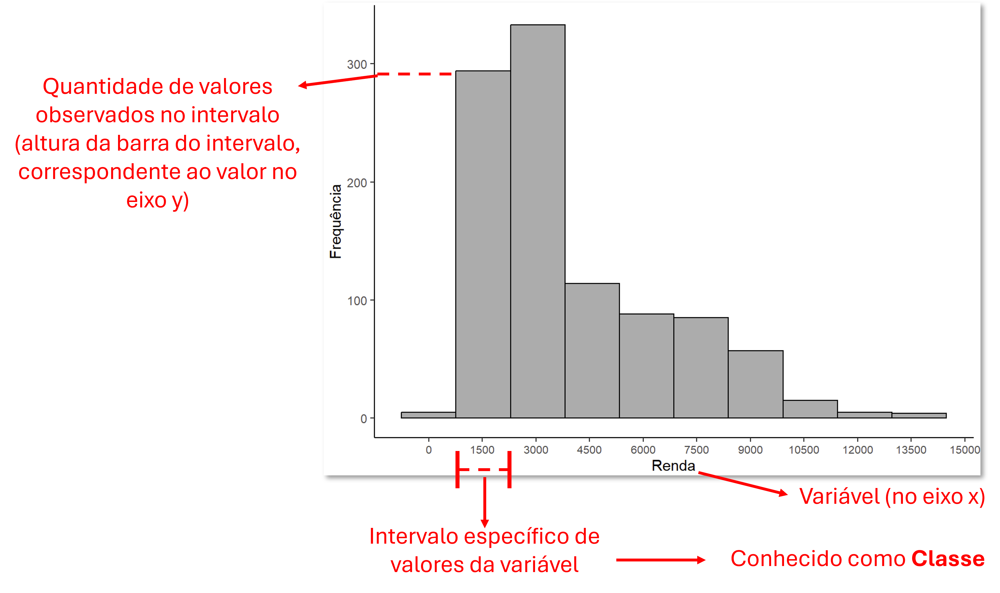
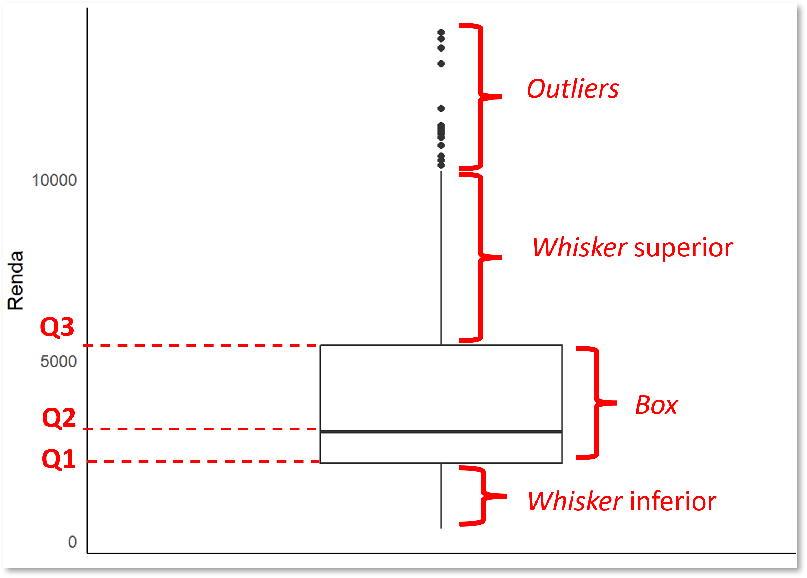
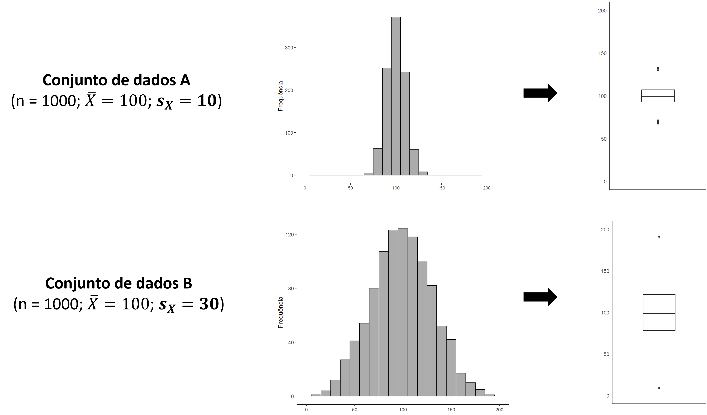
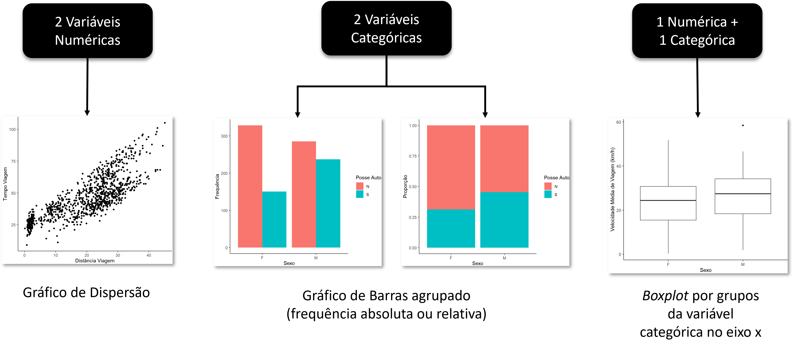

<!-- Para quem preferir esta aula em formato audiovisual, há uma *playlist* de videoaulas do meu canal do YouTube sobre Análise Exploratória de Dados com R. O conteúdo deste capítulo está compreendido nos vídeos 14 a 27.

[▶️ Abrir playlist no YouTube](https://www.youtube.com/playlist?list=PL_v-tArg0FZhA6dqbGv1uQMQqFOUPlryE) -->

Nos dois capítulos anteriores aprendemos a resumir dados em números e a organizá-los em tabelas. Este capítulo trata do terceiro movimento da análise exploratória, que é transformar esses dados em imagens. Começaremos discutindo a importância da visualização de dados e quais princípios separam um gráfico eficaz de um gráfico enganoso. Em seguida apresentaremos a Gramática dos Gráficos, o arcabouço teórico que estrutura o pacote `ggplot2` que utilizaremos no R. Por fim, percorreremos sistematicamente as possibilidades de representação conforme a quantidade e o tipo das variáveis envolvidas.

```{r}
#| label: setup-oculto
#| include: false
# Pacotes usados nas figuras ilustrativas das seções conceituais, cujo código
# não é exibido. O carregamento didático do tidyverse aparece mais adiante.
library(tidyverse)
library(patchwork)
```

## Importância da Visualização de Dados

A Guerra da Crimeia estendeu-se de 1853 a 1856 pela península da Crimeia, no mar Negro, pelo Cáucaso e pelos Bálcãs. De um lado estava o Império Russo, e do outro uma coligação formada por Império Otomano, Reino Unido, França e Reino da Sardenha, reunida em reação às pretensões expansionistas da Rússia. Em outubro de 1854, a enfermeira britânica Florence Nightingale foi enviada com uma equipe de voluntárias ao hospital militar de Scutari, na Turquia, para cuidar dos feridos do conflito.

{#fig-florence .float-right-sm}

O que Nightingale encontrou em Scutari a levou a organizar um registro meticuloso das causas de morte entre os soldados britânicos. Os números mostravam que a maior parte das mortes não vinha dos combates, e sim de doenças contraídas dentro do próprio hospital, como cólera, febre tifoide e disenteria, favorecidas pela ausência de cuidados sanitários, conforme se pode observar na @fig-rose-diagram. Nos primeiros sete meses da campanha, a mortalidade por doença correspondia sozinha a uma taxa anual de 60%, superior à da Grande Peste de Londres de 1665 [@friendly2021].

De volta à Inglaterra em julho de 1856, ela passou a pressionar o governo britânico por reformas nos hospitais militares. Apresentou relatórios extensos, cheios de tabelas e de propostas concretas, e pouco aconteceu. Foi então que recorreu a um recurso que acabaria por mudar a história da comunicação de dados.

{#fig-rose-diagram}

O diagrama representa cada mês do conflito como uma fatia de ângulo igual, cuja extensão a partir do centro corresponde à mortalidade daquele mês. As áreas azuis indicam mortes por doenças evitáveis, as vermelhas indicam mortes por ferimentos de combate e as cinzas indicam as demais causas, como acidentes e queimaduras. A separação em duas rosas é proposital, pois a Comissão Sanitária encarregada de investigar as condições dos hospitais chegou à região em março de 1855, exatamente na fronteira entre os dois períodos representados [@friendly2021].

A comparação entre as duas rosas dispensa qualquer cálculo. O azul domina a figura inteira e encolhe visivelmente no segundo período. Em uma única imagem ficava demonstrado que os soldados morriam sobretudo de causas evitáveis e que as medidas sanitárias funcionavam. O argumento venceu onde os relatórios haviam falhado, e as reformas sanitárias foram adotadas nos hospitais militares britânicos. A estratégia está resumida em uma frase tradicionalmente atribuída a ela:

::: {.citacao-destaque}
"O diagrama deve afetar através dos olhos o que não conseguimos transmitir ao cérebro do público através dos seus ouvidos à prova de palavras."
:::

Há no diagrama um detalhe que antecipa o assunto das próximas seções. Em uma versão anterior, Nightingale representou a mortalidade pela distância entre o centro e a ponta da fatia. Ela percebeu que o resultado enganava, porque o olho lê a área da fatia e não o seu comprimento, de modo que dobrar a taxa de mortalidade quadruplicava a área percebida. Na versão final passou a usar a raiz quadrada da distância, fazendo com que a área de cada fatia refletisse corretamente o número de mortes [@friendly2021]. Mais de um século antes de a psicologia da percepção ser sistematicamente incorporada ao projeto de gráficos, ela já havia identificado o problema e o corrigido.

## Como percebemos elementos visuais {#sec-percepcao}

Todo gráfico codifica dados usando um repertório limitado de propriedades gráficas. Sistematizá-las ajuda a perceber que a escolha entre um gráfico e outro é, no fundo, uma escolha entre esses elementos [@munzner2015]:

- **posição**, o local que o dado ocupa no espaço do gráfico;
- **tamanho**, a extensão linear das formas;
- **ângulo**, a rotação entre dois vetores;
- **inclinação**, a orientação de um vetor no espaço;
- **forma**, o símbolo usado para representar categorias;
- **área**, a extensão em duas dimensões;
- **volume**, a extensão em três dimensões;
- **matiz**, o tom ou coloração propriamente dito;
- **saturação**, a intensidade da matiz.

{#fig-elementos-visuais}

Os diferentes tipos de gráfico possuem como pecularidade exatamente um ou mais destes elementos. Enquanto um gráfico de barras usa posição e tamanho, um gráfico de setores^[Coloquialmente conhecido como gráfico de *pizza*] usa ângulo e área. Já um gráfico de dispersão com pontos coloridos usa posição, matiz e eventualmente área. A pergunta que importa é quão eficiente cada um desses elementos é no processo de assimilação das informações que se pretende transmitir.

A resposta a essa pergunta pode ser dada a partir de um simples exercício visual. A @fig-tres-codificacoes mostra um mesmo conjunto de cinco valores codificado de três maneiras, por intensidade de cor, por área de círculo e por altura de barra. Antes de prosseguir na leitura, vale a pena parar e tentar responder, para cada um dos três painéis, quantas vezes o valor de D é maior que o de E.

```{r}
#| label: fig-tres-codificacoes
#| echo: false
#| fig-cap: "Um mesmo conjunto de valores codificado por intensidade de cor (a), por área de círculo (b) e por altura de barra (c). Elaboração própria, com base na demonstração de @munzner2015."
#| fig-width: 3.2
#| fig-height: 6
dados_cod <- tibble(
  categoria = factor(c("A", "B", "C", "D", "E")),
  valor     = c(20, 40, 30, 50, 10)
)

tema_cod <- theme_minimal(base_size = 11) +
  theme(
    panel.grid      = element_blank(),
    axis.title      = element_blank(),
    axis.text.y     = element_blank(),
    legend.position = "none",
    plot.title      = element_text(size = 11, hjust = 0.5),
    plot.margin     = margin(t = 4, r = 4, b = 16, l = 4)
  )

p_cor <- dados_cod |>
  ggplot(aes(x = categoria, y = 1, fill = valor)) +
  geom_point(shape = 22, size = 16, color = "grey80", stroke = 0.4) +
  scale_fill_gradient(low = "#EDEBF7", high = "#2F2A7A") +
  scale_y_continuous(limits = c(0.82, 1.9), expand = c(0, 0)) +
  coord_cartesian(clip = "off") +
  labs(title = "(a) intensidade de cor") +
  tema_cod

p_area <- dados_cod |>
  ggplot(aes(x = categoria, y = 1, size = valor)) +
  geom_point(color = "#4D48B2") +
  scale_size_area(max_size = 20) +
  scale_y_continuous(limits = c(0.78, 1.9), expand = c(0, 0)) +
  coord_cartesian(clip = "off") +
  labs(title = "(b) área do círculo") +
  tema_cod

p_barra <- dados_cod |>
  ggplot(aes(x = categoria, y = valor)) +
  geom_col(width = 0.7, fill = "#4D48B2") +
  scale_y_continuous(expand = expansion(mult = c(0, 0.05))) +
  labs(title = "(c) altura da barra") +
  tema_cod

p_cor / p_area / p_barra
```

Os valores são exatamente os mesmos nos três painéis, e D vale cinco vezes E. Com intensidade de cor conseguimos no máximo ordenar grosseiramente as categorias, sem nenhuma noção da razão entre elas. Com área acertamos a ordem e subestimamos a diferença, porque o olho comprime a percepção de área. Com altura de barra a razão de cinco para um é lida com boa precisão. A comparação, portanto, é progressivamente mais fácil da primeira para a terceira representação.

Esse resultado não é uma impressão subjetiva. Estudos experimentais foram realizados em ocasiões diferentes e chegaram à mesma ordenação [@cleveland1985; @heer2010]^[@cleveland1985 conduziram experimentos controlados medindo o erro cometido por participantes ao estimar quantidades codificadas por diferentes elementos visuais, e obtiveram uma ordenação estável entre eles. Vinte e cinco anos depois, @heer2010 repetiram esses experimentos recorrendo a uma plataforma de trabalho colaborativo pela internet, o que lhes permitiu recrutar um conjunto de participantes muito maior e mais heterogêneo do que era viável em laboratório. Os resultados anteriores foram reproduzidos, e o estudo ainda os estendeu a codificações não contempladas originalmente, como a área de retângulos.]. A hierarquia resultante desses estudos (@fig-hierarquia-percepcao) coloca no topo a posição em escala comum e alinhada, seguida da posição em escala comum mas desalinhada, da extensão, do ângulo, da inclinação, da área, do volume, da intensidade de cor e, por último, da matiz. Consequentemente, quando o objetivo é comparar quantidades com precisão, convém usar elementos do topo da hierarquia.

{#fig-hierarquia-percepcao}

Isso não significa que os elementos da base sejam inúteis, e sim que eles servem a outro propósito ou apoiam a intuição de forma secundária. Um exemplo do primeiro caso é a matiz, bastante contraindicada para representar magnitude, porém excelente para distinguir categorias, porque o cérebro humano reconhece diferenças de tom com facilidade sem tentar quantificá-las.

O segundo caso aparece sempre que a leitura precisa fica a cargo de outro elemento e a codificação de baixa hierarquia apenas orienta o olhar. É o que veremos adiante neste capítulo no gráfico de dispersão em que uma terceira variável é representada pela intensidade de cor ou pelo tamanho dos pontos. A posição nos eixos sustenta a leitura precisa das duas primeiras variáveis, enquanto a cor ou área do ponto apenas indica se a terceira cresce ou diminui ao longo dos valores de $x$ e $y$, sem permitir comparação numérica direta entre observações. 

## A gramática dos gráficos

### Por que uma gramática

Até aqui discutimos gráficos como objetos prontos, escolhidos de um catálogo. Quem aprende visualização dessa maneira acaba com uma lista mental de tipos de gráficos (barras, setores, dispersão, histograma, *boxplot*, ...) e com a tarefa de escolher um deles a cada análise. O problema dessa abordagem é que a lista é bastante extensa, não explica por que um tipo funciona melhor que outro e não ajuda em nada quando a situação não se encaixa em nenhum item do catálogo.

{#fig-grammar_of_graphics .float-left-sm}

Em 1999, Leland Wilkinson propôs uma inversão dessa perspectiva em um trabalho que se tornou uma das referências teóricas mais influente da área, denominado a **Gramática dos Gráficos**^[do inglês, *Grammar of Graphics*] [@wilkinson2005]. O argumento central é que um gráfico não existe por si próprio, da mesma forma que uma frase não existe independentemente das palavras que a compõem. Sabemos que uma língua é muito mais que um repertório de frases prontas a serem memorizadas. Ela é um vocabulário extenso somado a regras de combinação, e dessa interação nasce a possibilidade de formular frases que ninguém jamais pronunciou. Wilkinson percebeu que gráficos funcionam do mesmo modo, ou seja, que existe um conjunto pequeno de componentes cujas combinações geram praticamente qualquer representação visual de dados, inclusive as que ainda não foram inventadas.

A consequência mais imediata dessa mudança de olhar é que a taxonomia dos tipos de gráfico se dissolve. O que parecem duas modalidades distintas costuma ser a mesma construção com uma única camada trocada. O caso mais eloquente é o par formado pelo gráfico de barras empilhadas e pelo gráfico de setores, caracterizando duas representações diferentes para a mesma informação.

```{r}
#| label: fig-cartesiano-polar
#| echo: false
#| fig-cap: "Uma mesma barra empilhada representada em coordenadas cartesianas (a) e em coordenadas polares (b). A segunda é o que costumamos chamar de gráfico de setores."
#| fig-width: 8
#| fig-height: 3.4
dados_gg <- tibble(
  categoria = factor(c("A", "B", "C", "D")),
  valor     = c(35, 25, 25, 15)
)

p_cartesiano <- dados_gg |>
  ggplot(aes(x = "", y = valor, fill = categoria)) +
  geom_col(width = 0.6, color = "white") +
  labs(title = "(a) coordenadas cartesianas",
       x = NULL, y = NULL, fill = "Categoria") +
  theme_minimal(base_size = 11) +
  theme(plot.title = element_text(size = 11, hjust = 0.5))

p_polar <- p_cartesiano +
  coord_polar(theta = "y") +
  labs(title = "(b) coordenadas polares") +
  theme(axis.text = element_blank(), panel.grid = element_blank())

p_cartesiano + p_polar + plot_layout(guides = "collect")
```

### As camadas de um gráfico

A composição proposta pela Gramática dos Gráficos é **modular** e organizada em camadas sobrepostas, o que permite construir praticamente qualquer modalidade de gráfico a partir de um conjunto pequeno de decisões.

{#fig-camadas-gg}

As camadas se dividem em dois grupos. O primeiro reúne os elementos fundamentais, sem os quais não há gráfico algum:

- Os **dados** (*data*) são a tabela que fornece os valores a representar. Na gramática, ela é a primeira camada, pois determina o que é possível representar. Uma tabela em que cada linha é uma observação e cada coluna é uma variável, formato que vimos no capítulo anterior, é exatamente o que a gramática pressupõe.

- O **mapeamento estético** (*aesthetics* ou *aesthetic mapping*) é a conexão entre cada variável da tabela e a propriedade gráfica que a representará. É aqui que a discussão da seção anterior entra na prática, porque mapear uma variável ao eixo $x$, à cor ou ao tamanho dos pontos são decisões com consequências perceptivas muito diferentes. O mapeamento é a camada que traduz números em elementos visuais.

- A **geometria** (*geometry*) é a forma visual concreta que traduz esse mapeamento, como pontos, barras, linhas ou caixas. Um mesmo mapeamento admite geometrias diferentes. Duas variáveis numéricas mapeadas aos eixos $x$ e $y$ podem virar uma nuvem de pontos ou uma linha, e a escolha entre elas depende de a relação entre as observações ser de comparação ou de continuidade.

O segundo grupo reúne os elementos complementares, que refinam o resultado sem alterar sua estrutura básica:

- As **estatísticas** (*statistics*) inserem no gráfico quantidades calculadas a partir dos dados em vez dos valores originais. Essa camada costuma passar despercebida porque quase sempre age de forma silenciosa. Um histograma, por exemplo, agrupa os valores em classes e desenha a *contagem* de cada classe. Um gráfico de barras construído a partir de uma variável categórica também *conta* observações antes de desenhar, e um boxplot calcula *quartis* e *limites* antes de traçar a caixa.

- As **escalas** (*scales*) definem como os valores das variáveis se convertem em valores concretos da propriedade gráfica, ou seja, quais números correspondem a quais posições no eixo, a quais cores e a quais tamanhos. Toda variável mapeada recebe automaticamente uma escala, e ajustá-la é o que permite trocar uma paleta de cores, inverter um eixo ou garantir que a área dos círculos seja proporcional ao valor representado.

- O **sistema de coordenadas** (*coordinates*) organiza o espaço em que as geometrias são desenhadas, podendo ser cartesiano ou polar, por exemplo.

- As **facetas** (*facets*) subdividem o gráfico em painéis segundo os níveis de uma ou duas variáveis categóricas, repetindo a mesma construção para cada subconjunto dos dados. É o recurso que permite comparar grupos sem sobrecarregar um único painel.

- O **tema** (*theme*) reúne os ajustes estéticos que não codificam dado algum, como cor de fundo, presença de grades, tamanho de fonte e posição da legenda.

Convém guardar essa divisão, porque ela organiza tudo o que faremos daqui em diante. Diante de qualquer gráfico deste capítulo, vale o exercício de identificar qual variável está em qual mapeamento, qual geometria foi escolhida e quais camadas complementares foram acionadas.

### O ggplot2

A Gramática dos Gráficos orienta o desenvolvimento das principais ferramentas de visualização em uso hoje, entre elas o Tableau, o Plotly e bibliotecas de Python como `bokeh`, `altair`, `seaborn` e `plotnine`. Sua implementação mais completa, porém, é o pacote `ggplot2` do R, onde o duplo *g* inicial vem justamente da sigla em inglês *G*rammar of *G*raphics.

O `ggplot2` foi desenvolvido por Hadley Wickham, que traduziu a proposta de Wilkinson para código. Ao implementá-la, inclusive, ele a reformulou naquilo que chamou de **gramática em camadas** [@wickham2010]. Duas contribuições dessa reformulação explicam por que o pacote é tão econômico de usar.

A primeira é a organização em camadas propriamente dita, que agrupa dados, mapeamento, geometria e estatística em unidades sobrepostas. É isso que torna possível somar elementos a um gráfico com o operador `+`, escrevendo a construção na mesma ordem em que a pensamos. A segunda é a **hierarquia de valores-padrão**. Todo gráfico precisa das sete camadas para existir, e exigir que todas fossem declaradas a cada vez tornaria o código muito comprido. O `ggplot2` deduz o que não foi informado. Ao pedir um histograma, o pacote sabe que a estatística é o agrupamento em classes, que o sistema de coordenadas é o cartesiano, que a escala do eixo $x$ é contínua e que o tema é o padrão. Nada disso precisa ser escrito, e tudo isso pode ser sobrescrito quando necessário. Por isso duas linhas de código produzem um gráfico completo, e por isso mesmo vale insistir que as camadas continuam todas lá, ainda que invisíveis no código.

Uma consequência prática dessa arquitetura é que o `ggplot2` não tem uma função por tipo de gráfico, ou seja, não existe uma função `hist()` e outra `barplot()` para se produzir os gráficos isoladamente como no R base. Em vez disso, existem funções para cada camada, e o tipo de gráfico emerge da combinação escolhida, como a @tbl-camadas resume.

| Camada | Papel | Funções no `ggplot2` |
|---|---|---|
| Dados | Tabela com os valores a representar | `ggplot(data = ...)` |
| Mapeamento estético | Liga variáveis a propriedades gráficas | `aes()` |
| Geometria | Forma visual que representa os dados | `geom_point()`, `geom_col()`, `geom_boxplot()` |
| Estatística | Transforma os dados antes de desenhá-los | `stat_*()` e o argumento `stat` das geometrias |
| Escalas | Converte valores em posições, cores e tamanhos | `scale_x_continuous()`, `scale_fill_manual()` |
| Coordenadas | Organiza o espaço do gráfico | `coord_cartesian()`, `coord_polar()`, `coord_flip()` |
| Facetas | Subdivide o gráfico em painéis | `facet_grid()`, `facet_wrap()` |
| Tema | Ajustes estéticos que não codificam dados | `theme_bw()`, `theme_minimal()`, `theme()` |

: Correspondência entre as camadas da gramática dos gráficos e as funções do `ggplot2`. {#tbl-camadas}

Essa tabela é a chave de leitura de todo o restante do capítulo. Cada gráfico que produzirmos daqui em diante será uma escolha explícita de algumas dessas linhas, com as demais assumindo seus valores-padrão. Para quem quiser aprofundar o funcionamento do pacote camada por camada, a referência é o livro do próprio autor [@wickham2016ggplot2], disponível gratuitamente em [ggplot2-book.org](https://ggplot2-book.org/).

O `ggplot2` faz parte do `tidyverse`, de modo que carregar a coleção completa já o disponibiliza:

```{r}
#| label: setup
#| message: false
#| warning: false
library(tidyverse)
```

## O primeiro gráfico

Trabalharemos com a base `escolha_modal`, a mesma dos capítulos anteriores. Lembre-se de fazer o download pelo link abaixo, salvando o arquivo em uma pasta onde você irá criar o projeto no RStudio junto com o script no qual executará o código para a criação dos gráficos:

- [`escolha_modal.csv`](https://github.com/pedreirajr/rcensolivro/releases/download/dados/escolha_modal.csv)

O código abaixo repete o encadeamento construído no capítulo anterior, lendo o arquivo, convertendo as variáveis categóricas para *factor*, passando o tempo de viagem de minutos para horas e criando a velocidade média da viagem:

```{r}
#| label: le-em
#| echo: false
#| cache: true
#| message: false
em <- read_csv(
  "https://github.com/pedreirajr/rcensolivro/releases/download/dados/escolha_modal.csv",
  locale = locale(encoding = "Latin1")
) |>
  mutate(
    sexo             = factor(sexo),
    posse_auto       = factor(posse_auto),
    modo_viagem      = factor(modo_viagem),
    tempo_viagem     = tempo_viagem / 60,
    vel_media_viagem = dist_viagem / tempo_viagem
  )
```

```{r}
#| label: le-em-exibido
#| eval: false
em <- read_csv("escolha_modal.csv", locale = locale(encoding = "Latin1")) |>
  mutate(
    sexo             = factor(sexo),
    posse_auto       = factor(posse_auto),
    modo_viagem      = factor(modo_viagem),
    tempo_viagem     = tempo_viagem / 60,
    vel_media_viagem = dist_viagem / tempo_viagem
  )
```

Vale conferir rapidamente a estrutura resultante antes de seguir:

```{r}
#| label: glimpse-em
glimpse(em)
```

A base tem 1.000 observações e sete variáveis originais, além da velocidade média que acabamos de criar. Há três variáveis categóricas (`sexo`, `posse_auto` e `modo_viagem`) e cinco numéricas (`idade`, `renda`, `dist_viagem`, `tempo_viagem` e `vel_media_viagem`), combinação que nos permitirá percorrer todos os casos deste capítulo.

A primeira função que trabalharemos do pacote é a `ggplot()`, que recebe dois argumentos principais, que correspondem exatamente às duas primeiras camadas da gramática. O argumento `data` recebe a tabela, e o argumento `mapping` recebe a função `aes()`, dentro da qual declaramos a correspondência entre as variáveis correspondem a as propriedades gráficas. Vejamos o que acontece ao informar somente esses dois argumentos:

```{r}
#| label: fig-ggplot-vazio
#| fig-cap: "Resultado de uma chamada a `ggplot()` sem geometria. O sistema de eixos é construído, mas nada é desenhado."
ggplot(data = em, mapping = aes(x = renda))
```

O R desenhou o painel e a escala do eixo $x$ correspondente à variável `renda`, sem ter desenhado nenhum elemento gráfico. Isso ocorre porque falta a terceira camada fundamental, a geometria. As geometrias são adicionadas com o operador `+` após `ggplot()`, conforme o exemplo da `geom_histogram()` abaixo que desenha um histograma para a variável renda:

```{r}
#| label: fig-ggplot-primeiro
#| message: false
#| fig-cap: "Histograma da renda obtido com as três camadas fundamentais da gramática."
ggplot(data = em, mapping = aes(x = renda)) +
  geom_histogram()
```

Com duas linhas de código tratamos de três das sete camadas da gramática. Os nomes dos argumentos podem ser omitidos, já que `data` e `mapping` são o primeiro e o segundo parâmetros da função. É também comum encadear a base de dados inicialmente com o pipe, o que se torna conveniente quando é preciso transformar os dados antes de plotá-los. Verifique, no seu computador, como as três formas abaixo produzem o mesmo resultado:

```{r}
#| label: formas-equivalentes
#| eval: false
ggplot(data = em, mapping = aes(x = renda)) +
  geom_histogram()

ggplot(em, aes(x = renda)) +
  geom_histogram()

em |>
  ggplot(aes(x = renda)) +
  geom_histogram()
```

:::{.callout-warning}
## `+` e `|>` não são intercambiáveis

O operador `|>` encadeia transformações de dados, passando o resultado de uma função como primeiro argumento da seguinte. O operador `+` empilha camadas de um gráfico já iniciado por `ggplot()`. Trocar um pelo outro gera erro. Na prática, o `|>` aparece antes da chamada a `ggplot()` e o `+` aparece depois dela.
:::

Para apresentarmos de forma mais sistematizada o desenvolvimento dos tipos de gráfico mais fundamentais, subdiviremos o nosso fluxo de trabalho nas três subseções a seguir:

- Visualização de **uma única variável**.

- Visualização de **duas variáveis**.

- Visualização de **três ou mais variáveis**.

## Visualizando uma única variável

Com uma única variável, a escolha do gráfico depende essencialmente da escala de mensuração desta variável (se numérica ou categórica), conforme demonstrado na @fig-unica-variavel. Para variáveis numéricas queremos enxergar a forma da distribuição, onde os valores se concentram e quão dispersos eles são, e as ferramentas usuais são o histograma e o boxplot. Para variáveis categóricas queremos contar observações em cada nível, e a ferramenta usual é o gráfico de barras.

{#fig-unica-variavel}

Apesar da leitura do gráfico de barras ser bem direta, existem aspectos teóricos importantes a serem discutidos a respeito de histogramas e do *boxplot*, que serão discutidos de forma mais minuciosa nas próximas seções.

### O histograma

O histograma divide o intervalo de valores da variável em faixas contíguas, chamadas **classes**, e representa cada classe por uma barra cuja altura corresponde à quantidade de observações que caem naquela faixa (@fig-hist-elementos). Observe que no eixo $x$ temos a variável de interesse e no eixo $y$ a frequência observada daquela classe.

{#fig-hist-elementos}


A leitura de um histograma responde a duas perguntas de imediato. A primeira é onde os dados se concentram, indicada pelas barras mais altas. A segunda é quão espalhados eles estão, indicada pela largura da região ocupada pelas barras.

Para entender como o histograma é montado, é importante interpretar as escolhas que os pacotes fazem por nós. Vamos construir um manualmente a partir dos seguintes valores de idade abaixo:

```{r}
#| label: idades-vetor
idades <- c(58.8, 65.5, 42.9, 98.4, 87.0, 63.9, 60.8, 60.2, 66.9, 73.8,
            77.6, 39.9, 58.1, 58.2, 56.5, 59.9, 59.7, 52.8, 62.6, 68.5)
```

O primeiro passo é ordenar as idades de forma crescente, o que já dá uma primeira noção de como elas se distribuem:

```{r}
#| label: sort-idades
sort(idades)
```

O segundo passo é definir as classes. É importante salientar que podemos escolher a quantidade de classes arbitrariamente, mas que existem regras práticas úteis para determiná-la. Antes de apresentar estas regras, vamos salvar alguns valores importantes para esta definição, que são a quantidade de observações da variável ($n$) e sua amplitude:

```{r}
#| label: n-amplitude
n <- length(idades)

n

amplitude <- max(idades) - min(idades)

amplitude
```

As duas regras práticas mais difundidas para a determinação da quantidade de classes ($C$) são a raiz quadrada do número de observações ($C=\sqrt{n}$), e a segunda é a regra de Sturges, que calcula $C = 1 + \log_2(n)$. Sendo assim:

```{r}
#| label: regras-classes
# Regra da raiz quadrada:
n_classes_raizquad = sqrt(n)

n_classes_raizquad

# Regra de Sturges:
n_classes_rsturges = 1 + log2(n)

n_classes_rsturges
```

Em geral, adotamos uma das regras e tomamos o valor do inteiro superior mais próximo. Neste caso, teríamos o valor de 5 para a regra da raiz quadrada e 6 para a regra de Sturges. Como ambas apontam para um resultado em torno de 5, utilizaremos essa quantidade. Logo, dividindo a amplitude por esse número e obtemos a extensão de cada intervalo (classe):

```{r}
#| label: ext-intervalo
n_classes = 5
ext_intervalo = amplitude / n_classes

ext_intervalo
```
O valor de 11,7 anos pode ser pouco prático como referência de leitura, e por isso costumamos arredondar para um número inteiro superior. Adotando intervalos de 12 anos iniciadas em 39, os limites das cinco classes ficam assim:

```{r}
#| label: limites-classes
# Usamos celing() para obter o maior inteiro (arredondamento p/ cima):
ext_intervalo <- ceiling(ext_intervalo) 

ext_intervalo

# Para obter o limite superior do intervalo, somamos o valor mínimo de idade à nova 
# amplitude, dada pela extensão do intervalo de uma classe vezes o número de classes:
lim_superior <- ext_intervalo*n_classes + min(idades)

lim_superior

# O código abaixo produz uma sequência numérica começando em 'from', 
# terminando em 'to' e espaçado de 'by' em 'by':
limites <- seq(from = 39, to = lim_superior, by = 12) 

limites
```

A convenção usual é tratar cada intervalo como fechado no início e aberto no final, de modo que a primeira classe contém os valores maiores ou iguais a 39 anos e menores que 51 anos. No R, a função `cut()` faz esse recorte e o argumento `right = FALSE` estabelece justamente essa convenção. O terceiro passo é contar quantas observações caem em cada classe:

```{r}
#| label: tbl-classes
#| tbl-cap: "Distribuição de frequências das idades em cinco classes de 12 anos."
tab_classes <- tibble(idades = idades) |>
  mutate(classe = cut(idades, breaks = limites, right = FALSE)) |>
  count(classe, name = "frequencia") |>
  mutate(proporcao = frequencia / sum(frequencia))

tab_classes
```

Vamos agora salvar as idades em um formato `tibble` com única coluna, já que não podemos passar um vetor para o ggplot:

```{r}
#| label: tab-idades
tab_idades <- tibble(idades = idades)

tab_idades
```

O quarto e último passo é desenhar uma barra para cada classe, com altura igual à sua frequência. É exatamente o que o `geom_histogram()` faz:

```{r}
#| label: fig-hist-manual
#| fig-cap: "Histograma das idades com o número de classes definido automaticamente pelo `ggplot2`."
tab_idades |>
  ggplot(aes(x = idades)) +
  geom_histogram()
```

Observe a mensagem reproduzida logo acima do gráfico. Ela indica que o `ggplot2` adotou 30 classes (*bins*) por padrão e nos sugere escolher um número mais apropriado. Podemos então informar no argumento `bins` a quantidade de classes que calculamos anteriormente (`n_classes`), conforme o exemplo abaixo:

```{r}
#| label: fig-hist-bins
#| fig-cap: "Histograma das idades com o número de classes definido pelo argumento `bins`."
tab_idades |>
  ggplot(aes(x = idades)) +
  geom_histogram(bins = n_classes)
```

O gráfico passou a ter cinco barras, como queríamos, mas os limites das classes não são os mesmos da @tbl-classes. A primeira barra começa em 32,6 anos e cada classe tem extensão de 14,6 anos, e não os 12 anos que havíamos definido. Isso ocorre porque o `geom_histogram()` do `ggplot2` usa uma lógica específica para definir os limites das classes (*bins*) quando o argumento `bins` é ajustado. Ao contrário do que se poderia esperar, ele não divide o intervalo total dos dados pelo número de classes, e sim por esse número menos um. O motivo é que o `ggplot2` posiciona as classes de forma que a primeira fique centrada no valor mínimo e a última no valor máximo, o que faz sobrar meia classe em cada extremidade. Com dados de 0 a 100 e `bins = 5`, por exemplo, cada classe terá extensão de 25 unidades (e não 20), e o histograma se estenderá de -12,5 a 112,5. No nosso caso, a amplitude de 58,5 anos foi dividida por 4, o que produziu as classes de 14,6 anos que observamos. Por esse motivo, quando os limites das classes forem importantes, convém defini-los diretamente, como faremos a seguir com o argumento de extensão da classe `binwidth`.

Abaixo passamos a esse argumento o valor `ext_intervalo` que calculamos anteriormente:

```{r}
#| label: fig-hist-binwidth
#| fig-cap: "Histograma das idades com a extensão das classes definida pelo argumento `binwidth`."
tab_idades |>
  ggplot(aes(x = idades)) +
  geom_histogram(binwidth = ext_intervalo)
```

Cada classe tem agora os 12 anos de extensão que pedimos, mas o resultado continua diferente da @tbl-classes, porque surgiram seis barras em vez de cinco. Isso acontece porque o `binwidth` define a largura das classes sem dizer onde a primeira delas começa, e o `ggplot2` a iniciou em 30 anos. Para chegar ao mesmo recorte da tabela precisamos de mais dois argumentos. O `boundary` fixa um dos limites das classes, e o `closed` estabelece se os intervalos são fechados à esquerda ou à direita, cumprindo o mesmo papel do argumento `right` da função `cut()` que usamos antes:

```{r}
#| label: fig-hist-boundary
#| fig-cap: "Histograma das idades com largura, origem e fechamento das classes definidos explicitamente."
tab_idades |>
  ggplot(aes(x = idades)) +
  geom_histogram(binwidth = ext_intervalo, boundary = 39, closed = "left")
```

Com os três argumentos combinados, o histograma finalmente reproduz as frequências da @tbl-classes. Vale registrar que esse nível de controle raramente é necessário na prática, já que na maior parte das vezes basta ajustar `bins` ou `binwidth` até que a forma da distribuição fique legível. Ele é útil, porém, quando o histograma precisa corresponder a classes definidas por alguma convenção externa, como faixas etárias oficiais ou faixas de renda em salários mínimos.

Neste momento é interessante testar algumas edições ao nosso gráfico que podem torná-los mais visualmente adequados. No código abaixo, nós reescrevemos os nomes dos eixos $x$ e $y$, além de propor um título (`title`), um subtítulo (`subtitle`) e uma legenda para o gráfico (`caption`) por meio da função `labs()`:

```{r}
#| label: fig-hist-labs
#| fig-cap: "Histograma das idades com título, subtítulo e nota definidos por `labs()`."
tab_idades |>
  ggplot(aes(x = idades)) +
  geom_histogram(bins = n_classes) +
  labs(x = "Idade", y = "Frequência", title = "Histograma", subtitle = "Idades",
       caption = "Nota: Valores extraídos de uma base de dados sobre estudos etários")
```
A aparência das barras também pode ajustada pelos argumentos `color`, que define a cor do contorno, `fill`, que define a cor de preenchimento, e `alpha`, que define a opacidade entre 0 e 1:

```{r}
#| label: fig-hist-cores
#| fig-cap: "Histograma das idades com ajustes de contorno, preenchimento e opacidade das barras."
tab_idades |>
  ggplot(aes(x = idades)) +
  geom_histogram(bins = n_classes, color = "black",
                 fill = "steelblue", alpha = 0.4) +
  labs(x = "Idade", y = "Frequência",
       title = "Histograma", subtitle = "Idades",
       caption = "Nota: Valores extraídos de uma base de dados sobre estudos etários")
```

Uma observação interessante é que as cores de contorno e preenchimento podem ser definidas tanto por nomes (como o "black" e o "steelblue"), quanto por meio de códigos de cor hexadecimal. Uma fonte interessante para obter esses códigos é o site [HTML Color Codes](https://htmlcolorcodes.com/). Experimente por exemplo o gráfico anterior com `color = #E8A61A` e `fill = #F50C05`.

:::{.callout-note}
## Argumentos dentro e fora de `aes()`

Note que os argumentos `color`, `fill` e `alpha` acima estão fora de `aes()`, e por isso não são mapeamento estético. Eles atribuem um valor fixo à geometria inteira. Quando esses mesmos argumentos aparecem dentro de `aes()`, passam a representar uma variável da base, e o `ggplot2` cria automaticamente uma escala e uma legenda para eles. Essa distinção percorre todo o restante do capítulo.
:::

A última camada que costumamos ajustar é o tema. O `ggplot2` traz vários temas prontos, entre eles `theme_bw()`, `theme_minimal()`, `theme_classic()` e `theme_void()`, que alteram cores de fundo, grades e eixos sem tocar nos dados representados. Abaixo testaremos o tema `theme_bw()`, mas fique à vontade para testar os possíveis temas pré-definidos do `ggplot2`:

```{r}
#| label: fig-hist-tema
#| fig-cap: "Histograma das idades com o tema `theme_bw()` aplicado."
tab_idades |>
  ggplot(aes(x = idades)) +
  geom_histogram(bins = n_classes, color = "black",
                 fill = "steelblue", alpha = 0.4) +
  labs(x = "Idade", y = "Frequência",
       title = "Histograma", subtitle = "Idades",
       caption = "Nota: Valores extraídos de uma base de dados sobre estudos etários") +
  theme_bw()
```

### O *boxplot*

O diagrama de caixa, mais conhecido como *boxplot*, também é utilizado para representar a distribuição dos dados. Há, porém, um ganho adicional em relação ao histograma, ao permitir identificar algumas medidas de posição importantes a partir do seu desenho. Ele é composto por uma caixa, dois traços que dela se estendem, chamados *whiskers*, e eventualmente por pontos isolados, conforme podemos observar na @fig-boxplot-elementos.

{#fig-boxplot-elementos}


A caixa é delimitada pelo primeiro e pelo terceiro quartis, com um traço interno na mediana. Ela contém, portanto, os 50% centrais das observações, e quanto menor sua altura maior é a concentração no centro da distribuição. Os *whiskers* se estendem até o valor mais extremo que ainda esteja a até 1,5 intervalo interquartil $(IQR = Q3 - Q1)$ de distância da caixa. Isso significa que o *whisker* **superior** se estende até o **menor** valor entre $\max{x}$ e $Q3 + 1{,}5 \cdot IQR$ e o *whisker* **inferior** se estende até o **maior** valor entre $\min{x}$ e $Q1 - 1{,}5 \cdot IQR$. Observações além desses limites (para cima ou para baixo) são desenhadas individualmente e classificadas como valores discrepantes ou *outliers*^[É também comum utilizar o multiplicador 3 para a definição, ou seja $Q3 + 3 \cdot IQR$ e $Q1 - 3 \cdot IQR$], sendo pontos de atenção no controle de qualidade dos dados.

Voltemos aos dados de `em`. Para construir um *boxplot* da renda, mapeamos a variável ao eixo vertical e adicionamos `geom_boxplot()`:

```{r}
#| label: fig-boxplot-renda
#| fig-cap: "Boxplot da renda dos entrevistados."
em |>
  ggplot(aes(y = renda)) +
  geom_boxplot() +
  labs(y = "Renda (R$)") +
  theme_bw()
```

Quando representamos a distribuição de uma única variável, a caixa ocupa toda a largura disponível, o que é pouco elegante. Como o `ggplot2` posiciona a caixa entre -0,4 e 0,4 no eixo horizontal^[Note que esses valores no eixo $x$ não possuem qualquer significado em relação à base de dados, pois servem somente para posicionarmos a caixa], basta ampliar os limites desse eixo com `xlim()` para obter uma proporção mais agradável:

```{r}
#| label: fig-boxplot-ajustado
#| fig-cap: "Boxplot da renda com os limites do eixo horizontal ajustados."
em |>
  ggplot(aes(y = renda)) +
  geom_boxplot() +
  xlim(-1, 1) +
  labs(y = "Renda (R$)") +
  theme_bw()
```

Vale conferir numericamente a que correspondem os elementos do gráfico. Calculando os quartis, o intervalo interquartil e os limites dos *whiskers*:

```{r}
#| label: elementos-boxplot
Q1  <- quantile(em$renda, 0.25)
Q3  <- quantile(em$renda, 0.75)

Q1; Q3

IQR <- Q3 - Q1

IQR

c(Q1 = Q1, mediana = median(em$renda), Q3 = Q3, IQR = IQR)
c(limite_inferior = Q1 - 1.5 * IQR, minimo = min(em$renda))
c(limite_superior = Q3 + 1.5 * IQR, maximo = max(em$renda))
```

O *whisker* inferior termina no valor mínimo observado (`min(em$renda)`), porque este é maior que $Q_1 - 1{,}5 \cdot IQR$. Já o *whisker* superior termina antes do máximo (`max(em$renda)`), o que confirma a existência de observações classificadas como *outliers* na cauda superior da distribuição de renda.

Observe na @fig-hist-vs-boxplot como histograma e boxplot são complementares. O histograma mostra a forma completa da distribuição, incluindo eventuais picos, e o boxplot resume posição e dispersão de maneira compacta, o que o torna especialmente útil para comparar vários grupos lado a lado. Em uma análise exploratória com variáveis numéricas é sempre interessante explorar ambos.

{#fig-hist-vs-boxplot}

### O gráfico de barras

Para variáveis categóricas, a representação usual é o gráfico de barras, que conta as observações em cada nível. O eixo horizontal traz os níveis e o eixo vertical traz a contagem, dada pela altura das barras.

O caminho mais direto usa `geom_bar()`, que faz a contagem internamente a partir da base completa:

```{r}
#| label: fig-barras-modo
#| fig-cap: "Quantidade de entrevistados por modo de viagem."
em |>
  ggplot(aes(x = modo_viagem)) +
  geom_bar() +
  labs(x = "Modo de viagem", y = "Frequência") +
  theme_bw()
```

Um caminho alternativo parte de uma tabela já agregada. Sumarizando antes com `count()`, passamos a ter uma coluna com as contagens, e nesse caso a geometria apropriada é `geom_col()`, que usa os valores tal como estão em vez de contá-los:

```{r}
#| label: tab-modo
tab_mv <- em |>
  count(modo_viagem)

tab_mv
```

```{r}
#| label: fig-barras-col
#| fig-cap: "O mesmo gráfico construído a partir de uma tabela previamente agregada."
tab_mv |>
  ggplot(aes(x = modo_viagem, y = n)) +
  geom_col() +
  labs(x = "Modo de viagem", y = "Frequência") +
  theme_bw()
```

Uma terceira forma equivalente é usar o `geom_bar(stat = "identity")`, notação mais antiga que produz o mesmo resultado de `geom_col()` e ainda aparece com frequência em códigos R.

Os ajustes visuais seguem uma lógica parecida com a do histograma, com `width` controlando a largura das barras, cujo padrão é 0,9. Quando os rótulos dos níveis são longos, a função `coord_flip()` inverte os eixos e melhora bastante a legibilidade:

```{r}
#| label: fig-barras-flip
#| fig-cap: "Gráfico de barras horizontal, com ajustes de largura e cor."
em |>
  ggplot(aes(x = modo_viagem)) +
  geom_bar(width = 0.6, color = "black", fill = "#4D48B2", alpha = 0.8) +
  coord_flip() +
  labs(x = "Modo de viagem", y = "Frequência") +
  theme_bw()
```

## Visualizando duas variáveis

Com duas variáveis passamos a investigar relações, e o gráfico adequado depende da combinação de tipos. Vamos trabalhar, principalmente, com o conjunto de opções apresentado na @fig-duas-variaveis, além de outras alternativas a serem explicadas mais adiante.

{#fig-duas-variaveis}

### Duas variáveis numéricas

O gráfico de dispersão representa cada observação por um ponto cujas coordenadas são os valores das duas variáveis nos eixos $x$ e $y$. É a representação que melhor aproveita a hierarquia de percepção, porque usa posição nos dois eixos. Abaixo utilizaremos a camada de geometria `geom_point()` para tanto, indicando dentro do mapeamento estético, em `aes()`, quais variáveis da tabela `em` devem vir em cada eixo. Neste caso, trabalharemos com distância e tempo de viagem:

```{r}
#| label: fig-dispersao
#| fig-cap: "Relação entre distância e tempo de viagem."
em |>
  ggplot(aes(x = dist_viagem, y = tempo_viagem)) +
  geom_point() +
  labs(x = "Distância da viagem (km)", y = "Tempo de viagem (h)") +
  theme_bw()
```

Com muitas observações, muitos pontos se sobrepõem e a densidade da nuvem fica difícil de avaliar. O argumento `alpha` resolve o problema, porque regiões com mais sobreposição ficam visivelmente mais escuras. Observe que alteramos também o tamanho dos pontos com `size`, além da sua coloração com `color`:

```{r}
#| label: fig-dispersao-alpha
#| fig-cap: "Relação entre distância e tempo de viagem com transparência nos pontos."
em |>
  ggplot(aes(x = dist_viagem, y = tempo_viagem)) +
  geom_point(size = 3, alpha = 0.2, color = "blue") +
  labs(
    x = "Distância da viagem (km)",
    y = "Tempo de viagem (h)",
    title = "Tempo de viagem em função da distância"
  ) +
  theme_bw()
```

A nuvem revela uma relação positiva entre as duas variáveis, com dispersão crescente à medida que a distância aumenta.

### Duas variáveis categóricas

Para cruzar duas variáveis categóricas, uma solução interessante é mantermos a primeira no eixo horizontal e mapearmos a segunda com o preenchimento de cor (`fill`) das barras. Vamos cruzar o sexo do entrevistado com a posse de automóvel:

```{r}
#| label: fig-barras-empilhadas
#| fig-cap: "Posse de automóvel por sexo, em barras empilhadas."
em |>
  ggplot(aes(x = sexo, fill = posse_auto)) +
  geom_bar() +
  labs(x = "Sexo", y = "Frequência", fill = "Possui auto") +
  theme_bw()
```

O comportamento padrão do `geom_bar()` é `position = "stack"`, que empilha as categorias. O empilhamento facilita a leitura do total de cada barra e dificulta a comparação entre as categorias empilhadas, já que apenas o segmento da base fica alinhado a uma escala comum. Alterando para `position = "dodge"`, as barras ficam lado a lado e passam a compartilhar a mesma linha de base:

```{r}
#| label: fig-barras-dodge
#| fig-cap: "Posse de automóvel por sexo, em barras lado a lado."
em |>
  ggplot(aes(x = sexo, fill = posse_auto)) +
  geom_bar(position = "dodge") +
  labs(x = "Sexo", y = "Frequência", fill = "Possui auto") +
  theme_bw()
```

Frequentemente interessa mais a frequência relativa que a absoluta, sobretudo quando os grupos têm tamanhos diferentes. Aqui existe uma armadilha comum. Ao calcular a proporção logo após o `count()`, obtemos a participação de cada combinação no total geral:

```{r}
#| label: prop-errada
em |>
  count(sexo, posse_auto) |>
  mutate(p = n / sum(n))
```

As quatro proporções somam 1, e não é isso que queremos. A pergunta correta é qual a proporção de cada categoria de posse de automóvel **dentro** de cada sexo, o que exige agrupar pela primeira variável antes de calcular:

```{r}
#| label: prop-certa1
tab_sexo_auto <- em |>
  group_by(sexo,posse_auto) |>
  summarize(n = n()) |>
  mutate(p = n / sum(n))

tab_sexo_auto
```

Outra opção mais enxuta é utilizar `count()` para ambas as variáveis primeiro e depois agrupar por sexo e produzir as proporções, conforme o código abaixo:

```{r}
#| label: prop-certa2
tab_sexo_auto <- em |>
  count(sexo,posse_auto) |> 
  group_by(sexo) |>
  mutate(p = n / sum(n))

tab_sexo_auto
```

Observe que em ambos os casos as proporções somam 1 dentro de cada sexo, e o gráfico empilhado passa a comparar composições. Note também como é possível agora afirmar que há indícios de associação entre as variáveis sexo e automóvel, já que os dados apontam uma maior posse de automóvel entre pessoas do sexo masculino, algo que não era imediatamente identificável nos gráficos de barra com valores absolutos.

```{r}
#| label: fig-barras-relativa
#| fig-cap: "Composição da posse de automóvel dentro de cada sexo."
tab_sexo_auto |>
  ggplot(aes(x = sexo, y = p, fill = posse_auto)) +
  geom_col() +
  labs(x = "Sexo",  y = "Proporção", fill = "Possui auto") +
  theme_bw()
```


### Uma variável numérica e outra categórica

Quando cruzamos uma variável numérica com uma categórica, o objetivo costuma ser comparar a distribuição da primeira entre os níveis da segunda. O boxplot é a opção mais econômica, porque coloca vários resumos lado a lado com os eixos alinhados:

```{r}
#| label: fig-boxplot-grupos
#| fig-cap: "Velocidade média da viagem por modo de transporte."
em |>
  ggplot(aes(x = modo_viagem, y = vel_media_viagem)) +
  geom_boxplot() +
  labs(x = "Modo de viagem", y = "Velocidade média (km/h)") +
  theme_bw()
```

O gráfico separa nitidamente os modos motorizados dos não motorizados, e mostra também que a dispersão interna varia bastante de um modo para outro. Note que diferente do caso do *boxplot* para uma única variável numérica, agora o eixo $x$ faz sentido e representa de forma categorizada os níveis da variável modo de viagem.

Uma alternativa é manter o histograma e usar a variável categórica para subdividir o gráfico em painéis, o que introduz a camada de **facetas**. A função `facet_grid()` recebe uma fórmula com dois lados separados pelo til (`~`). A variável escrita antes do til define as linhas da grade de painéis e a variável escrita depois dele define as colunas. Quando um dos lados não recebe variável alguma, colocamos um ponto (`.`) no lugar, que funciona como marcador de ausência. A fórmula `sexo ~ .` pede, portanto, uma grade com uma linha para cada sexo e nenhuma divisão em colunas, o que empilha os painéis verticalmente^[Caso quiséssemos que a subdivisão fosse por coluna, faríamos `. ~  sexo`, o que empilharia os paines horizontalmente]:

```{r}
#| label: fig-hist-facet
#| fig-cap: "Distribuição da velocidade média por sexo, em painéis."
#| message: false
em |>
  ggplot(aes(x = vel_media_viagem)) +
  geom_histogram(color = "black", fill = "gray70") +
  facet_grid(sexo ~ .) +
  labs(x = "Velocidade média (km/h)", y = "Frequência") +
  theme_bw()
```

Uma terceira alternativa substitui as barras por curvas de densidade sobrepostas através da camada de geometria `geom_density()`, o que facilita a comparação direta das formas por eliminar a separação em painéis:

```{r}
#| label: fig-densidade
#| fig-cap: "Densidade da velocidade média por sexo, com curvas sobrepostas."
em |>
  ggplot(aes(x = vel_media_viagem, fill = sexo)) +
  geom_density(alpha = 0.5) +
  labs(x = "Velocidade média (km/h)", y = "Densidade", fill = "Sexo") +
  theme_bw()
```

Vale entender de onde vem essa curva, porque ela não é simplesmente o contorno das barras de um histograma. Em vez de contar quantas observações caem dentro de cada intervalo, o R substitui cada observação por uma pequena curva em forma de sino, centrada no valor observado, e soma todas essas curvas ao longo do eixo horizontal. Onde as observações estão próximas umas das outras, as curvas se sobrepõem e a soma assume valores altos. Onde há poucas observações, a soma permanece baixa. O resultado é um perfil contínuo da distribuição, sem os degraus do histograma^[O procedimento se chama *estimação de densidade por kernel*, e cada uma dessas pequenas curvas é o *kernel* que dá nome ao método. A largura dessas curvas controla a suavidade do resultado, do mesmo modo que a largura das barras controla a aparência do histograma. Curvas estreitas produzem um traçado cheio de ondulações que refletem particularidades da amostra, e curvas largas produzem um traçado liso demais, a ponto de esconder características reais da distribuição. O R escolhe sozinho uma largura razoável a partir do tamanho da amostra e da dispersão dos dados, e o argumento `adjust` permite pedir mais suavização, com valores acima de 1, ou menos suavização, com valores abaixo de 1.].


## Visualizando três ou mais variáveis

A partir da terceira variável, todas as representações consistem em acrescentar camadas de codificação aos gráficos que já conhecemos. É aqui que a hierarquia de percepção se torna um critério prático de decisão (@fig-hierarquia-percepcao), porque precisamos distribuir as variáveis entre elementos visuais de eficácia desigual. A regra de bolso é reservar os eixos com adequada alocação de facetas, que ocupam o topo da hierarquia, para as variáveis mais importantes da análise, e alocar as demais a cor, tamanho ou forma.

### Três e quatro variáveis numéricas

Partindo do gráfico de dispersão, a terceira variável numérica pode ser mapeada ao tamanho dos pontos. No caso abaixo, inserimos a variável `idade` no mapeamento estético a ser representada pelo tamanho desse ponto.

```{r}
#| label: fig-3num-size
#| fig-cap: "Tempo e distância de viagem com a idade representada pelo tamanho dos pontos."
em |>
  ggplot(aes(x = dist_viagem, y = tempo_viagem, size = idade)) +
  geom_point(alpha = 0.3) +
  labs(x = "Distância da viagem (km)", y = "Tempo de viagem (h)", size = "Idade") +
  theme_bw()
```

Cabe uma explicação sobre o que o R faz com os valores de idade ao desenhar os pontos. O que ele varia não é o diâmetro do círculo, e sim a sua área, o que na prática significa extrair a raiz quadrada do valor antes de definir o raio de cada ponto. Conforme já vimos, a razão é perceptiva, pois quando comparamos círculos, julgamos a mancha que cada um ocupa na tela, de modo que dobrar o diâmetro quadruplica a área e faz o ponto parecer muito maior do que a diferença nos dados justifica. Ao trabalhar com a área, o `ggplot2` mantém a impressão visual mais próxima da variação real da variável^[Por padrão, os pontos ficam entre 1 e 6 milímetros, com o menor valor observado recebendo o menor tamanho e o maior valor recebendo o maior. O tamanho comunica, portanto, a posição relativa de cada observação dentro da faixa observada, e não uma proporção exata, de forma que um ponto com o dobro da área não corresponde a alguém com o dobro da idade.].

Alternativamente, a terceira variável pode ser mapeada à intensidade de cor, conforme o gráfico abaixo. Note que o elemento visual (@fig-elementos-visuais) utilizado a partir do mapeamento estético do `color` é a *saturação* e não a *matiz*.

```{r}
#| label: fig-3num-color
#| fig-cap: "Tempo e distância de viagem com a idade representada pela intensidade de cor."
em |>
  ggplot(aes(x = dist_viagem, y = tempo_viagem, color = idade)) +
  geom_point() +
  labs(x = "Distância da viagem (km)", y = "Tempo de viagem (h)", color = "Idade") +
  theme_bw()
```

Combinando os dois recursos, chegamos a quatro variáveis numéricas em um único gráfico. É interessante apresentar, neste momento, possibilidades de uso das camadas de **escalas** da Gramática dos Gráficos (@fig-camadas-gg), onde podemos editar cores, tamanhos e formatos além da coloração padrão do `ggplot2`. No caso abaixo, utilizamos a função `scale_color_distiller()` permite trocar a paleta de cores por uma sequencial mais legível que a padrão. Para este gráfico, empregamos a paleta "BuPu" que vai do azul claro até o roxo escuro, garantindo com o `direction = 1` que este seja o sentido do gradiente^[caso queiramos que vá do roxo escuro até o azul claro, utilizamos `direction = -1`. Por incrível que pareça, essa última escoha é o *default* das funções de escala do `ggplot2`, ou seja, se nada for definido para `direction`, a função entenderá que o valor é `-1`].

```{r}
#| label: fig-4num
#| fig-cap: "Quatro variáveis numéricas representadas por posição, tamanho e cor."
em |>
  ggplot(aes(x = dist_viagem, y = tempo_viagem,
             size = renda, color = idade)) +
  geom_point(alpha = 0.6) +
  scale_color_distiller(palette = "BuPu", direction = 1) +
  labs(x = "Distância da viagem (km)", y = "Tempo de viagem (h)",
       size = "Renda (R$)",color = "Idade") +
  theme_bw()
```

Este é um bom momento para lembrar que a possibilidade técnica não implica boa prática. *Área* e *saturação* ocupam posições baixas na hierarquia de percepção, de modo que renda e idade aqui comunicam tendências gerais e não permitem comparações precisas. Quando a leitura exata da terceira ou quarta variável for essencial, é preferível produzir vários gráficos mais simples.

### Duas numéricas e uma categórica

Para uma variável categórica, o recurso natural é a matiz, que apesar de contraindicada para representar magnitude, é bastante adequada para distinguir categorias:

```{r}
#| label: fig-2num-1cat-cor
#| fig-cap: "Tempo e distância de viagem por modo de transporte, distinguidos por cor."
em |>
  ggplot(aes(x = dist_viagem, y = tempo_viagem, color = modo_viagem)) +
  geom_point(alpha = 0.6) +
  labs(x = "Distância da viagem (km)", y = "Tempo de viagem (h)",
       color = "Modo de viagem") +
  theme_bw()
```

A separação entre os modos fica evidente, com cada categoria formando uma nuvem de pontos com faixas destacadas no diagrama distância VS. viagem. A *forma* dos pontos é outra alternativa para variáveis categóricas, embora seja menos eficaz que a cor e só funcione bem com poucos níveis e poucos pontos a serem mostrados. No caso abaixo, passamos a variável `sexo` no argumento `shape` da função `aes()` de mapeamento estético:

```{r}
#| label: fig-2num-1cat-forma
#| fig-cap: "Tempo e distância de viagem por sexo, distinguidos pela forma dos pontos."
em |>
  ggplot(aes(x = dist_viagem, y = tempo_viagem, shape = sexo)) +
  geom_point(alpha = 0.5, size = 2) +
  labs(x = "Distância da viagem (km)", y = "Tempo de viagem (h)", 
       shape = "Sexo") +
  theme_bw()
```

### Duas categóricas e uma numérica

Partindo do *boxplot* agrupado, a segunda variável categórica pode ser mapeada ao preenchimento das caixas. A função `scale_fill_manual()` permite definir cores customizadas para cada nível definido no mapeamento estético de cor de preenchimento (`fill`), através do seu argumento `values`^[Neste caso, é importante entender qual a ordem desses níveis preliminarmente para saber qual categoria receberá qual cor]:

```{r}
#| label: fig-2cat-1num-fill
#| fig-cap: "Velocidade média por sexo e posse de automóvel, com as caixas distinguidas por cor."
em |>
  ggplot(aes(x = sexo, y = vel_media_viagem, fill = posse_auto)) +
  geom_boxplot() +
  scale_fill_manual(values = c("#E4A11B", "#3B71CA")) +
  labs(x = "Sexo", y = "Velocidade média (km/h)", fill = "Possui auto") +
  theme_bw()
```

Ou então às facetas, o que separa os grupos em painéis distintos:

```{r}
#| label: fig-2cat-1num-facet
#| fig-cap: "Velocidade média por sexo, em painéis definidos pela posse de automóvel."
em |>
  ggplot(aes(x = sexo, y = vel_media_viagem)) +
  geom_boxplot() +
  facet_grid(. ~ posse_auto) +
  labs(x = "Sexo", y = "Velocidade média (km/h)") +
  theme_bw()
```

A escolha entre as duas depende da comparação que interessa. Com cor, comparamos os níveis da segunda categórica dentro de cada nível da primeira, porque as caixas ficam próximas. Com facetas, comparamos o padrão geral entre os painéis.

### Três e quatro variáveis categóricas

Com três variáveis categóricas e nenhuma numérica, o que resta a representar é a contagem de observações. Combinamos então eixo horizontal, preenchimento e facetas, uma para cada variável, mantendo a contagem no eixo vertical. No caso abaixo, os paineis serão formados por cada modo de viagem, junto com o sexo no eixo $x$ e a posse de automóvel como cor de preenchimento:

```{r}
#| label: fig-3cat-abs
#| fig-cap: "Frequência absoluta por sexo, posse de automóvel e modo de viagem."
#| fig-width: 9
#| fig-height: 4
em |>
  count(sexo, posse_auto, modo_viagem) |>
  ggplot(aes(x = sexo, y = n, fill = posse_auto)) +
  geom_col(position = "dodge") +
  facet_grid(. ~ modo_viagem) +
  labs(x = "Sexo",  y = "Frequência", fill = "Possui auto") +
  theme_bw()
```

A versão em frequência relativa exige o mesmo cuidado com o agrupamento visto anteriormente. É preciso, de antemão, entender como o gráfico será estruturado, mais especificamente onde as variáveis serão relativizadas. Para que cada barra empilhada represente a composição de posse de automóvel dentro de uma combinação de sexo e modo de viagem, agrupamos por essas duas últimas variáveis antes de calcular a proporção. Veja primeiramente a tabela sumarizada:

```{r}
#| label: tab-3cat-rel
em |>
  count(sexo, modo_viagem, posse_auto) |>
  group_by(sexo, modo_viagem) |>
  mutate(p = n / sum(n))
```

Note como as proporções de sem (N) e com (S) automóvel agora somam 1 (100%) em cada combinação de categorias de sexo e modo de viagem. Na sequência, produzimos o gráfico de barras em frequência relativa a partir dessa tabela:
```{r}
#| label: fig-3cat-rel
#| fig-cap: "Composição da posse de automóvel por sexo e modo de viagem."
#| fig-width: 9
#| fig-height: 4
em |>
  count(sexo, modo_viagem, posse_auto) |>
  group_by(sexo, modo_viagem) |>
  mutate(p = n / sum(n)) |>
  ggplot(aes(x = sexo, y = p, fill = posse_auto)) +
  geom_col() +
  facet_grid(. ~ modo_viagem) +
  labs(x = "Sexo", y = "Proporção", fill = "Possui auto") +
  theme_bw()
```

Uma quarta variável categórica cabe ainda na segunda dimensão do grid de painéis. Vamos criar uma variável dicotômica de faixa etária e usá-la nas linhas do grid, deixando o modo de viagem nas colunas, e produzir mais um gráfico com frequência relativa, agrupando a posse de automóvel agora pelas variáveis sexo, posse de automóvel e faixa etária:

```{r}
#| label: fig-4cat
#| fig-cap: "Frequência relativa por sexo, posse de automóvel, faixa etária e modo de viagem."
#| fig-width: 9
#| fig-height: 5
em |>
  mutate(faixa_etaria = ifelse(idade > 40, "Mais de 40 anos", "Até 40 anos")) |>
  count(sexo, modo_viagem, faixa_etaria, posse_auto) |>
  group_by(sexo, faixa_etaria, modo_viagem) |> 
  mutate(p = n / sum(n)) |>
  ggplot(aes(x = sexo, y = p, fill = posse_auto)) +
  geom_col() +
  facet_grid(faixa_etaria ~ modo_viagem) +
  labs(x = "Sexo", y = "Proporção", fill = "Possui auto") +
  theme_bw()
```

Vale a pena discutirmos um pouco melhor esse gráfico anterior para termos uma noção da importância dos gráficos em uma análise exploratória de dados para o entendimento do fenômeno que estamos estudando. Observe mais especificamente aqueles indivíduos que se deslocam primordialmente por carro próprio ou transporte por aplicativo (3ª coluna do painel). Note como o padrão de posse de automóvel por sexo é diferente quando estamos olhando para indivíduos com até 40 anos e aqueles com mais de 40 anos. No caso dos mais jovens dentro desse grupo, há um leve indício de maior posse de automóvel entre mulheres ao passo que esse padrão se inverte quando consideramos aqueles com maior idade. Além de permitir enxergar estes padrões mais complexos, estas representações podem servir como primeiros indícios de especificação de modelos estatísticos mais avançados a serem trabalhados com dados porventura tenhamos em mãos com várias variáveis a serem consideradas.

### Duas numéricas e duas categóricas

O último caso combina o gráfico de dispersão com um grid completo de painéis, no qual uma variável categórica define as linhas e a outra define as colunas:

```{r}
#| label: fig-2num-2cat-grid
#| fig-cap: "Tempo e distância de viagem em painéis definidos por posse de automóvel e modo de viagem."
#| fig-width: 9
#| fig-height: 5
em |>
  ggplot(aes(x = dist_viagem, y = tempo_viagem)) +
  geom_point(alpha = 0.4) +
  facet_grid(posse_auto ~ modo_viagem) +
  labs(x = "Distância da viagem (km)", y = "Tempo de viagem (h)") +
  theme_bw()
```

Alternativamente, uma das categóricas vai para a cor e apenas a outra permanece nos painéis, o que economiza espaço:

```{r}
#| label: fig-2num-2cat-cor
#| fig-cap: "Tempo e distância de viagem por modo, com a posse de automóvel indicada por cor."
#| fig-width: 9
#| fig-height: 3.5
em |>
  ggplot(aes(x = dist_viagem, y = tempo_viagem, color = posse_auto)) +
  geom_point(alpha = 0.5) +
  facet_grid(. ~ modo_viagem) +
  labs(x = "Distância da viagem (km)", y = "Tempo de viagem (h)",
       color = "Possui auto") +
  theme_bw()
```

## Ajustes estéticos adicionais

Esta seção reúne recursos de refinamento e pode ser tranquilamente pulada em uma primeira leitura, já que tratam só de refinamentos estéticos não obrigatórios. Ela funciona melhor como material de consulta, para quando um gráfico já construído precisar de uma paleta diferente, de um eixo em porcentagem ou de rótulos que não se sobreponham. Por isso, em vez de propor exemplos novos, retomaremos aqui figuras que já produzimos ao longo do capítulo, alterando um aspecto de cada vez.

Antes de começar, convém retomar a distinção entre argumentos dentro e fora de `aes()`, porque é ela que organiza tudo o que veremos. Quando uma propriedade gráfica vale para a geometria inteira, ela entra como argumento do próprio `geom_*()`, como fizemos em `geom_histogram(fill = "steelblue")`. Não há variável da base de dados envolvida e não há escala a ajustar. Quando a propriedade representa uma variável da base, ela **deve** entrar em `aes()`, e o `ggplot2` cria automaticamente uma escala e uma legenda para ela. Nesse segundo caso, mudar a aparência significa intervir na camada de **escalas**, com as funções da família `scale_*()`. Por fim, a função`theme()`, tratada no final desta seção, é um terceiro caso de ajuste estético, pois trata de elementos que não codificam dado algum e por isso nunca dependem de `aes()`.

Vale conhecer a lógica dos nomes dessas funções de escala, porque ela se repete em todas elas e permite deduzir a função certa antes mesmo de procurar na documentação. Tomemos a `scale_color_distiller()`, usada na @fig-4num. O prefixo `scale_` indica a camada de escalas. O termo seguinte identifica o mapeamento estético que será modificado, no caso `color`, e poderia ser `fill`, `size`, `shape`, `x` ou `y`. O último termo indica a natureza da escala. Aqui, `distiller` designa as paletas do projeto ColorBrewer adaptadas a variáveis contínuas (originalmente reunidas no pacote `RColorBrewer`) e pensadas para leitura em mapas e gráficos. Pela mesma lógica, `scale_fill_distiller()` aplicaria a paleta ao preenchimento em vez da cor do contorno, e `scale_color_brewer()` usaria as paletas do ColorBrewer para uma variável categórica.

Nenhuma seção de livro dá conta de listar todas as combinações possíveis. O nosso objetivo aqui é introduzir a discussão mostrando o caminho inicial de possibilidades de ajustes estéticos no `ggplot2`. Mais importante é saber onde procurar e a ajuda do próprio R, acessível por `?scale_fill_brewer` ou `?theme`, traz a lista completa de argumentos de cada função com exemplos executáveis. Já a referência de funções do `ggplot2`, em <https://ggplot2.tidyverse.org/reference/>, organiza todas as escalas por família e mostra o resultado de cada uma. Ao longo desta seção indicaremos, a cada assunto, a página que vale a consulta.

### Cores e preenchimentos

Duas estéticas distintas cuidam de cor no `ggplot2`. O `color` define a cor de linhas, contornos e pontos, e o `fill` define a cor da área preenchida de barras, caixas e histogramas. Cada família de escalas existe nas duas versões, de modo que `scale_color_brewer()` e `scale_fill_brewer()` fazem a mesma coisa em elementos diferentes. Uma segunda divisão separa as escalas conforme o tipo da variável mapeada. Variáveis categóricas pedem escalas discretas, como `scale_fill_manual()`, `scale_fill_brewer()` e `scale_fill_viridis_d()`, enquanto variáveis numéricas pedem escalas contínuas, como `scale_color_gradient()`, `scale_color_distiller()` e `scale_color_viridis_c()`.

Já usamos a `scale_fill_manual()` na @fig-2cat-1num-fill, informando as cores uma a uma. Quando não temos uma preferência específica, é mais prático recorrer a uma paleta pronta. Retomamos abaixo aquela mesma figura com a paleta "Set2" do ColorBrewer, aproveitando para mostrar que as funções de escala também controlam a legenda, com os argumentos `name` definindo o seu título e `labels` renomeando os seus níveis, o que dispensa o argumento `fill` dentro de `labs()`:

```{r}
#| label: fig-ajuste-fill-brewer
#| fig-cap: "A @fig-2cat-1num-fill com paleta pronta do ColorBrewer e legenda renomeada."
em |>
  ggplot(aes(x = sexo, y = vel_media_viagem, fill = posse_auto)) +
  geom_boxplot() +
  scale_fill_brewer(palette = "Set2", name = "Possui automóvel",
                    labels = c("Não", "Sim")) +
  labs(x = "Sexo", y = "Velocidade média (km/h)") +
  theme_bw()
```

O mesmo raciocínio vale para variáveis numéricas. Retomando a @fig-4num, trocamos a paleta ColorBrewer pela família `viridis`, que acompanha o `ggplot2` e reúne paletas desenhadas para permanecer legíveis na impressão em tons de cinza e para pessoas com daltonismo. O argumento `option` seleciona entre as variantes disponíveis, como "magma", "plasma" e "cividis":

```{r}
#| label: fig-ajuste-cor-viridis
#| fig-cap: "A @fig-4num com a paleta contínua viridis na variante plasma."
em |>
  ggplot(aes(x = dist_viagem, y = tempo_viagem,
             size = renda, color = idade)) +
  geom_point(alpha = 0.6) +
  scale_color_viridis_c(option = "plasma") +
  labs(x = "Distância da viagem (km)", y = "Tempo de viagem (h)",
    size = "Renda (R$)",color = "Idade") +
  theme_bw()
```

Três recursos ajudam na hora de escolher cores. O site do ColorBrewer, em <https://colorbrewer2.org>, permite visualizar as paletas e filtrá-las por critérios como legibilidade em tons de cinza, e os nomes exibidos ali, como "BuPu" e "Set2", são exatamente os que entram no argumento `palette`. Dentro do R, o comando `RColorBrewer::display.brewer.all()` mostra todas essas paletas de uma vez. Para cores definidas manualmente, o site [HTML Color Codes](https://htmlcolorcodes.com/), já mencionado neste capítulo, fornece os códigos hexadecimais.

### Formas, tamanhos e espessuras

As demais estéticas seguem exatamente a mesma lógica de nomes, bastando trocar o termo do meio. A @fig-2num-1cat-forma distinguiu o sexo pela forma dos pontos, aceitando as formas que o `ggplot2` escolhe por padrão. A função `scale_shape_manual()` permite definir quais serão usadas, identificadas por números de 0 a 25, sendo que de 0 a 14 temos símbolos abertos ou formados por linhas, de 15 a 20 símbolos sólidos e de 21 a 25 símbolos que aceitam contorno e preenchimento definidos separadamente. Abaixo escolhemos o círculo sólido (16) e o triângulo sólido (17):

```{r}
#| label: fig-ajuste-forma
#| fig-cap: "A @fig-2num-1cat-forma com as formas dos pontos definidas explicitamente."
em |>
  ggplot(aes(x = dist_viagem, y = tempo_viagem, shape = sexo)) +
  geom_point(alpha = 0.5, size = 2) +
  scale_shape_manual(values = c(16, 17)) +
  labs(x = "Distância da viagem (km)", y = "Tempo de viagem (h)",
       shape = "Sexo") +
  theme_bw()
```

O tamanho segue o mesmo caminho. Vimos na @fig-3num-size que os pontos variam por padrão entre 1 e 6 milímetros, com a área proporcional ao valor representado. Quando essa faixa é estreita demais para revelar a variação, o argumento `range` da função `scale_size()` a amplia:

```{r}
#| label: fig-ajuste-tamanho
#| fig-cap: "A @fig-3num-size com a faixa de tamanhos ampliada de 1 a 10 milímetros."
em |>
  ggplot(aes(x = dist_viagem, y = tempo_viagem, size = idade)) +
  geom_point(alpha = 0.3) +
  scale_size(range = c(1, 10)) +
  labs(x = "Distância da viagem (km)", y = "Tempo de viagem (h)",
       size = "Idade") +
  theme_bw()
```

Outras estéticas menos frequentes têm suas próprias escalas, como `scale_alpha()` para a transparência, `scale_linewidth()` para a espessura de linhas e `scale_linetype_manual()` para o estilo do traço, que pode ser contínuo, tracejado ou pontilhado. As formas numeradas, os tipos de linha e as demais especificações estão reunidos e ilustrados na vinheta *Aesthetic specifications* do pacote, em <https://ggplot2.tidyverse.org/articles/ggplot2-specs.html>.

### Eixos

Os eixos também são escalas, ainda que raramente pensemos neles assim. As funções seguem a mesma convenção de nomes, com `scale_x_continuous()` e `scale_y_continuous()` para variáveis numéricas e `scale_x_discrete()` e `scale_y_discrete()` para categóricas. Os argumentos mais usados são `name`, que substitui o rótulo do eixo e faz o mesmo que `labs()`, `breaks`, que define onde aparecem as marcações, `labels`, que define como os valores dessas marcações são escritos, e `limits`, que define o intervalo representado.

Um caso muito frequente é o eixo de proporções, que fica bem mais legível em porcentagem. A @fig-barras-relativa trazia valores entre 0 e 1, e abaixo definimos marcações de 25 em 25 pontos percentuais e formatamos os rótulos com a função `percent()` do pacote `scales`, instalado junto com o `ggplot2`:

```{r}
#| label: fig-ajuste-eixo-percent
#| fig-cap: "A @fig-barras-relativa com o eixo vertical formatado em porcentagem."
tab_sexo_auto |>
  ggplot(aes(x = sexo, y = p, fill = posse_auto)) +
  geom_col() +
  scale_y_continuous(breaks = seq(0, 1, by = 0.25),
                     labels = scales::percent) +
  labs(x = "Sexo", y = "Proporção", fill = "Possui auto") +
  theme_bw()
```

O pacote `scales` oferece formatadores para outras situações, e vale conhecê-los porque a notação numérica padrão do R segue a convenção anglófona, com ponto decimal e vírgula de milhar. A função `scales::label_number(big.mark = ".", decimal.mark = ",")` escreve os números no padrão brasileiro (separação de milhar com ponto e decimal com vírgula), e `scales::label_percent(decimal.mark = ",")` faz o mesmo com porcentagens.

Já o argumento `limits` merece atenção, porque ele não faz exatamente o que se espera dele. Retomando a @fig-dispersao-alpha, vamos restringir o eixo horizontal às viagens de até 20 km:

```{r}
#| label: fig-ajuste-eixo-limits
#| fig-cap: "A @fig-dispersao-alpha com o eixo horizontal restringido por `limits`, o que descarta observações."
em |>
  ggplot(aes(x = dist_viagem, y = tempo_viagem)) +
  geom_point(size = 3, alpha = 0.2, color = "blue") +
  scale_x_continuous(limits = c(0, 20)) +
  labs(x = "Distância da viagem (km)", y = "Tempo de viagem (h)") +
  theme_bw()
```

Repare no aviso que o R emite junto ao gráfico, informando quantas linhas foram removidas. Ao definir `limits`, as observações fora do intervalo são descartadas antes do desenho, e não apenas escondidas. Em um gráfico de dispersão isso passa quase despercebido, mas em um *boxplot* ou em uma curva de densidade o efeito é grave, porque os quartis e a suavização passam a ser calculados sem esses valores. As funções `xlim()` e `ylim()`, usadas na @fig-boxplot-ajustado, são atalhos para essa mesma forma.

Quando a intenção é apenas aproximar a visualização, preservando todos os dados nos cálculos, o caminho é a camada de coordenadas, com `coord_cartesian()`:

```{r}
#| label: fig-ajuste-eixo-zoom
#| fig-cap: "A mesma restrição obtida com `coord_cartesian()`, que preserva todas as observações."
em |>
  ggplot(aes(x = dist_viagem, y = tempo_viagem)) +
  geom_point(size = 3, alpha = 0.2, color = "blue") +
  coord_cartesian(xlim = c(0, 20)) +
  labs(x = "Distância da viagem (km)", y = "Tempo de viagem (h)") +
  theme_bw()
```

Desta vez nenhum aviso aparece e nenhuma observação é perdida, pois o gráfico inteiro é construído e só depois recortado para exibição. A regra prática é usar `limits` quando se quer efetivamente excluir uma faixa de valores da análise e `coord_cartesian()` quando se quer apenas ampliar uma região do gráfico.

### Anotações e linhas de referência

Nem tudo o que aparece em um gráfico precisa vir da base de dados. Linhas de corte, valores de referência e pequenos textos explicativos são acréscimos frequentes. As funções `geom_hline()` e `geom_vline()` desenham linhas horizontais e verticais em posições informadas pelos argumentos `yintercept` e `xintercept`, e `geom_abline()` desenha uma reta a partir de um intercepto e uma inclinação. Para textos e demais elementos avulsos, a função `annotate()` desenha um único elemento nas coordenadas indicadas. A diferença em relação a um `geom_*()` comum está justamente aí, pois a geometria desenha um elemento por linha da base e a anotação desenha apenas o que pedimos.

No exemplo abaixo, marcamos na @fig-dispersao-alpha o tempo médio de viagem com uma linha tracejada e a identificamos com um texto:

```{r}
#| label: fig-ajuste-anotacoes
#| fig-cap: "A @fig-dispersao-alpha com uma linha de referência no tempo médio de viagem."
tempo_medio <- mean(em$tempo_viagem)

em |>
  ggplot(aes(x = dist_viagem, y = tempo_viagem)) +
  geom_point(size = 3, alpha = 0.2, color = "blue") +
  geom_hline(yintercept = tempo_medio, linetype = "dashed",
             color = "red", linewidth = 0.8) +
  annotate("text", x = 0.8 * max(em$dist_viagem), y = tempo_medio,
           label = "Tempo médio", color = "red", vjust = -0.5) +
  labs(x = "Distância da viagem (km)", y = "Tempo de viagem (h)") +
  theme_bw()
```

O argumento `vjust` desloca o texto verticalmente em relação ao ponto informado, evitando que ele fique sobre a linha. Note ainda que a posição horizontal foi calculada a partir dos próprios dados, com `0.8 * max(em$dist_viagem)`, o que mantém a anotação dentro do painel mesmo que a base mude.

### Ajustes de tema

O tema reúne tudo aquilo que altera a aparência do gráfico sem codificar dado algum, como cores de fundo, grades, fontes e posição da legenda. Já usamos os temas prontos, como `theme_bw()`, que trocam vários desses elementos de uma vez. A função `theme()` complementa esses temas e permite modificar um elemento específico.

Cada elemento é ajustado por uma função própria, conforme a sua natureza. A `element_text()` cuida de textos, com argumentos como `size`, `face`, `angle` e `color`. A `element_line()` cuida de linhas, como as da grade. A `element_rect()` cuida de retângulos, como o fundo do painel. E a `element_blank()` remove o elemento por completo. Uma armadilha comum tem a ver com a ordem, pois um tema pronto sobrescreve tudo o que veio antes dele. Por isso a chamada a `theme()` precisa vir depois de `theme_bw()` (ou qualquer outra pré-definição, como `theme_classic()`, `theme_dark()`, ...), e não antes.

No exemplo abaixo, retomamos a @fig-2num-1cat-cor movendo a legenda para a parte inferior, o que devolve largura ao painel, e removendo as linhas de grade secundárias:

```{r}
#| label: fig-ajuste-tema-legenda
#| fig-cap: "A @fig-2num-1cat-cor com a legenda embaixo e sem as grades secundárias."
em |>
  ggplot(aes(x = dist_viagem, y = tempo_viagem, color = modo_viagem)) +
  geom_point(alpha = 0.6) +
  labs(x = "Distância da viagem (km)", y = "Tempo de viagem (h)",
       color = "Modo de viagem") +
  theme_bw() +
  theme(legend.position = "bottom",
        panel.grid.minor = element_blank())
```

Vale notar a divisão de tarefas entre as camadas. O título da legenda e os rótulos dos seus níveis pertencem à escala, e por isso são definidos em `labs()` ou nos argumentos `name` e `labels` das funções `scale_*()`. A posição da legenda e a formatação do seu texto pertencem ao tema.

Outro ajuste frequente resolve a sobreposição de rótulos no eixo horizontal, situação comum quando os níveis têm nomes longos. Retomando a @fig-barras-modo, inclinamos os rótulos em 45 graus e destacamos o título em negrito:

```{r}
#| label: fig-ajuste-tema-texto
#| fig-cap: "A @fig-barras-modo com rótulos inclinados no eixo horizontal e título em negrito."
em |>
  ggplot(aes(x = modo_viagem)) +
  geom_bar() +
  labs(x = "Modo de viagem", y = "Frequência",
       title = "Entrevistados por modo de viagem") +
  theme_bw() +
  theme(axis.text.x = element_text(angle = 45, hjust = 1),
        plot.title = element_text(face = "bold", size = 13))
```

O argumento `hjust = 1` alinha o final de cada rótulo à sua marcação no eixo, evitando que o texto inclinado invada o painel. Lembre-se de que a @fig-barras-flip resolveu um problema semelhante por outro caminho, invertendo os eixos com `coord_flip()`.

:::{.callout-tip}
## Onde consultar as demais possibilidades

A lista de ajustes possíveis é longa demais para caber em um capítulo, e vale mais saber onde procurar do que memorizar funções. Cinco fontes cobrem praticamente tudo o que aparece na prática:

- a ajuda do próprio R, com `?scale_fill_brewer`, `?scale_x_continuous` ou `?theme`, que traz todos os argumentos de cada função com exemplos executáveis;
- a referência de funções do `ggplot2`, em <https://ggplot2.tidyverse.org/reference/>, organizada por camada da gramática;
- a vinheta *Aesthetic specifications*, em <https://ggplot2.tidyverse.org/articles/ggplot2-specs.html>, que ilustra as formas numeradas de 0 a 25, os tipos de linha e os formatos de cor aceitos;
- o livro do autor do pacote, em <https://ggplot2-book.org/>, com capítulos dedicados a escalas e a temas;
- a folha de referência de visualização de dados do Posit, em <https://rstudio.github.io/cheatsheets/data-visualization.pdf>, útil para consulta rápida.
:::

## Salvando gráficos

Por fim, gráficos costumam sair do R para relatórios, artigos e apresentações. A função `ggsave()` exporta o último gráfico produzido, ou um gráfico armazenado em um objeto, com controle sobre dimensões e resolução:

```{r}
#| label: ggsave-exemplo
#| eval: false
grafico_renda <- em |>
  ggplot(aes(x = renda)) +
  geom_histogram(binwidth = 500, color = "black", fill = "gray70") +
  labs(x = "Renda (R$)", y = "Frequência") +
  theme_bw()

ggsave("histograma_renda.png", plot = grafico_renda,
       width = 16, height = 10, units = "cm", dpi = 300)
```

Os argumentos `width` e `height` definem as dimensões na unidade indicada em `units`, e `dpi` define a resolução em pontos por polegada. Para publicação impressa, 300 dpi é o valor usualmente exigido. O formato de saída é deduzido da extensão do nome do arquivo, o que permite gerar `.png`, `.jpg`, `.pdf` ou `.svg` sem argumentos adicionais.


## Exercícios

Antes de iniciar os exercícios, baixe os arquivos abaixo para uma pasta onde você irá processá-los. Crie um projeto do R dentro dessa pasta e um novo script `.R` dentro desse projeto para responder às questões abaixo.

- [`escolha_modal.csv`](https://github.com/pedreirajr/rcensolivro/releases/download/dados/escolha_modal.csv)
- [`velocidades.xlsx`](https://github.com/pedreirajr/rcensolivro/releases/download/dados/velocidades.xlsx)

1. Leia o arquivo `velocidades.xlsx`, armazene-o em um objeto `vel` e converta `faixa` e `tipo_veic` para *factor*. Construa um histograma da variável `velocidade` com classes de 5 km/h, com contorno preto e preenchimento cinza, rótulos em português nos dois eixos e um tema à sua escolha.

2. Ainda com a base `vel`, construa um boxplot da variável `velocidade`. Em seguida calcule no R o primeiro quartil, o terceiro quartil, o intervalo interquartil e os limites $Q_1 - 1{,}5 \cdot IQR$ e $Q_3 + 1{,}5 \cdot IQR$. Verifique se existem *outliers* e, em caso afirmativo, em qual das caudas eles se encontram.

3. Construa um gráfico de barras horizontal com a contagem de observações por `tipo_veic`. Produza o mesmo gráfico de duas maneiras, uma diretamente da base completa com `geom_bar()` e outra a partir de uma tabela agregada com `count()` e `geom_col()`.

4. Compare a distribuição da velocidade entre os tipos de veículo usando um boxplot agrupado. Em seguida produza a mesma comparação com curvas de densidade sobrepostas. Qual das duas representações você considera mais adequada para essa comparação, e por quê?

5. Na base `vel`, cruze `faixa` e `tipo_veic` em um gráfico de barras agrupadas, primeiro em frequência absoluta e depois em frequência relativa dentro de cada faixa. Atenção ao agrupamento necessário para o cálculo das proporções.

6. Usando a base `em` deste capítulo, construa um gráfico de dispersão entre `idade` e `renda`, mapeando o modo de viagem à cor dos pontos e a posse de automóvel aos painéis. Ajuste a transparência dos pontos e escreva uma frase interpretando o padrão observado.

7. Retome o gráfico da questão anterior e escolha uma codificação alternativa para a variável `modo_viagem`, usando forma em vez de cor. Compare os dois resultados à luz da hierarquia de percepção discutida na @sec-percepcao e justifique qual deles comunica melhor a informação.

8. Escolha o gráfico que você considerou mais informativo entre todos os que produziu nesta lista e exporte-o com `ggsave()` em formato `.png`, com 16 cm de largura, 10 cm de altura e resolução de 300 dpi.
