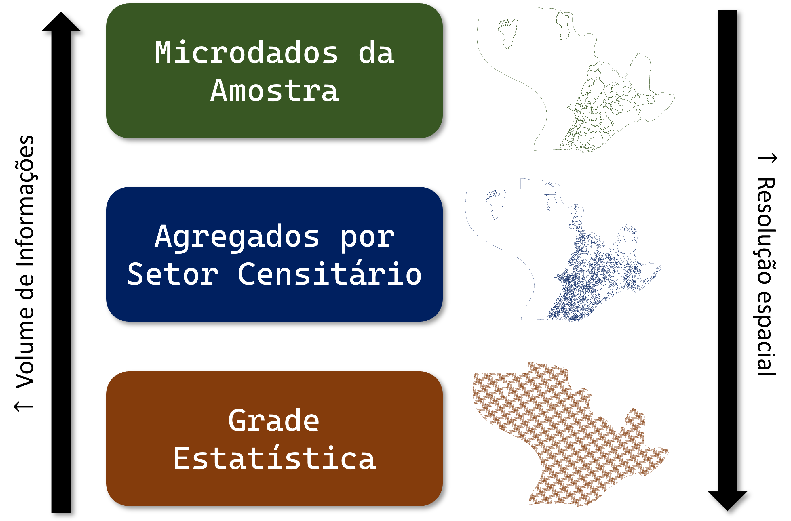

## Por que dados populacionais importam

O território de uma cidade ou região é habitado por pessoas com características sociodemográficas distintas (idade, renda, escolaridade, raça, gênero, composição familiar) que vivem em condições muito variadas de habitação, saneamento, acesso a serviços e mobilidade. Conhecer essas condições permite que entendamos adequadamente suas necessidades, de modo que as prioridades de planejamento urbano e regional sejam bem delineadas.

Considere alguns exemplos. A demanda por equipamentos de saúde depende da estrutura etária e das condições de renda da população em cada área da cidade. A escolha dos locais para construção de escolas requer saber onde vivem crianças e adolescentes em idade escolar. O dimensionamento de redes de saneamento básico exige conhecer quantos domicílios existem em cada setor do território e em que condições se encontram. O planejamento dos sistemas de transporte precisa saber onde moram e trabalham as pessoas, quanto ganham e de que forma se deslocam. Em todos esses casos, a eficácia das políticas públicas depende da qualidade e da granularidade dos dados disponíveis sobre a população.

Essa necessidade é especialmente crítica em países com grandes desigualdades intraurbanas, como o Brasil. Em uma mesma cidade, bairros vizinhos podem apresentar condições de renda, habitação e acesso a serviços completamente distintas. Sabemos, inclusive, que não é raro que essas diferenças se apresentem dentro de um *mesmo* bairro! Deste modo, políticas formuladas com base em totais ou médias municipais tendem a ignorar essas diferenças e, frequentemente, a aprofundá-las. Dados desagregados em nível intraurbano são, portanto, indispensáveis para um diagnóstico adequado e para o monitoramento dos efeitos de qualquer intervenção.

No Brasil, a principal fonte de dados populacionais com essa capacidade de desagregação espacial é o **Censo Demográfico**, realizado pelo Instituto Brasileiro de Geografia e Estatística (IBGE). Este capítulo apresenta alguns fundamentos conceituais e metodológicos para compreender e utilizar esses dados,<!-- Atualizar essa parte sempre que mudar --> incluindo o papel institucional do IBGE, os recortes geográficos para fins estatísticos do nosso território, as características e o histórico do Censo e os instrumentos de coleta empregados. Os capítulos seguintes aprofundam em questões conceituais específicas e sobre como obter e explorar os dados principais produtos do Censo:<!-- Atualizar essa parte sempre que mudar --> os Agregados por Setor Censitário (Cap. 7), os Microdados da Amostra (Cap. 8), a Grade Estatística (Cap. 9), o Cadastro Nacional de Endereços para Fins Estatísticos (Cap. 10) e a Pesquisa Urbanística do Entorno dos Domicílios (Cap. 11).


Embora existam ferramentas de acesso não programático aos dados do Censo (a exemplo do [SIDRA](https://sidra.ibge.gov.br/pesquisa/censo-demografico/demografico-2022/universo-caracteristicas-urbanisticas-do-entorno-dos-domicilios-nas-favelas-e-comunidades-urbanas) e do [Ipeadata](https://www.ipeadata.gov.br/Default.aspx)), nosso foco é em como explorar essas bases de forma programática em R<!-- checar se é o caso da Pesq. Urbanística -->, o que nos permitirá uma flexibilidade bastante interessante de obtenção e manipulação dessas informações. Ao longo destes capítulos, utilizaremos principalmente três pacotes: o [`geobr`](https://github.com/ipeaGIT/geobr), que permite baixar recortes geográficos oficiais do Brasil de forma simples e prática; o [`censobr`](https://github.com/ipeaGIT/censobr/), que dá acesso aos dados do Censo Demográfico (agregados por setor censitário e microdados) de forma padronizada; e o [`cnefetools`](https://github.com/pedreirajr/cnefetools), voltado para o processamento e análise do Cadastro Nacional de Endereços para Fins Estatísticos (CNEFE).

## O papel institucional do IBGE

O IBGE é o órgão federal responsável pela produção e divulgação das estatísticas oficiais do Brasil. Sua missão institucional é "retratar o Brasil com informações necessárias para conhecer sua realidade e exercer a cidadania" [@ibge_institucional]. A primeira agência estatística brasileira com caráter permanente foi a Diretoria Geral de Estatística, criada em 1871. Após sucessivas reorganizações, o governo federal criou, em 1934, o Instituto Nacional de Estatística (INE), que iniciou suas operações em maio de 1936. Em 1937, o Conselho Brasileiro de Geografia foi incorporado ao INE, dando origem ao nome atual. Para cumprir sua missão, o IBGE mantém hoje uma rede que abrange 27 superintendências estaduais e mais de 560 agências de coleta distribuídas por todo o território nacional.

O arcabouço legal que rege o IBGE foi construído ao longo de décadas. A Lei nº 5.878/1973 define os objetivos e competências do Instituto, que abrangem tanto a produção de estatísticas primárias e derivadas quanto as atividades de geociências e cartografia [@lei5878]. O Decreto-Lei nº 161/1967, por sua vez, institui o Plano Nacional de Estatística e o Plano Nacional de Geografia e Cartografia Terrestre, estabelecendo que toda pessoa natural ou jurídica sob jurisdição brasileira é obrigada a fornecer as informações solicitadas pelo IBGE [@dl161]. Essa obrigatoriedade é complementada pela Lei nº 5.534/1968 [@lei5534], modificada pela Lei Federal nº 5.878/1973 [@lei5878] e regulamentada pelo Decreto nº 73.177/1973 [@d77177], que garante o caráter sigiloso das informações coletadas. Os dados fornecidos são usados exclusivamente para fins estatísticos e não podem ser objeto de certidão nem servir de prova em processos administrativos, fiscais ou judiciais [@lei5534]. Esse compromisso com o sigilo é condição essencial para que a população confie no processo e forneça informações verídicas.

As atividades do Instituto organizam-se em duas frentes. Na de **estatísticas**, o IBGE produz informações em três áreas: (i) sociais e demográficas (idade, sexo, cor ou raça, educação, trabalho, renda, habitação, migração, saúde, saneamento, entre outros temas); (ii) econômicas (produção, comércio, indústria e contas nacionais); e (iii) agropecuárias (estrutura fundiária e produção rural). Na de **geociências**, é o responsável oficial pela organização do território nacional, incluindo o posicionamento geodésico, a cartografia e a definição dos recortes territoriais usados nas pesquisas, aspecto detalhado na seção @sec-recortes<!-- checar isso -->. É importante salientar que as estatísticas sociais e demográficas são obtidas por pesquisas domiciliares, registros públicos e levantamentos em estabelecimentos. A @tbl-pesquisas-ibge apresenta algumas das principais pesquisas domiciliares realizadas pelo IBGE.

```{r, warning = F}
#| label: tbl-pesquisas-ibge
#| tbl-cap: "Principais pesquisas domiciliares do IBGE. Fonte: @ibge_institucional."
#| echo: false

tibble::tibble(
  Pesquisa = c(
    "Censo Demográfico",
    "Pesquisa Nacional por Amostra de Domicílios Contínua",
    "Pesquisa de Orçamentos Familiares",
    "Pesquisa Nacional de Saúde"
  ),
  Sigla = c("Censo", "PNAD-C", "POF", "PNS"),
  Periodicidade = c(
    "Decenal",
    "Trimestral (desde 2012)",
    "Irregular (últimas edições: 2002-03, 2008-09, 2017-18, 2024-25)",
    "Quinquenal (últimas edições: 2013, 2019)"
  ),
  Temas = c(
    "População, domicílios e condições de vida",
    "Trabalho, renda e educação",
    "Consumo, despesas e orçamento familiar",
    "Saúde e acesso a serviços"
  )
) |>
  knitr::kable(
    col.names = c("Pesquisa", "Sigla", "Periodicidade", "Temas principais"),
    align = c("l", "c", "l", "l")
  )
```

Entre todas essas pesquisas, o Censo Demográfico ocupa uma posição de destaque, pois é a única que cobre a totalidade da população e permite desagregação espacial em nível intraurbano. Conforme mencionado anteriormente, esta característica torna-o indispensável para o planejamento dos municípios em aspectos importantes como habitação, mobilidade, saneamento e distribuição de água e energia. Antes de começarmos a falar especificamente sobre os produtos estatísticos do Censo, é importante que entendamos melhor a respeito dos **recortes geográficos** sobre os quais podemos obter estas informações da população.

## Recortes geográficos do IBGE {#sec-recortes}

Para que as estatísticas possam ser associadas a um lugar, o IBGE organiza o território nacional em diferentes tipos de recortes espaciais, sistematizados no **Quadro Geográfico de Referência para Produção, Análise e Disseminação de Estatísticas** [@ibge_quageo]. Esses recortes dividem-se em duas grandes categorias, denominadas recortes **legais** e **institucionais**. Os **recortes legais** são definidos por legislação federal ou estadual e existem independentemente do IBGE, sendo os mais conhecidos os recortes de **país**, **grandes regiões**, **estados**, **regiões metropolitanas** e **municípios**. No nível intraurbano, os recortes legais são os **bairros**, **distritos** e **subdistritos**, subdivisões administrativas dos municípios.

Os **recortes institucionais**, por sua vez, são criados pelo próprio IBGE para fins de organização operacional e divulgação de dados. Em escala supramunicipal, incluem as **regiões geográficas** **intermediárias** e **imediatas** (que substituíram, respectivamente, as **mesorregiões** e **microrregiões** na classificação de 2017 [@ibge_div_regional2017], que veremos mais adiante). No nível intraurbano, os recortes institucionais para a análise de dados do Censo são as **áreas de ponderação**, os **setores censitários** e a **grade estatística**, cada um com características específicas de resolução espacial e riqueza temática.

Um conceito fundamental de se entender a respeito dos recortes geográficos é o de **resolução espacial**, que é a medida do nível de detalhamento espacial de um dado geográfico. Quanto *maior* a resolução espacial, *menores* são as unidades representadas e *mais precisamente* os dados podem ser localizados no território. Por exemplo, a grade estatística (células de 200 × 200 metros nas áreas urbanas e 1 × 1 km nas rurais) representa a maior resolução espacial disponível nos produtos do IBGE. Já a camada do país, com sua única feição representando os seus 8,5 milhões de km² de área, a menor.

### Explorando recortes geográficos com o `geobr`

Os recortes geográficos do IBGE podem ser explorados interativamente no portal [Quadro Geográfico de Referência para Produção, Análise e Disseminação de Estatísticas](https://www.ibge.gov.br/geociencias/organizacao-do-territorio/divisao-regional/24233-quadro-geografico-de-referencia-para-producao-analise-e-disseminacao-de-estatisticas.html?=&t=acesso-ao-produto) [@ibge_quageo]. Para acesso programático em R, o pacote `geobr` [@geobr] disponibiliza funções para download direto das malhas oficiais do IBGE, com geometrias simplificadas ou precisas prontas para análise e visualização. A documentação completa encontra-se em [ipeagit.github.io/geobr](https://ipeagit.github.io/geobr/).

Vamos começar adicionando as bibliotecas necessárias para processamento e visualização dos dados:
```{r, warning = F, message = F}
library(geobr)
library(dplyr)
library(ggplot2)
```

A @fig-recortes-legais-institucionais ilustra como é simples baixar algumas malhas territoriais e visualizá-las de forma personalizada com poucas linhas de código. Os municípios representam a malha legal de base, lidos com a função `read_municipality()`, enquanto as regiões intermediárias agrupam municípios contíguos com similaridades socioeconômicas para fins de organização estatística, obtidas via `read_intermediate_region()`.
```{r}
#| label: fig-recortes-legais-institucionais
#| fig-cap: "Municípios (recorte legal) e regiões intermediárias (recorte institucional) do Brasil."
#| fig-subcap:
#|   - "Os 5.570 municípios brasileiros"
#|   - "As 137 regiões intermediárias brasileiras"
#| layout-ncol: 2
#| message: false
#| cache: true

# Download de municípios e regiões intermediárias
municipios   <- read_municipality(year = 2020)
regiao_intermed <- read_intermediate_region(year = 2020)

# Plotando os mapas dos municípios e regiões intermediárias com ggplot:
ggplot(municipios) +
  geom_sf(fill = "gray92", color = "gray70", linewidth = 0.1) +
  theme_minimal()

ggplot(regiao_intermed) +
  geom_sf(fill = "gray92", color = "gray70", linewidth = 0.3) +
  theme_minimal()
```

É possível explorar as malhas geográficas disponibilizadas pelo `geobr` por meio da função `list_geobr()`, que retorna um `data.frame` com todos os conjuntos de dados disponíveis, seus anos e uma breve descrição. É importante destacar além de trazer os recortes geográficos previstos pelo IBGE, o pacote também traz bases espaciais vinculadas a outras áreas, a exemplo da malha de polígonos das regiões de saúde (`read_health_region`) e da malha de pontos das escolas (`read_schools`). Sendo assim, o `list_geobr()` é um bom ponto de partida para descobrir o que o pacote oferece.

```{r}
#| label: tbl-list-geobr
#| tbl-cap: "Arquivos geográficos disponíveis no pacote `geobr`."
#| message: false
#| cache: true

library(geobr)
library(knitr)

kable(list_geobr())
```

Um aspecto interessante do `geobr` é que a maioria das funções relativas aos recortes geográficos do IBGE compartilha os mesmos parâmetros:

- `year`: o ano de referência da malha, no formato YYYY; 

- `code_*`: código IBGE ou sigla do estado com 2 dígitos ou código IBGE do município com 7 dígitos. Em geral, omitir esse parâmetro retorna a malha para o país inteiro. A propósito, quando não souber o código IBGE do município, é possível utilizar a função `lookup_muni`. Para encontrar o código IBGE de Fortaleza, por exemplo, execute o código `lookup_muni(name_muni = 'Fortaleza')$code_muni` <!-- Adiconar footnote: ^[Se você fizer somente `lookup_muni(name_muni = 'Feira de Santana')`, sem `$code_muni`, será retornada toda a linha da tabela de municípios do `geobr`. A adição do `$code_muni` retorna somente o valor do código IBGE do município que se encontra na coluna `code_muni`]-->.

- `simplified`: parâmetro que é `TRUE` por padrão, retornando uma geometria simplificada de menor tamanho em memória, adequada para processamento dos dados. Se `simplified = FALSE`, então a malha virá sem imperfeições, mais adequada para visualização (especialmente mais aproximada das fronteiras das feições);

- `showProgress`: exibe barra de progresso no download;

- `cache`: parâmero que é `TRUE` por padrão, reutilizando dados já baixados localmente, evitando downloads repetidos. 

Os exemplos a seguir exploram as principais funções, organizados do nível supramunicipal ao intraurbano.

### Recortes supramunicipais legais

Vamos entender como baixar alguns tipos de recortes legais, mais especificamente os de estados e regiões metropolitanas. `read_state` baixa os limites estaduais, ao passo que `read_metro_area` baixa os recortes metropolitanos oficiais. Em ambos os casos, omitir o parâmetro `code_state` retorna o Brasil inteiro (@fig-recortes-supra-legais).

```{r}
#| label: fig-recortes-supra-legais
#| fig-cap: "Recortes supramunicipais legais do Brasil."
#| fig-subcap:
#|   - "Estados"
#|   - "Regiões Metropolitanas"
#| layout-ncol: 2
#| message: false
#| cache: true

library(ggplot2)

estados <- read_state(year = 2020)
metros  <- read_metro_area(year = 2018)

ggplot(estados) +
  geom_sf(fill = "gray92", color = "gray70", linewidth = 0.3) +
  theme_minimal()

ggplot(metros) +
  geom_sf(fill = "gray92", color = "gray70", linewidth = 0.3) +
  theme_minimal()
```

Caso você queria somente os estados do Ceará e a Região Metropolitana do Rio de Janeiro, é possível utilizar o `code_state` no primeiro caso e um `filter` do pacote `dplyr` no segundo, conforme a @fig-recortes-supra-legais-2.

```{r}
#| label: fig-recortes-supra-legais-2
#| fig-cap: "Recortes supramunicipais legais do Brasil (Ceará e RMRJ)."
#| fig-subcap:
#|   - "Estado do Ceará"
#|   - "Região Metropolitana do Rio de Janeiro"
#| layout-ncol: 2
#| message: false
#| cache: true

library(ggplot2)

ceara <- read_state(year = 2020, code_state = "CE")
rmrj  <- read_metro_area(year = 2018) |> 
  filter(name_metro == "RM Rio de Janeiro")
  

ggplot(ceara) +
  geom_sf(fill = "gray92", color = "gray70", linewidth = 0.3) +
  theme_minimal()

ggplot(rmrj) +
  geom_sf(fill = "gray92", color = "gray70", linewidth = 0.3) +
  theme_minimal()
```

### Recortes supramunicipais institucionais

As Regiões Geográficas Intermediárias e Imediatas são a classificação institucional vigente, adotada pelo IBGE em 2017 para substituir as mesorregiões e microrregiões [@ibge_div_regional2017]. As **Regiões Geográficas Imediatas** têm na rede urbana o seu principal elemento de referência e são estruturadas a partir de centros urbanos próximos para a satisfação das necessidades imediatas das populações, como compras de bens de consumo, busca de trabalho, acesso a serviços de saúde e educação e prestação de serviços públicos. As **Regiões Geográficas Intermediárias** correspondem a uma escala entre as Unidades da Federação e as Imediatas, organizadas preferencialmente em torno de metrópoles ou capitais regionais que articulam um conjunto de Regiões Imediatas por meio de funções urbanas de maior complexidade e fluxos de gestão pública e privada. `read_intermediate_region()` e `read_immediate_region()` baixam esses recortes, enquanto `read_meso_region()` e `read_micro_region()` retornam a classificação anterior. Na @fig-recortes-supra-institucionais, veremos em um único mapa estes dois recortes para o estado de Minas Gerais, distinguindo-os pela coloração e espessura da linha de contorno. Observe que também definimos a cor de preenchimento dos polígonos das regiões intermediárias como vazio (`NA`), de modo que a camada passada inicialmente (`imediatas`) não seja sobreposta completamente.

```{r}
#| label: fig-recortes-supra-institucionais
#| fig-cap: "Recortes supramunicipais institucionais do Brasil."
#| message: false
#| cache: true

regiao_intermed <- read_intermediate_region(year = 2020,
                                            code_intermediate = "MG")
regiao_imed     <- read_immediate_region(year = 2020, 
                                         code_immediate = "MG")

ggplot() +
  geom_sf(data = regiao_imed, fill = "gray92", color = "gray70", linewidth = 0.4) +
  geom_sf(data = regiao_intermed, color = "black", linewidth = 1.2, fill = NA) +
  theme_minimal()
```

### Recortes intramunicipais legais

No nível intraurbano, `read_neighborhood()` disponibiliza os limites de bairros. A função não possui parâmetro de filtragem por município, retornando os bairros de todos os 720 municípios cobertos de uma vez, e o filtro é feito depois no `data.frame` resultante (assim como em `read_metro_area()`). A cobertura é parcial, uma vez que nem todos os municípios disponibilizaram seus limites oficiais de bairros ao IBGE.

```{r}
#| label: fig-bairros-salvador
#| fig-cap: "Bairros de Salvador (BA), recorte intraurbano legal."
#| message: false
#| cache: true

library(dplyr)

bairros <- read_neighborhood(year = 2022, showProgress = FALSE)

bairros |>
  filter(name_muni == "Salvador") |>
  ggplot() +
  geom_sf(fill = "gray92", color = "gray70", linewidth = 0.3) +
  theme_minimal()
```

### Recortes intramunicipais institucionais

Estes são os recortes que mais nos interessam ao longo dos próximos capítulos. `read_weighting_area()` e `read_census_tract()` baixam, respectivamente, as áreas de ponderação e os setores censitários. Ambos aceitam código de estado (sigla ou 2 dígitos) ou código de município (7 dígitos) nos parâmetros `code_weighting` e `code_tract`, o que permite baixar apenas os dados de interesse sem carregar o Brasil inteiro. Mais adiante, veremos ainda como obter a grade estatística por meio da função `read_statistical_grid()`.

Para visualizar os setores censitários e as áreas de ponderação de forma comparada e interativa, utilizaremos o pacote `mapview` em conjunto com o `leafsync`, que permite sincronizar dois mapas lado a lado de modo que o zoom e o deslocamento em um deles reflitam automaticamente no outro^[Se você ainda não os tem instalados, lembre-se de utilizar a função `install.packages()` para tanto]. O código a seguir baixa as áreas de ponderação e os setores censitários de Maceió (AL) e os exibe em painéis sincronizados.

```{r}
#| label: map-recortes-intra-institucionais
#| message: false
#| cache: true

library(mapview)
library(leafsync)

# Código IBGE de Maceió: 2704302
areas_pond <- read_weighting_area(code_weighting = 2704302, year = 2010)
setores    <- read_census_tract(code_tract = 2704302, year = 2010)

m_pond    <- mapview(areas_pond, layer.name = "Áreas de ponderação",
                     col.regions = "gray80", color = "gray40", lwd = 1.5,
                     alpha.regions = 0.5, legend = FALSE)
m_setores <- mapview(setores, layer.name = "Setores censitários",
                     col.regions = "gray80", color = "gray40", lwd = 0.5,
                     alpha.regions = 0.5, legend = FALSE)

sync(m_pond, m_setores)
```

::: {.callout-tip}
Aproxime o zoom nos dois mapas e observe os contornos dos polígonos. É comum perceber pequenas imperfeições nas bordas das feições, com vértices deslocados. Isso ocorre porque o parâmetro `simplified = TRUE` é o padrão em todas as funções do `geobr`, o que reduz o tamanho dos arquivos e acelera o processamento, ao custo de simplificar a geometria. Para reproduzir os mapas com geometrias precisas, execute o código localmente com `simplified = FALSE` nos dois downloads e aproxime o zoom novamente para verificar como as bordas ficam com os contornos regularizados.
:::

## Principais aspectos metodológicos

Entendido o papel do IBGE e os seus principais recortes geográficos, podemos voltar ao foco do nosso capítulo. O Censo Demográfico é o maior e mais complexo levantamento estatístico do Brasil. Diferente das pesquisas por amostragem (como a PNAD-C, a POF ou a PNS, que entrevistam apenas uma fração dos domicílios), o Censo tem como ambição cobrir todos os domicílios do território nacional, sem exceção. Essa universalidade é o que o torna insubstituível, pois é a única pesquisa capaz de fornecer informações estatísticas desagregadas em qualquer recorte do território, desde o nível nacional até o setor censitário.

Os dois objetivos principais do Censo são contar todos os habitantes do território nacional e identificar as condições em que vivem. O primeiro recenseamento do território brasileiro foi realizado em 1872, no Período Imperial. A partir de 1890, o Censo passou a ter periodicidade decenal, sendo esta frequência formalmente estabelecida pela Lei nº 8.184/1991 [@lei8184]. No século XX, embora as edições previstas para 1910 e 1930 não tenham sido realizadas,  os Censos de 1940, 1950, 1960, 1970, 1980 e 1991 foram realizados com sucesso. Já no século XXI, tivemos as edições de 2000, 2010 e 2022. Este último intervalo maior de 12 anos ocorreu em razão e de dificuldades no planejamento e financiamento da pesquisa, agravadas ainda pela pandemia da COVID-19, o que inviabilizou sua realização no ano previsto de 2020.

::: callout-note
**Desafios do Censo de 2022**

A coleta do Censo Demográfico 2022 começou em 1º de agosto de 2022 e foi concluída em 28 de maio de 2023. Em outubro de 2022, prazo inicialmente previsto para o encerramento da operação, haviam sido recenseadas 70% das pessoas de 14 anos ou mais que seriam efetivamente investigadas até o fim da coleta. Em fevereiro de 2023, esse percentual chegou a 96,4% e, em março, a 97,8%. Para comparação, no Censo 2010 o patamar de 97% já havia sido alcançado em outubro de 2010, dentro do prazo tradicional de três meses. O desempenho mais baixo do Censo 2022 até outubro decorreu de diversos fatores, entre eles dificuldades de contratação de pessoal pelo IBGE e a menor disposição da população em responder ao recenseamento. Esse declínio nas taxas de resposta em pesquisas e censos com entrevistas diretas, contudo, não é um fenômeno exclusivo do Brasil, tendo sido registrado também em outros países.
:::


Realizar um censo demográfico é uma das operações logísticas mais complexas que um Estado pode empreender. Para o [Censo de 2022](https://censo2022.ibge.gov.br/sobre/geografia-censitaria/base-territorial.html), o IBGE coordenou 183 mil agentes recenseadores distribuídos em 468 mil setores censitários de todos os municípios do país. Com a missão de visitar individualmente cada domicílio brasileiro, incluindo áreas urbanas densas, zonas rurais isoladas, territórios indígenas e comunidades de difícil acesso, estes agentes percorreram mais de [13,4 milhões de km no território](https://agenciadenoticias.ibge.gov.br/agencia-noticias/2012-agencia-de-noticias/noticias/41911-censo-2022-na-casa-brasil-ibge-equipe-tecnica-divulga-os-agregados-por-setores-censitarios-e-trajetos-dos-recenseadores)^[isso equivale a, aproximadamente, 335 voltas em torno da Terra!]. Essa escala exige anos de preparação antes do trabalho de campo e anos de processamento e divulgação de resultados após sua conclusão.

A importância do Censo ultrapassa sua própria produção de dados. Por oferecer a única contagem exaustiva da população em nível intraurbano, ele fundamenta o funcionamento de todo o sistema de estatísticas nacionais. As pesquisas por amostragem do IBGE utilizam os resultados do Censo para calibrar os pesos de suas amostras, garantindo que os resultados sejam representativos para a população como um todo. Projeções populacionais para os anos entre censos, utilizadas para o planejamento público e a distribuição de recursos entre municípios, também são calculadas com base nas tendências observadas entre edições censitárias. Sem o Censo, o sistema estatístico brasileiro perderia sua referência de ancoragem.

Vale ainda salientar que a metodologia censitária no Brasil é desenvolvida em diálogo com padrões internacionais. A realização de censos demográficos periódicos é prática comum entre os institutos nacionais de estatística ao redor do mundo. Nos Estados Unidos, o *Census Bureau* conduz um censo decenal desde 1790, complementado pela *American Community Survey* (ACS), pesquisa amostral anual que fornece estimativas de características socioeconômicas em nível local entre os censos. Em Portugal e Espanha, o Instituto Nacional de Estatística (INE) realiza recenseamentos decenais com estrutura metodológica semelhante à do IBGE. O *Statistics Canada* conduz o censo a cada cinco anos, alternando entre um recenseamento completo e uma versão com questionário expandido aplicado a uma amostra.

Todos estes institutos possuem como referência global o documento *Principles and Recommendations for Population and Housing Censuses* [@unsd_princrec2025], publicado pela Divisão de Estatística das Nações Unidas (UNSD, Série M67). A versão mais recente, a Revisão 4 do documento, aprovada pela Comissão de Estatística da ONU em março de 2025, orienta o chamado *Census Round* 2030, o ciclo internacional de censos que abrange os recenseamentos realizados ao longo da década de 2030. 

Para coordenar a produção dessa revisão, a ONU organizou grupos de trabalho temáticos, os *Task Teams*. O IBGE preside o **Task Team 3: Use of Geospatial Information in Census Operations**, responsável por consolidar as recomendações sobre o uso de informação geoespacial nas operações censitárias. O Task Team 3 conta com a participação de institutos e organismos de vários países e regiões, entre eles Indonésia, Austrália, Colômbia, Índia, Quênia e Polônia, além de organizações como a Comissão Europeia (Eurostat), o Banco Mundial, a CEPAL e o UNFPA. A presidência brasileira desse grupo reflete o reconhecimento internacional do trabalho do IBGE na integração entre estatística e geografia na condução de pesquisas deste porte.

::: callout-note
**Desafios e limitações do Censo**

A realização de um censo demográfico envolve desafios logísticos e metodológicos consideráveis. Um dos principais é a impossibilidade de garantir cobertura total da população. Nas operações censitárias, dois tipos de erro de cobertura podem ocorrer. A *omissão* acontece quando pessoas que deveriam ter sido recenseadas não foram e a *inclusão indevida* quando pessoas são contadas quando não deveriam ter sido. A diferença entre ambos é chamada de *erro líquido de enumeração*, a medida mais usada para avaliar a qualidade da cobertura.

Para o Censo de 2022, a Pesquisa de Pós-Enumeração (PPE) [@ibge_ppe2022] estimou um erro líquido de enumeração de **8,3%** da população recenseada, composto por uma taxa de omissão de **12,2%** e de inclusão indevida de **3,3%**. Esses erros não se distribuem uniformemente pelo território. O Rio de Janeiro registrou a maior taxa entre os estados (15,5%), seguido por Rondônia (11,2%), Roraima (10,9%), Amapá (10,8%) e São Paulo (10,8%). No extremo oposto, Paraíba (3,8%), Piauí (4,1%) e Alagoas (4,8%) apresentaram as menores taxas. As regiões Sul e Nordeste ficaram inteiramente abaixo da média nacional, enquanto estados do Norte e do Sudeste tiveram desempenho pior. Há também uma relação clara com o porte dos municípios, onde municípios com menos de 14.000 habitantes registraram erro líquido de 3,9%, enquanto municípios com mais de um milhão de habitantes chegaram a 13,2%. Nas grandes cidades, contribuem para esse resultado o difícil acesso a condomínios fechados e as adversidades da coleta em favelas e comunidades urbanas, onde o endereçamento precário e problemas de segurança pública limitam a atuação dos recenseadores.

Outro aspecto metodológico relevante para a interpretação dos dados é a *imputação*. Quando um domicílio é classificado como ocupado, mas a entrevista não é realizada (por recusa, ausência dos moradores ou dificuldade de acesso), o IBGE não o registra automaticamente como dado faltante/ausente. Em vez disso, atribui-se a ele o número de moradores de um domicílio com perfil semelhante (o chamado domicílio *doador*), selecionado com base na situação do setor (urbano ou rural), no porte do município, no tipo de espécie do domicílio e na classe socioeconômica do setor censitário. No Censo de 2022, foram imputadas aproximadamente **8 milhões de pessoas** (3,9% do total de 203 milhões), com São Paulo registrando a maior taxa estadual (7,7%).

Por fim, a periodicidade decenal representa uma limitação estrutural. Com intervalos de dez anos entre censos, os dados envelhecem rapidamente em um país com dinâmica urbana acelerada. Para mitigar essa limitação, o IBGE realiza periodicamente pesquisas amostrais que permitem atualizar estimativas entre censos, mas sem a mesma granularidade espacial.

:::

A partir dessa compreensão introdutória, podemos então apresentar os principais métodos de coleta desta pesquisa e seus respectivos produtos, cujo conteúdo será explorado de forma mais detalhada nos próximos capítulos.

### Os Instrumentos de Coleta do Censo
O **setor censitário** é a menor porção territorial em que o Brasil é dividido para fins de coleta estatística. Trata-se de uma área contínua cujo dimensionamento leva em conta a extensão geográfica e a quantidade de domicílios ou estabelecimentos agropecuários nela presentes [@ibge_quageo]. Nas áreas urbanas, os setores tendem a ser menores e mais densamente ocupados. Nas rurais, abrangem extensões maiores com população dispersa. Conforme mencionado anteriormente, para o Censo de 2022, o território brasileiro foi dividido em **468 mil setores censitários**, quase 158 mil a mais que os 310 mil setores da edição de 2010.

De acordo com o Manual do Recenseador [@ibge2022recenseador], cada setor censitário é de responsabilidade de um único recenseador, apesar de haver exceções como as coletas por **mutirão**^[Ocorrem, geralmente, em setores unidades recenseáveis muito acima da média (300 domicílios), com objetivo de ganhos de eficiência na coleta em função grande extensão territorial e questões de segurança. Porém, devem ser a exceção e não a regra.]. Dentro de cada setor, a operação de campo segue uma sequência com duas fases principais. Na primeira, denominada pelo IBGE **etapa de reconhecimento do setor censitário**, os Agentes Censitários Supervisores (ACS) percorrem as faces de quadra para coletar informações sobre a infraestrutura do entorno e atualizar o mapa do setor, identificando logradouros que orientarão o trabalho posterior. 

Antes de iniciar a coleta propriamente dita, os próprios recenseadores também realizam um reconhecimento individual de sua área de trabalho, analisando o mapa do setor, planejando o percurso e sanando dúvidas de localização com o ACS responsável [@ibge2022recenseador]. Somente após essa preparação tem início a **coleta domiciliar**, em que os recenseadores percorrem os endereços do setor, aplicam os questionários e registram as coordenadas geográficas e a espécie de cada localização visitada. Essa sequência organiza o conjunto de instrumentos de coleta do Censo, cada um com finalidade, cobertura e método próprios, cujos detalhese são melhor especificados a seguir.

#### Questionário da Pesquisa Urbanística do Entorno dos Domicílios

A Pesquisa Urbanística do Entorno dos Domicílios corresponde à etapa de reconhecimento do setor descrita anteriormente e tem a finalidade de coletar dados de infraestrutura urbana e identificar logradouros que orientarão o trabalho dos recenseadores. É conduzida pelos **Agentes Censitários Supervisores (ACS)**, que percorrem as faces de quadra a pé utilizando o **DMC** (Dispositivo Móvel de Coleta), aparelho semelhante a um *smartphone* equipado com o aplicativo de coleta do IBGE. A pesquisa cobriu cerca de 340 mil dos 468 mil setores existentes, abrangendo os setores urbanos faceados^[Um setor **faceado** é aquele cujos limites são definidos por faces de quadra, ou seja, os trechos de logradouro entre duas esquinas consecutivas, o que permite percorrê-lo sistematicamente pela calçada, frente a frente com os imóveis.] e setores rurais com áreas urbanizadas mapeadas, em todos os 5.568 municípios do país.

Para cada face percorrida, o ACS preenche por observação direta, sem entrevistar moradores, um questionário padronizado que investiga aspectos como capacidade de circulação da via^[com relação ao tamanho dos veículos que podem trafegar pela mesma], pavimentação, bueiros, iluminação pública, pontos de parada de ônibus ou van, sinalização para bicicletas, existência e condições das calçadas, rampas para cadeirantes e arborização [@ibge_entorno2022].

A coleta pelos ACS ocorreu predominantemente entre 20 de junho e 31 de julho de 2022, antes do início da coleta domiciliar. Durante as entrevistas domiciliares, os recenseadores puderam efetuar ajustes nas informações registradas pelos ACS. As informações do entorno têm como referência a data efetiva de coleta em campo, diferentemente dos questionários domiciliares, cujo momento de referência é a meia-noite de 31 de julho para 1º de agosto de 2022. Os dados coletados são publicados no produto **Características Urbanísticas do Entorno dos Domicílios**, descrito na @sec-produtos_censo.

#### Registro Automático de Trajeto

Ao longo de todo o percurso pelo setor, o DMC do recenseador registra automaticamente e de forma contínua a posição GPS/GNSS, gerando uma trilha georreferenciada do caminho percorrido. Esse registro automático permite ao IBGE monitorar a cobertura da coleta em tempo real e identificar setores com lacunas durante a operação. Os trajetos registrados são publicados como produto público após o encerramento da coleta.

#### Questionários de entrevista domiciliar (Básico e da Amostra)

Os dois questionários domiciliares do Censo compartilham uma mesma **data de referência**, que define quem é recenseável. Para o Censo de 2022, este momento foi o da meia-noite do dia 31 de julho para 1º de agosto de 2022^[Pessoas nascidas após esta data não foram incluídas no Censo 2022]. Qualquer pessoa que residia em um domicílio brasileiro nesse momento é, por definição, parte da população recenseada. Moradores temporariamente ausentes na data da visita do recenseador são registrados normalmente, desde que o domicílio seja seu local habitual de residência. Vale salientar que o período de coleta inicia-se, geralmente, em 31 de agosto e dura aproximadamente 3 meses^[Uma exceção importante foi o Censo de 2022, que só concluiu a coleta dos questionários em 28 de maio de 2023, devido a dificuldades de contratação de pessoal pelo IBGE e a menor disposição da população em responder ao recenseamento].

Existem dois tipos de questionário aplicados, denominados Questionário Básico (ou do Universo) e Questionário da Amostra (ou Ampliado). O **Questionário Básico** é aplicado em todos os domicílios do país, exceto naqueles selecionados para a amostra, e investiga as características fundamentais dos moradores e do domicílio. Este questionário possuía 34 itens no Censo de 2010, que foram reduzidos para 26 questões no Censo de 2022. Os resultados relativos a esta coleta são divulgados em forma de agregados (totais, médias e variâncias), no nível do setor censitário.

Já o **Questionário da Amostra** é aplicado em uma fração dos domicílios, selecionados de forma aleatória dentro de cada setor censitário. Além dos 26 quesitos do Básico, inclui investigações mais detalhadas sobre temas específicos: identificação étnico-racial, nupcialidade, núcleo familiar, fecundidade, religião ou culto, deficiência, migração interna ou internacional, educação, deslocamento para estudo, trabalho e rendimento, deslocamento para trabalho, mortalidade e autismo [@ibge_nota_am2022]. No Censo de 2010 o questionário tinha 102 quesitos e, em 2022, este número foi de 77 [@ibge_nota_sc2022]. A fração amostral varia conforme o porte do município. Nos menores (até 2.500 habitantes) chega a 50% dos domicílios, ao passo que nos maiores (acima de 500 mil habitantes) é de apenas 5%, com média geral de 11% [@ibge_nota_am2022]. Os resultados são divulgados por meio de microdados (respostas individuais), cuja correspondência geográfica ocorre no nível da **área de ponderação**, recorte formado por agrupamento de setores censitários com no mínimo 400 domicílios particulares ocupados na amostra, garantindo precisão estatística e preservando o anonimato dos respondentes.

Os questionários foram coletados predominantemente na modalidade **CAPI** (*Computer-Assisted Personal Interviewing*), em que o recenseador realiza a entrevista presencialmente utilizando o DMC. Complementarmente, o Censo de 2022 também ofereceu coleta por **CATI** (*Computer-Assisted Telephone Interviewing*), entrevista conduzida por telefone pelos recenseadores com seus próprios DMCs, e por **CAWI** (*Computer-Assisted Web Interviewing*), preenchimento realizado pelo próprio morador via portal do Censo na internet. A CAPI foi responsável por 98,9% das entrevistas, enquanto CATI e CAWI responderam por 0,6% cada [@ibge_nota_sc2022]. O uso da internet como canal de coleta foi uma inovação introduzida no Censo de 2010, quando cerca de 45 mil questionários foram preenchidos pelos próprios moradores pelo portal do IBGE, o que correspondeu a aproximadamente 0,07% dos domicílios visitados [@ibge_metodologia2010]. Vale salientar que a coleta por telefone (CATI) foi realizada pela primeira vez neste Censo de 2022.

#### Cadastro de Endereços

Enquanto os questionários coletam informações sobre quem mora nos domicílios, o cadastro de endereços registra onde esses domicílios estão. Durante a coleta domiciliar, ao percorrer cada endereço do setor, o recenseador utiliza o receptor GPS/GNSS integrado ao DMC para capturar as coordenadas geográficas de cada localização, além de informações sobre a espécie do endereço (domicílio particular, estabelecimento de saúde, de ensino, entre outros) e outras características do logradouro. Antes da operação censitária, o IBGE também atualiza o cadastro de endereços por outras duas vias, seja incorporando registros administrativos (como os endereços do Cadastro de Pessoas Físicas) ou em visitas de campo realizadas por equipes específicas de atualização [@ibge_entorno2022]. O conjunto de endereços cadastrados é publicado no **Cadastro Nacional de Endereços para Fins Estatísticos (CNEFE)**, produto descrito na seção seguinte. 

### Os produtos do censo {#sec-produtos_censo}

O Censo Demográfico produz um conjunto diversificado de produtos de dados a partir dos instrumentos de coleta apresentados anteriormente, cada um com características distintas de resolução espacial, riqueza temática e forma de acesso. Os principais são:

- **Agregados por setor censitário:** estatísticas (totais, médias e variâncias) tabuladas para cada um dos 468 mil setores censitários do país, a partir das respostas do Questionário Básico (universo). Cobrem características dos domicílios e dos moradores, e incluem também variáveis da Pesquisa Urbanística do Entorno dos Domicílios agregadas ao nível do setor.
- **Microdados da Amostra:** registros individuais anonimizados de domicílios e moradores que responderam ao Questionário da Amostra, identificados até o nível da área de ponderação. Permitem análises complexas com controle de variáveis socioeconômicas.
- **Grade Estatística:** contagens populacionais e de domicílios distribuídas em células regulares de 200 × 200 m nas áreas urbanas e 1 × 1 km nas rurais, oferecendo a maior resolução espacial dos produtos do Censo.
- **Cadastro Nacional de Endereços para Fins Estatísticos (CNEFE):** cadastro georreferenciado de todos os endereços visitados durante a operação censitária, com coordenadas geográficas e informações sobre a espécie de cada localização. No Censo de 2022 foram cadastrados 106,8 milhões de endereços [@cnefe_metodologia2024].
- **Características Urbanísticas do Entorno dos Domicílios:** informações sobre a infraestrutura urbana coletadas na Pesquisa Urbanística do Entorno dos Domicílios. Embora a unidade de coleta seja a face de quadra, a melhor resolução espacial disponível ocorre no nível do **setor censitário** (estatísticas de totais e percentuais), com possibilidade de agregação também por **bairro, subdistrito, distrito e município** [@ibge_entorno2022].
- **Trajeto dos Recenseadores:** dados georreferenciados das trilhas percorridas por todos os recenseadores durante a operação de campo, disponibilizado publicamente pelo IBGE após o encerramento da coleta.
- **Produtos temáticos:** o Censo produz ainda resultados específicos para territórios indígenas, comunidades quilombolas e favelas e comunidades urbanas.

Antes de fecharmos este capítulo, é importante compreender uma característica marcante que orienta o uso desses produtos. Diz respeito à relação inversa entre resolução espacial e riqueza temática das informações divulgadas. Quanto maior a resolução espacial, menor a quantidade de estatísticas disponíveis naquele nível. Isso decorre em larga medida pela obrigação do IBGE em garantir o sigilo das informações individuais coletadas. Em unidades geográficas muito pequenas, divulgar muitas variáveis aumenta o risco de que uma combinação de características permita identificar um domicílio ou uma pessoa específica. Por essa razão, a grade estatística (a maior resolução espacial) disponibiliza apenas totais populacionais e de domicílios, enquanto os microdados do Questionário da Amostra, muito mais ricos tematicamente, são identificados apenas até o nível da área de ponderação. A @fig-res-esp-vol-est ilustra esse *trade-off* utilizando mapas de diferentes recortes geográficos para o município de Salvador. Observe que à medida que a resolução espacial aumenta, o volume de estatísticas disponíveis (oriunda dos seus produtos correspondentes) diminui.

{#fig-res-esp-vol-est}
