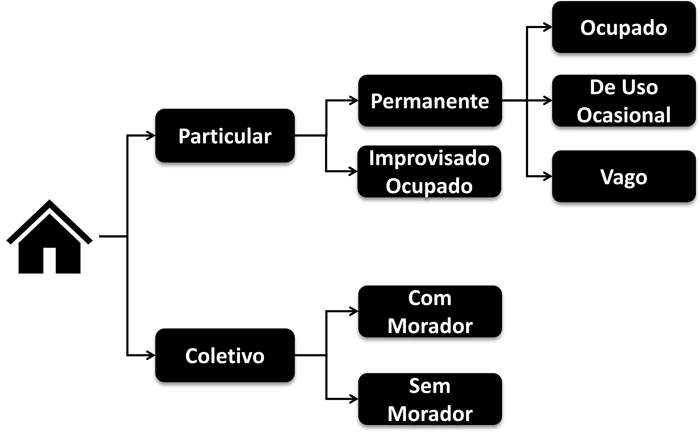
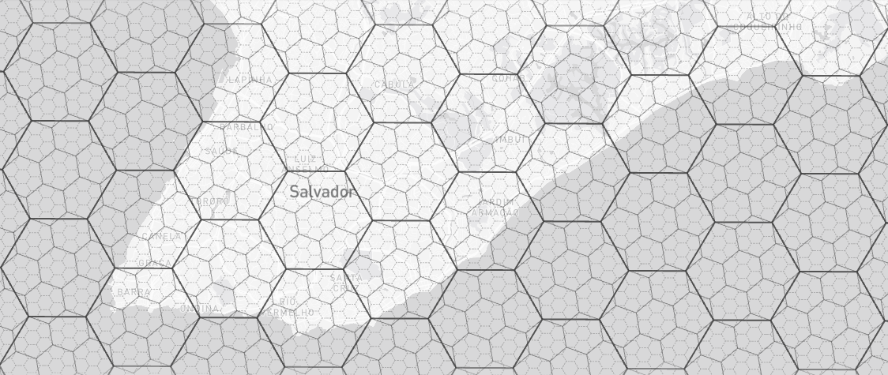
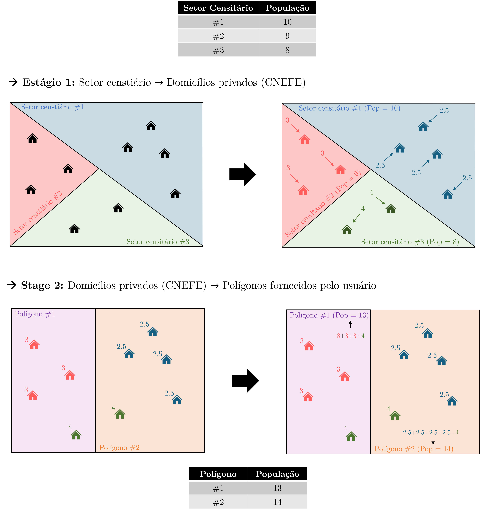

```{r}
#| label: setup
#| include: false
knitr::opts_chunk$set(cache = TRUE)
```

## Introdução

O produto **Agregados por Setores Censitários** é um dos resultados do Censo mais amplamente utilizados por pesquisadores, planejadores e gestores públicos. Trata-se de um conjunto de tabelas em que cada linha representa um setor censitário e cada coluna representa uma variável agregada, como o total de moradores, o número de domicílios, as condições de abastecimento de água e esgotamento sanitário e a composição etária da população.

A popularidade desse produto decorre do equilíbrio entre resolução espacial e quantidade de estatísticas disponível por unidade espacial. Enquanto os microdados da amostra permitem análises mais ricas em termos de variáveis (renda, educação, migração), as **áreas de ponderação** (unidade espacial dos microdados) são muito maiores que os setores censitários. Para se ter uma ideia, no Censo de 2010, o município de São Paulo possuía 5.082 setores censitários, mas apenas 107 áreas de ponderação, conforme ilustra a @fig-sp-comparacao. A grade estatística, por sua vez, oferece resolução ainda maior com as quadrículas urbanas de 200 x 200 m, mas contém somente totais de população e domicílio. 

```{r}
#| echo: false
#| message: false
#| cache: true

rds_sp_sc <- "data/cap07/sp_sc_2010.rds"
rds_sp_ap <- "data/cap07/sp_ap_2010.rds"

if (!file.exists(rds_sp_sc) || !file.exists(rds_sp_ap)) {
  dir.create("data/cap07", recursive = TRUE, showWarnings = FALSE)
  sp_sc <- geobr::read_census_tract(code_tract = 3550308, year = 2010, simplified = TRUE)
  sp_ap <- geobr::read_weighting_area(code_weighting = 3550308, year = 2010, simplified = TRUE)
  saveRDS(sp_sc, rds_sp_sc)
  saveRDS(sp_ap, rds_sp_ap)
} else {
  sp_sc <- readRDS(rds_sp_sc)
  sp_ap <- readRDS(rds_sp_ap)
}
```

```{r}
#| label: fig-sp-comparacao
#| fig-cap: "Setores censitários e áreas de ponderação do município de São Paulo (Censo 2010)."
#| fig-subcap:
#|   - "5.082 setores censitários"
#|   - "107 áreas de ponderação"
#| layout-ncol: 2
#| fig-width: 6
#| fig-height: 7
#| echo: false
#| cache: true
#| message: false
library(ggplot2)

ggplot(sp_sc) +
  geom_sf(fill = "steelblue", color = "gray70", linewidth = 0.05) +
  coord_sf(expand = FALSE) +
  theme_minimal() +
  theme(axis.text = element_blank(),
        axis.ticks = element_blank(),
        panel.grid = element_blank())

ggplot(sp_ap) +
  geom_sf(fill = "steelblue", color = "gray70", linewidth = 0.3) +
  coord_sf(expand = FALSE) +
  theme_minimal() +
  theme(axis.text = element_blank(),
        axis.ticks = element_blank(),
        panel.grid = element_blank())
```

O produto que conhecemos hoje tem uma origem mais modesta do que a dimensão atual sugere. A ideia de setor censitário, como a menor unidade espacial de trabalho do Censo, só veio surgir [pela primeira vez no Censo de 1950](https://www.ibge.gov.br/estatisticas/sociais/saude/9662-censo-demografico-2010.html?edicao=9754&t=conceitos-e-metodos). Antes do Censo 1991, esses arquivos eram concebidos como cadastros de apoio às operações internas do IBGE, com a finalidade de viabilizar a seleção de amostras em pesquisas domiciliares posteriores [@ibge_nota_sc2022]. Para isso, era suficiente registrar variáveis descritivas da divisão territorial e informações sobre o porte dos setores, como o total de domicílios e estimativas de variância que orientavam a determinação do tamanho das amostras.

No Censo 2000, o IBGE produziu a primeira edição dos agregados por setor censitário, reunindo 527 variáveis sobre características dos domicílios, dos responsáveis e das pessoas residentes, com cruzamentos exclusivamente por sexo. Uma segunda edição, gerada a partir dos microdados do universo, expandiu esse conjunto para mais de 3200 variáveis, organizadas em planilhas separadas por Unidade da Federação.

No Censo 2010, houve uma consolidação deste produto, com divulgação não só no nível dos setores, mas também em Grandes Regiões, Unidades da Federação, Municípios, Distritos, Subdistritos, Bairros e Regiões Metropolitanas [@ibge_metodologia2010]. Nesta edição, houve o acréscimo de variáveis relativas a rendimento, tipologia do setor censitário e características do entorno dos domicílios urbanos, totalizando cerca de 3000 variáveis.

No Censo 2022, os arquivos cobrem, pela primeira vez, dados sobre povos indígenas e quilombolas em nível de setor, além dos temas já consolidados de domicílios, demografia, alfabetização, cor ou raça, mortalidade e relações de parentesco, com mais de 3500 variáveis distribuídas em diversos arquivos temáticos [@ibge_nota_sc2022]. Não obstante, com a redução do questionário Básico (de 34, em 2010, para 26, em 2022), houve perda de variáveis importantes como o rendimento de todos os membros do domicílio.

Antes de partirmos para a exploração destes dados, vamos entender primeiramente alguns conceitos importantes que norteiam o levantamento e a organização destes dados, sobretudo aqueles referentes a **moradores** e aos tipos de **domicílio**.

## Conceitos importantes

Para usar corretamente os dados dos agregados, é essencial compreender como o IBGE conceitua moradores e classifica os domicílios. Muitas das variáveis disponíveis nos arquivos temáticos dizem respeito a categorias específicas dessa classificação (como domicílios particulares permanentes ocupados ou domicílios coletivos com morador) e seu significado só fica claro a partir desse sistema conceitual.

O ponto de partida é a definição de **morador(a)**. Para o Censo de 2022, é a pessoa que residia no domicílio na data de referência, ou seja, à meia-noite da transição do dia 31 de julho ao dia 1º de agosto de 2022. Mais especificamente, refere-se a alguém que tem aquele domicílio como local habitual de residência e se encontrava presente no mesmo na data de referência. Todavia, há pessoas que possuem um certo domicílio como local habitual de residência, mas estavam ausentes no período de referência. Nestes casos, esta pessoa ainda é considerada moradora daquele local, caso essa ausência seja inferior a 12 meses e tenha ocorrido por um dos seguintes motivos [@ibge_metodologia2010]: viagens (a passeio, serviço, negócio, estudos, etc.); internação em estabelecimento de ensino ou hospedagem em outro domicílio, pensionato, república de estudantes (visando facilitar a frequência durante o ano letivo); detenção, sem sentença definitiva declarada; internação temporária em hospital ou estabelecimento similar; ou embarque a serviço (militares, petroleiros, etc.).

Já o conceito de domicílio refere-se a todo local estruturalmente **separado** e **independente** que serve de habitação a uma ou mais pessoas. Os critérios de separação (limitado por paredes, muros ou cercas, com cobertura) e de independência (acesso direto, sem passar por local de moradia de outras pessoas) devem ser atendidos simultaneamente para que um espaço seja classificado como domicílio [@ibge_nota_sc2022].^[Nas áreas indígenas, este conceito é flexibilizado para abranger a diversidade de domicílios de grupos variados]

A @fig-domicilios ilustra a árvore de classificação dos domicílios adotada pelo IBGE.

{#fig-domicilios}

A divisão principal separa os domicílios em dois grandes grupos:

**Domicílios particulares** são aqueles em que o relacionamento entre os ocupantes é ditado por laços de parentesco, de dependência doméstica ou por normas de convivência. Dentro desse grupo, há duas subcategorias:

-   *Permanentes*: construídos com a finalidade exclusiva de servir como habitação. São classificados em três subtipos^[pode-se considerar ainda a presença de um quarto subtipo *Ocupado sem entrevista*, consistindo de domicílio que estava habitado na data de referência, mas os moradores estavam ausentes ou se recusaram a responder. Para esses casos, o IBGE aplica imputação estatística com base em domicílios semelhantes do mesmo setor]:
    -   *Ocupado*: estava habitado na data de referência e a entrevista foi realizada.
    -   *De uso ocasional*: usado para descanso de fins de semana, férias ou outro fim, não sendo a residência habitual de nenhum morador.
    -   *Vago*: sem morador na data de referência.
-   *Improvisados*: localizados em edificações sem finalidade habitacional (como comércios ou galpões), em espaços públicos (calçadas, praças, viadutos), estruturas móveis ou abrigos naturais, e que estavam ocupados por moradores na data de referência.

**Domicílios coletivos** são instituições ou estabelecimentos em que a relação entre as pessoas que neles se encontravam era restrita a normas de subordinação administrativa^[condomínios residenciais, prédios residenciais, cortiços e repúblicas de estudantes **não** são considerados domicílios coletivos]. Incluem quartéis, hospitais, orfanatos, asilos, presídios^[detento é considerado morador da penitenciária se houver alguma condenação, ou se a detenção da detenção tiver ultrapassado 12 meses], conventos e alojamentos. São classificados em coletivos com morador e coletivos sem morador.

Como estes termos são utilizados com grande frequência, é comum utilizarmos siglas para representá-los conforme a @tbl-domicilios_termos:


```{r, warning = F}
#| label: tbl-domicilios_termos
#| tbl-cap: "Siglas dos tipos de domicílios"
#| echo: false

tibble::tibble(
  Sigla = c(
    "DPPO","DPIO","DPO","DPPV","DPPUO","DCCM","DCSM"
  ),
  Descricao = c(
    "Domicílio Particular Permanente Ocupado",
    "Domicílio Particular Improvisado Ocupado",
    "Domicílio Particular Ocupado (DPPO + DPIO)",
    "Domicílio Particular Permanente Vago",
    "Domicílio Particular Permanente de Uso Ocasional",
    "Domicílio Coletivo Com Morador",
    "Domicílio Coletivo Sem Morador"
  )
) |>
  knitr::kable(
    col.names = c("Sigla", "Descrição"),
    align = c("c", "c"),
    format.args = list(big.mark = ".")
  )
```


## Conteúdo dos Agregados

É importante lembrar que os Agregados por Setores Censitários são produzidos a partir dos **resultados do universo**, ou seja, das informações coletadas pelo **Questionário Básico**. Esse questionário é aplicado em todas as unidades domiciliares *não* selecionadas para a amostra. Para os Censos de 2010 e 2022, estamos falando de aproximadamente 90% dos domicílios entrevistados.

O termo "agregados" indica que as informações não aparecem no nível do indivíduo ou do domicílio, como nos microdados, mas como estatísticas resumidas calculadas para todos os moradores e domicílios de cada setor. Com relação às variáveis de **contagem (totais)**, são disponibilizados valores relativos a variáveis individuais (a exemplo do total de pessoas do sexo feminino ou do número de domicílios do tipo apartamento) ou em cruzamentos de categorias (como o número de pessoas entre 15 e 29 anos que são do sexo feminino e o total de domicílios do tipo casa que possuem abastecimento de água da rede geral). Agregados de **média** e **variância** são menos frequentes, sendo especialmente calculados no caso de variáveis de renda/rendimento, seja do(a) responsável do domicílio ou de todas as pessoas do domicílio com 10 anos ou mais (esta última não coletada no Questionário Básico no Censo de 2022).

Essas informações estão organizadas em **arquivos temáticos**, pois o volume total de variáveis é muito grande para ser distribuído em uma única tabela. As cerca de 3500 variáveis do Censo 2022 são disponibilizadas nos seguintes arquivos:

```{r, warning = F}
#| label: tbl-arquivos-tematicos
#| tbl-cap: "Arquivos temáticos dos Agregados por Setores Censitários do Censo 2022. Fonte: @ibge_nota_sc2022."
#| echo: false

tibble::tibble(
  Arquivo = c(
    "Básico",
    "Domicílios (Parte 1)", "Domicílios (Parte 2)", "Domicílios (Parte 3)",
    "Pessoas (Alfabetização)", "Pessoas (Demografia)", "Pessoas (Parentesco)",
    "Mortalidade (Óbitos)", "Cor ou Raça",
    "Indígenas (Domicílios e pessoas)", "Quilombolas (Domicílios e Pessoas)",
    "Entorno (Domicílios, Pessoas e Faces)", "Renda do Responsável"
  ),
  Conteudo = c(
    "Identificação geográfica e totais estruturais (população, domicílios)",
    "Características dos domicílios",
    "Características dos domicílios (continuação)",
    "Características dos domicílios (continuação)",
    "Condição de alfabetização por sexo e idade",
    "Estrutura etária e sexo",
    "Relação com o responsável pelo domicílio",
    "Óbitos no domicílio",
    "Distribuição por cor ou raça",
    "Domicílios e pessoas em territórios indígenas",
    "Domicílios e pessoas em territórios quilombolas",
    "Características do entorno dos domicílios urbanos",
    "Rendimento do responsável pelo domicílio"
  ),
  Variaveis = c(7, 89, 406, 148, 362, 36, 182, 93, 95, 1029, 951, 105, 5)
) |>
  knitr::kable(
    col.names = c("Arquivo", "Conteúdo", "Nº de Variáveis"),
    align = c("c", "c", "c"),
    format.args = list(big.mark = ".")
  )
```

Uma limitação importante dos agregados por setor que todo usuário precisa conhecer é a aplicação de **regras de sigilo** para proteger a identidade dos informantes. Em setores com menos de cinco domicílios particulares permanentes, os valores da maioria das variáveis são substituídos por "x", indicando omissão (valor ausente). Para os demais setores, células com frequência igual a 1 ou 2 também são suprimidas, pelo risco de que combinações de variáveis com valores muito baixos permitam a identificação indireta de um informante.

Vale ainda mencionar que além dos arquivos no nível de setor censitário, o IBGE também disponibiliza agregações nos níveis de **Distritos**, **Subdistritos** e **Bairros**, facilitando consultas em recortes administrativos mais amplos. 

## Analisando os agregados com o `censobr`

Para obter os dados dos agregados e os microdados da amostra (no próximo capítulo), utilizamos o pacote `censobr` [@censobr], que oferece acesso direto a estes arquivos sem necessidade de baixar e descompactar os arquivos do site do IBGE manualmente. Para os agregados, utilizaremos a função `read_tracts()`, cujos argumentos principais são `year`, para escolher o ano do censo, e `dataset`, para especificar qual arquivo temático carregar. Para melhor compreensão, explore a ajuda da função `read_tracts()` e experimente as opções disponíveis para estes parâmetros. No exemplo abaixo, são baixadas as tabelas dos arquivos Básico e Domicílio (as 3 partes indicadas na @tbl-arquivos-tematicos) para o Censo de 2022:

```{r}
#| eval: false
library(censobr)

# Carregando o arquivo Básico do Censo 2022
sc2022 <- read_tracts(dataset = "Basico", year = 2022)

# Carregando o arquivo de Domicílios do Censo 2022
sc2022_dom <- read_tracts(dataset = "Domicilio", year = 2022)
```

Diversas funções do pacote, incluindo a `read_tracts()`, foram projetadas para lidar com o desafio do grande volume de dados produzido pelo Censo. Para os agregados de todos os setores censitários do país, por exemplo, estamos nos referindo a um arquivo de 468 mil linhas que pode conter milhares de variáveis. Baixar esse volume toda vez que o script é executado seria inviável. Por isso, por padrão, o argumento `cache = TRUE` faz com que os arquivos sejam armazenados localmente em formato *parquet*^[um formato de arquivo colunar que, ao contrário do CSV (que grava os dados linha a linha), organiza-os coluna a coluna, o que viabiliza compressão muito mais eficiente e leitura seletiva de apenas as variáveis necessárias] logo após o primeiro download. Nas execuções seguintes, os dados são lidos do disco, sem necessidade de acesso à rede.

Há ainda um segundo mecanismo que torna o fluxo eficiente. Em vez de retornar um `data.frame` convencional, a função retorna um objeto do tipo *Arrow table*. A diferença está em quando os dados são realmente carregados na memória. Com um `data.frame`, tudo é lido imediatamente em RAM. Já um arquivo Arrow funciona de forma *lazy* (em português, *preguiçosa*). Quando fazemos operações de manipulação, como `filter()`, `select()` ou `rename()`, nenhum dado é lido, já que o Arrow apenas registra essas operações como um plano de execução. Os dados só são efetivamente carregados quando `collect()` é chamado ao final. Isso significa que o Arrow pode, ao executar o plano, ler do arquivo apenas as colunas e linhas que sobrevivem aos filtros, ignorando o restante. Com 468 mil setores no Brasil, filtrar pelo município antes de `collect()` pode reduzir consideravelmente o que é carregado na RAM.

### Produzindo tabelas com base em diferentes arquivos de agregados {#sec-obtendo}

Com os conceitos estabelecidos, podemos partir para a prática. Nesta seção construímos um painel de mapas com indicadores de adequação habitacional para os setores censitários de **Recife (PE)**. O fluxo que seguiremos combina acesso aos dados do Censo (`censobr`), manipulação tabular (via `tidyverse`), operações espaciais (via `sf`), acesso à cartografia oficial (`geobr`) e visualização estática (`ggplot2`):

```{r}
#| message: false
#| warning: false

library(tidyverse)
library(sf)
library(geobr)
library(censobr)
library(mapview)
```

Vamos, preliminarmente, obter o código IBGE do município de Recife para que possamos selecionar somente os setores censitários deste município na nossa base:

```{r, eval = F}
recife_ibge <- geobr::lookup_muni(name_muni = "Recife")$code_muni
```

```{r, echo = F, message = F, warning = F}
recife_ibge <- 2611606
```

Como as variáveis são identificadas por códigos (como `V0001`, `domicilio01_V00001`), **consultar o dicionário de dados é sempre o primeiro passo** antes de trabalhar com os arquivos. O `censobr` dá acesso a esse dicionário pela função `data_dictionary()`. Para o Censo de 2022, isso fará com que um arquivo .xlsx seja aberto em seu computador, onde cada planilha (aba) representa um arquivo dos agregados:

```{r}
#| eval: false

# Dicionário de variáveis dos agregados (Censo 2022)
data_dictionary(year = 2022, dataset = "tracts")
```

::: callout-tip
Mantenha o dicionário aberto enquanto trabalha com os dados. Os códigos de variáveis são baseados no nome do arquivo temático e em um número sequencial, sem nenhuma relação semântica com o conteúdo. Sem o dicionário, não é possível saber o que cada coluna representa.
:::

Para o nosso exemplo, utilizaremos as seguintes variáveis:

```{r}
#| label: tbl-variaveis-selecionadas
#| tbl-cap: "Variáveis selecionadas para o exemplo."
#| echo: false

tibble::tibble(
  Arquivo  = c("Básico", "Domicílio", "Domicílio", "Domicílio", "Domicílio"),
  Codigo   = c("`V0001`", "`domicilio01_V00001`", "`domicilio02_V00111`",
               "`domicilio02_V00309`", "`domicilio02_V00310`"),
  Nome     = c("`tot`", "`dpp`", "`redger_a`", "`redger_e`", "`fossa_s`"),
  Descricao = c(
    "População total residente",
    "Domicílios particulares permanentes",
    "Dom. com abastecimento de água pela rede geral",
    "Dom. com esgotamento via rede geral",
    "Dom. com fossa séptica ligada à rede"
  )
) |>
  knitr::kable(
    col.names = c("Arquivo", "Código original", "Nome atribuído", "Descrição"),
    align     = c("c", "c", "c", "c")
  )
```

A partir dessas variáveis brutas, derivamos dois indicadores de inadequação. A definição de adequação segue o critério adotado pelo **Índice de Vulnerabilidade Social (IVS)** do Ipea [@ipea_ivs2015]. Utilizaremos dois indicadores do IVS Infraestrutura Urbana, um relacionado à abastecimento de água inadequado, quando o abastecimento de água não provém de rede geral, e outro relacionado à esgotamento sanitário inadequado, quando o esgotamento sanitário não é realizado por rede coletora ou fossa séptica:

-   **`perc_agua_inadeq`**: proporção de domicílios *sem* abastecimento de água pela rede geral (`1 - redger_a / dpp`)
-   **`perc_esg_inadeq`**: proporção de domicílios com esgotamento inadequado, ou seja, sem rede geral nem fossa séptica ligada (`1 - (redger_e + fossa_s) / dpp`)

```{r}
#| eval: false
library(censobr)

# Leitura dos arquivos Básico e do Domicílio dos agregados:
sc2022     <- read_tracts(dataset = "Basico",    year = 2022)
sc2022_dom <- read_tracts(dataset = "Domicilio", year = 2022)

# Produção da base de dados para análise
sc_recife_2022 <- sc2022 |>
  filter(code_muni == recife_ibge) |>     # Filtrando somente recife
  select(code_tract, code_muni, V0001) |> # Selecionando somente colunas de interesse
  rename(tot = V0001) |>                  # Renomeando a população total
  # Junção dos dois arquivos de agregados:
  left_join(
    sc2022_dom |>
      filter(code_muni == recife_ibge) |> # Filtrando somente recife
      select(code_tract, code_muni,       # Selecionando somente colunas de interesse
             domicilio01_V00001,
             domicilio02_V00111,
             domicilio02_V00309,
             domicilio02_V00310)
  ) |>
  # Atribuição de novos nomes às variáveis de interesse para análise:
  rename(
    dpp      = domicilio01_V00001,
    redger_a = domicilio02_V00111,
    redger_e = domicilio02_V00309,
    fossa_s  = domicilio02_V00310
  ) |>
  collect() |> # Observe que a base de dados é trazida para memória somente neste momento
  # Cálculo dos indicadores finais com base no IVS:
  mutate(
    perc_agua_inadeq = 100 * (1 - redger_a / dpp),
    perc_esg_inadeq  = 100 * (1 - (redger_e + fossa_s) / dpp)
  )
```

```{r}
#| echo: false
#| message: false
#| cache: true

rds_sc <- "data/cap07/sc_tot_2022.rds"

if (!file.exists(rds_sc)) {
  recife_ibge    <- geobr::lookup_muni(name_muni = "Recife")$code_muni
  sc2022         <- censobr::read_tracts(dataset = "Basico",    year = 2022)
  sc2022_dom     <- censobr::read_tracts(dataset = "Domicilio", year = 2022)

  sc_recife_2022 <- sc2022 |>
    filter(code_muni == recife_ibge) |>
    select(code_tract, code_muni, V0001) |>
    rename(tot = V0001) |>
    left_join(
      sc2022_dom |>
        filter(code_muni == recife_ibge) |>
        select(code_tract, code_muni,
               domicilio01_V00001,
               domicilio02_V00111,
               domicilio02_V00309,
               domicilio02_V00310)
    ) |>
    rename(
      dpp      = domicilio01_V00001,
      redger_a = domicilio02_V00111,
      redger_e = domicilio02_V00309,
      fossa_s  = domicilio02_V00310
    ) |>
    collect() |>
    mutate(
      perc_agua_inadeq = 100 * (1 - redger_a / dpp),
      perc_esg_inadeq  = 100 * (1 - (redger_e + fossa_s) / dpp)
    )

  rm(sc2022, sc2022_dom)
  dir.create("data/cap07", recursive = TRUE, showWarnings = FALSE)
  saveRDS(sc_recife_2022, rds_sc)
} else {
  sc_recife_2022 <- readRDS(rds_sc)
}
```

O resultado é um `data.frame` com os setores censitários de Recife. Podemos verificar o total de setores e as variáveis disponíveis:

```{r}
nrow(sc_recife_2022)
names(sc_recife_2022)
```

### Integrando a geometria com o `geobr`

Com os dados de Recife já em memória, o próximo passo é integrar os polígonos dos setores. Baixamos a malha com `read_census_tract()` e fazemos a junção com os indicadores pela coluna `code_tract`:

```{r}
#| eval: false

recife_sc_geo <- geobr::read_census_tract(
  code_tract = recife_ibge,
  simplified = FALSE
)

recife_sc_geo <- recife_sc_geo |>
  left_join(sc_recife_2022, by = "code_tract")
```

```{r}
#| echo: false
#| message: false
#| cache: true

rds_geo <- "data/cap07/recife_sc_geo.rds"

if (!file.exists(rds_geo)) {
  recife_sc_geo <- geobr::read_census_tract(
    code_tract = recife_ibge,
    simplified = FALSE
  ) |>
    left_join(sc_recife_2022, by = "code_tract")

  saveRDS(recife_sc_geo, rds_geo)
} else {
  recife_sc_geo <- readRDS(rds_geo)
}
```

### Visualizando os resultados em mapas

Com a camada espacial pronta, usamos o `ggplot2` para gerar mapas coropléticos que mostram a distribuição espacial dos indicadores por setor. Os quatro mapas a seguir mostram, respectivamente, a população total, o total de domicílios particulares permanentes, a proporção de domicílios sem acesso à rede de água e a proporção de domicílios com esgotamento inadequado.

::: {.callout-note}
## Escala de cor com transformação de raiz quadrada

O mapa da @fig-recife-tot utiliza uma escala de cor com transformação de raiz quadrada (`trans = "sqrt"`). O motivo é a presença de um setor com valor muito acima dos demais, o Complexo Prisional do Curado, com 5.799 indivíduos, que é quase o triplo do segundo setor mais populoso. Em uma escala linear, a paleta de azuis se concentraria quase toda entre zero e esse valor extremo, deixando o restante do município com tons muito claros e sem distinção visual. A transformação raiz quadrada comprime os valores altos e expande os baixos na escala de cor, sem precisar remover o setor ou tratar o valor como ausente. Esse recurso é especialmente útil quando poucos locais concentram valores muito acima da distribuição geral, como presídios, hospitais de grande porte ou terminais de carga em mapas de população.
:::

```{r}
#| label: fig-recife-tot
#| fig-cap: "População total residente por setor censitário, Recife (Censo 2022), com escala de cor com transformação de raiz quadrada para compensar o efeito do setor do Complexo Prisional do Curado (com 5.799 hab.)."
#| fig-height: 5
#| message: false
#| warning: false
ggplot(recife_sc_geo) +
  geom_sf(aes(fill = tot), color = NA) +
  scale_fill_distiller(palette = "Blues", direction = 1,
                       name = "Pop. total",
                       na.value = "gray90",
                       trans = "sqrt",
                       labels = scales::label_number(big.mark = ".")) +
  coord_sf(expand = FALSE) +
  theme_minimal() +
  theme(axis.text = element_blank(),
        axis.ticks = element_blank(),
        panel.grid = element_blank())
```

```{r}
#| label: fig-recife-dpp
#| fig-cap: "Total de domicílios particulares permanentes por setor censitário, Recife (Censo 2022)."
#| fig-height: 5
#| message: false
#| warning: false
ggplot(recife_sc_geo) +
  geom_sf(aes(fill = dpp), color = NA) +
  scale_fill_distiller(palette = "Purples", direction = 1,
                       name = "Dom. part.\npermanentes",
                       na.value = "gray90") +
  coord_sf(expand = FALSE) +
  theme_minimal() +
  theme(axis.text = element_blank(),
        axis.ticks = element_blank(),
        panel.grid = element_blank())
```

```{r}
#| label: fig-recife-agua
#| fig-cap: "Proporção de domicílios com abastecimento de água inadequado por setor censitário, Recife (Censo 2022)."
#| fig-height: 5
#| message: false
#| warning: false
ggplot(recife_sc_geo) +
  geom_sf(aes(fill = perc_agua_inadeq), color = NA) +
  scale_fill_distiller(palette = "Reds", direction = 1,
                       name = "% sem água\nda rede",
                       na.value = "gray90") +
  coord_sf(expand = FALSE) +
  theme_minimal() +
  theme(axis.text = element_blank(),
        axis.ticks = element_blank(),
        panel.grid = element_blank())
```

```{r}
#| label: fig-recife-esgoto
#| fig-cap: "Proporção de domicílios com esgotamento sanitário inadequado por setor censitário, Recife (Censo 2022)."
#| fig-height: 5
#| message: false
#| warning: false
ggplot(recife_sc_geo) +
  geom_sf(aes(fill = perc_esg_inadeq), color = NA) +
  scale_fill_distiller(palette = "YlOrRd", direction = 1,
                       name = "% esgoto\ninadequado",
                       na.value = "gray90") +
  coord_sf(expand = FALSE) +
  theme_minimal() +
  theme(axis.text = element_blank(),
        axis.ticks = element_blank(),
        panel.grid = element_blank())
```

Os mapas revelam padrões de desigualdade intraurbana típicos das grandes metrópoles brasileiras. Setores com maior proporção de domicílios sem acesso adequado a saneamento tendem a se concentrar em determinadas áreas do município, enquanto outros setores apresentam cobertura praticamente universal. Esse tipo de visualização é um ponto de partida valioso para diagnósticos de infraestrutura urbana.

## Produção de mapas personalizados das variáveis dos Agregados

Os setores censitários são a unidade espacial de coleta do IBGE, desenhados para facilitar o trabalho dos recenseadores. Isso significa que seus limites não necessariamente coincidem com as unidades de análise que os pesquisadores desejam utilizar. Em muitos contextos, é mais conveniente trabalhar com unidades padronizadas para propósitos analíticos específicos, a exemplo de distritos sanitários, subprefeituras, áreas de risco da defesa civil, distritos policiais ou zonas de tráfego.

Em outras aplicações, pode ser mais interessante recorrer ao uso de grades regulares como o [GeoHash](https://geohash.softeng.co/) ou a [grade hexagonal H3](https://h3geo.org/). Ambos têm em comum o fato de particionarem a superfície terrestre em células indexadas de forma hierárquica, permitindo representar localizações, agregar dados espaciais e realizar análises em diferentes níveis de resolução. No caso do GeoHash, essa indexação é feita a partir de uma subdivisão sucessiva do espaço em retângulos, codificados por cadeias alfanuméricas, nas quais o aumento do número de caracteres corresponde a um refinamento da resolução espacial.

A grade hexagonal H3 também divide a superfície terrestre em células hexagonais indexadas por cadeias alfanuméricas. Sua estrutura é organizada em 16 níveis hierárquicos de resolução, nos quais cada célula de um dado nível pode ser subdividida em sete células do nível seguinte, preservando, em geral, a forma hexagonal. As resoluções mais usadas em análises urbanas são a 8 (área média de ~0,74 km², lado de ~460 m) e a 9 (~0,10 km², lado de ~174 m). No exemplo da @fig-h3_ssa abaixo, é possível observar a sobreposição de grades hexagonais H3 para as resoluções 7, 8 e 9, por exemplo, tendo parte do município de Salvador como pano de fundo. Em termos práticos, a resolução 7 produz células mais agregadas, a 8 representa um nível intermediário e a 9 gera uma malha mais detalhada, com hexágonos progressivamente menores à medida que a resolução aumenta.

{#fig-h3_ssa}

Em relação às grades retangulares convencionais, grades hexagonais apresentam algumas vantagens topológicas relevantes [@brodsky_h3_2018]. Em primeiro lugar, os hexágonos têm apenas um tipo de vizinho (os que compartilham aresta), enquanto quadrados têm dois (aresta e vértice), o que exige conjuntos distintos de coeficientes em análises. Em decorrência desse aspecto, o centro de cada hexágono é equidistante dos seis vizinhos, ao contrário das grades quadradas, onde os vizinhos diagonais estão ~41% mais distantes que os laterais. Além disso, anéis concêntricos de hexágonos aproximam círculos com mais fidelidade do que anéis quadrados, tornando a análise de zonas de influência e proximidade mais natural.

No Brasil, um caso de uso de destaque das grades hexagonais é o **Projeto Acesso a Oportunidades** do IPEA [@pereira_aop_td2772], que disponibiliza dados censitários e de uso do solo em grade H3 de resolução 9 para diversas cidades brasileiras, integrando informações sobre distribuição espacial da população por idade, sexo, renda e raça, além da localização de empregos e serviços públicos.

Contudo, transferir dados de setores censitários para outras unidades espaciais não é uma tarefa trivial. A abordagem mais simples, que distribui os dados proporcionalmente à área de sobreposição entre os setores e as unidades-alvo, ignora que a população não está distribuída uniformemente pelo espaço. Uma quadra residencial densa e um parque urbano podem estar no mesmo setor e ter a mesma área, mas a população se concentra na quadra.

### Interpolação dasimétrica com o pacote `cnefetools`

Uma possível solução para esse problema é a **interpolação dasimétrica** (*dasymetric interpolation*), uma técnica que usa informações espaciais auxiliares para guiar a redistribuição espacial dos dados [@mennis2003dasymetric]. No contexto do Censo brasileiro, o Cadastro Nacional de Endereços para Fins Estatísticos (CNEFE, um dos produtos do Censo que abordaremos em um outro capítulo mais adiante) oferece um insumo interessante para este propósito: a localização de cada endereço visitado pelos recenseadores.

O pacote [`cnefetools`](https://github.com/pedreirajr/cnefetools) [@pedreira2026cnefetools] implementa esse fluxo de trabalho de forma integrada, combinando automaticamente os dados do CNEFE com os agregados por setor para produzir estimativas em outras configurações espaciais. As funções do pacote que executam esse processo são:

-   `tracts_to_h3()`: transfere variáveis dos setores para uma grade de hexágonos H3 na resolução desejada.
-   `tracts_to_polygon()`: transfere variáveis dos setores para qualquer tipo de malha de polígonos fornecida pelo usuário.

Em vez de assumir distribuição uniforme por área, a interpolação dasimétrica distribui os dados do setor pelos pontos de endereços que estão dentro dele e, em seguida, agrega os valores dos pontos que caem em cada unidade-alvo, conforme ilustrado na @fig-dasyinter.

{#fig-dasyinter}

O argumento `vars` de ambas as funções aceita os nomes de variáveis listados na @tbl-cnefetools-vars. Para cada variável, o pacote identifica automaticamente o tipo de alocação adequado (total ou média) com base em uma tabela de referência interna (`tracts_variables_ref`).

```{r}
#| label: tbl-cnefetools-vars
#| tbl-cap: "Variáveis disponíveis para interpolação dasimétrica no `cnefetools`. Fonte: `cnefetools::tracts_variables_ref`."
#| echo: false

tibble::tibble(
  Variavel  = c("`pop_ph`", "`pop_ch`", "`male`", "`female`",
                "`age_0_4`", "`age_5_9`", "`age_10_14`", "`age_15_19`",
                "`age_20_24`", "`age_25_29`", "`age_30_39`", "`age_40_49`",
                "`age_50_59`", "`age_60_69`", "`age_70m`",
                "`race_branca`", "`race_preta`", "`race_parda`",
                "`race_amarela`", "`race_indigena`",
                "`n_resp`", "`avg_inc_resp`"),
  Codigo    = c("V00005", "V00007", "V01007", "V01008",
                "V01031", "V01032", "V01033", "V01034",
                "V01035", "V01036", "V01037", "V01038",
                "V01039", "V01040", "V01041",
                "V01317", "V01318", "V01320", "V01319", "V01321",
                "V06001", "V06004"),
  Descricao = c(
    "Moradores em dom. particulares permanentes ocupados",
    "Moradores em dom. coletivos com morador",
    "Pessoas do sexo masculino",
    "Pessoas do sexo feminino",
    "Pessoas de 0 a 4 anos",
    "Pessoas de 5 a 9 anos",
    "Pessoas de 10 a 14 anos",
    "Pessoas de 15 a 19 anos",
    "Pessoas de 20 a 24 anos",
    "Pessoas de 25 a 29 anos",
    "Pessoas de 30 a 39 anos",
    "Pessoas de 40 a 49 anos",
    "Pessoas de 50 a 59 anos",
    "Pessoas de 60 a 69 anos",
    "Pessoas de 70 anos ou mais",
    "Pessoas de cor ou raça branca",
    "Pessoas de cor ou raça preta",
    "Pessoas de cor ou raça parda",
    "Pessoas de cor ou raça amarela",
    "Pessoas de cor ou raça indígena",
    "Responsáveis por dom. particulares permanentes ocupados",
    "Rendimento nominal médio mensal dos responsáveis com rendimentos"
  ),
  Tipo = c(rep("Total", 21), "Média")
) |>
  knitr::kable(
    col.names = c("Variável", "Código IBGE", "Descrição", "Tipo"),
    align     = c("c", "c", "c", "c")
  )
```

É importante salientar que o método funciona de maneira diferente para dois tipos de variáveis:

-   **Variáveis de totais** (como população total ou quantidade de indivíduos do sexo feminino): o total do setor é dividido igualmente entre os pontos de endereço elegíveis dentro dele. Cada unidade espacial alvo recebe, então, a soma dos valores dos pontos que caem dentro de seus limites. Corresponde exatamente ao que é demonstrado na @fig-dasyinter.
-   **Variáveis de média** (a única: rendimento nominal médio mensal dos responsáveis com rendimento): o valor médio do setor é atribuído a cada ponto. A unidade espacial alvo recebe a média dos valores dos pontos que estão dentro dela.

### Interpolando para hexágonos H3

Entendidos estes aspectos preliminares, podemos então produzir alguns resultados. O código a seguir gera uma grade de hexágonos H3 (resolução 8, definido no argumento `h3_resolution`) para Recife com a variável de população total em domicílios particulares permanentes (`pop_ph`) a partir da função `tracts_to_h3()`:

```{r}
#| eval: false

library(cnefetools)

hex_recife <- tracts_to_h3(
  code_muni     = 2611606,
  h3_resolution = 8,
  vars          = "pop_ph"
)
```

A população de domicílios privados do arquivo geográfico `hex_recife` produzido pela `tracts_to_h3()` anteriormente pode ser então visualizado de forma interativa com `mapview`, conforme o código abaixo:

```{r}
#| echo: false
#| message: false
#| cache: true

rds_h3 <- "data/cap07/hex_recife.rds"

if (!file.exists(rds_h3)) {
  library(cnefetools)
  hex_recife <- tracts_to_h3(
    code_muni     = 2611606,
    h3_resolution = 8,
    vars          = "pop_ph"
  )
  saveRDS(hex_recife, rds_h3)
} else {
  hex_recife <- readRDS(rds_h3)
}
```

```{r, warning = F}
#| cache: true
mapview(hex_recife,
        zcol        = "pop_ph",
        layer.name  = "Habitantes (estimativa)",
        col.regions = hcl.colors(100, palette = "YlOrRd") |> rev())
```

### Interpolando para malhas poligonais de qualquer tipo

Apesar de bastante úteis, nem sempre estamos interessados em produzir informações do Censo em grades regulares (hexagonais ou não). No contexto do planejamento de transportes, por exemplo, é muito comum trabalharmos com a representação espacial de **zonas de tráfego** para subdividir o território. Estas são as unidades espaciais básicas usadas nos modelos de demanda por transporte, onde zona é delimitada de modo que os deslocamentos entre origens e destinos diferentes possam ser representados como fluxos entre pares de zonas. 

Na prática, seus limites são definidos respeitando divisores naturais como vias expressas, linhas férreas e rios. Neste desenho, é importante também que o total de viagens internas (com origem e destino dentro de cada zona) não sejam maiores que um determinado limite. O [Manual de Estudos de Tráfego](https://www.gov.br/dnit/pt-br/assuntos/planejamento-e-pesquisa/ipr/coletanea-de-manuais/vigentes/723_manual_estudos_trafego.pdf) do Departamento Nacional de Infraestrutura de Transportes [@dnit2006trafego], por exemplo, preconiza que as zonas não tenham tráfego local superior a 15% do seu total de viagens. Tais recomendações podem implicar que as fronteira dos setores censitários não sejam úteis para estudos de transporte, o que torna necessária alguma forma de interpolação para alocar variáveis socioeconômicas às zonas.

Considerando este contexto, nosso objetivo será produzir dados censitários para zonas de tráfego a partir da função `tracts_to_polygon()`. Utilizaremos o município de São Paulo como estudo de caso, a partir das suas zonas de tráfego produzidas na Pesquisa Origem-Destino (OD) de 2017, realizada pelo Metrô de São Paulo. Esse arquivo geográfico será obtido a partir do pacote [`odbr`](https://github.com/hsvab/odbr) [@svab2023odbr], que traz também os microdados desta pesquisa. 

Como a pesquisa cobre toda a região metropolitana (39 municípios), filtraremos apenas as zonas do município de São Paulo-SP através do campo `NomeMunici`:

```{r}
#| eval: false

library(cnefetools)
library(odbr)

# Zonas de tráfego da Pesquisa OD 2017 — Região Metropolitana de SP
sp_zones <- read_map(
  city     = "Sao Paulo",
  year     = 2017,
  geometry = "zone"
)

# Filtrando apenas as zonas do município de São Paulo
sp_zones_muni <- sp_zones |>
  filter(NomeMunici == "São Paulo") |>
  sf::st_make_valid()
```

Utilizamos então essa malha poligonal `sp_zones_muni` como valor do argumento `polygon` da função `tracts_to_polygon()`, e escolhemos a população de domicílios privados (`pop_ph`) e a população com 70 anos ou mais (`age_70m`) para interpolar para as zonas de tráfego: 

```{r}
#| eval: false

# Transferindo população total e idosos dos setores para as zonas
sp_zones_census <- tracts_to_polygon(
  code_muni = 3550308,
  polygon   = sp_zones_muni,
  vars      = c("pop_ph", "age_70m")
)

```

Por fim, produzimos um mapa da variável relativa à população de 70 anos ou mais nas zonas de tráfego, originalmente advinda dos agregados:

```{r}
#| eval: false

# Proporção de população com 70 anos ou mais por zona
sp_zones_ratio <- sp_zones_census |>
  filter(pop_ph > 0) |>
  mutate(pct_70m = age_70m / pop_ph)

mapview(sp_zones_ratio, zcol = "pct_70m", layer.name = "Prop. pop. 70+")
```

```{r}
#| echo: false
#| message: false
#| cache: true

rds_taz <- "data/cap07/sp_zones_ratio.rds"

if (!file.exists(rds_taz)) {
  library(cnefetools)
  library(odbr)

  sp_zones <- read_map(
    city     = "Sao Paulo",
    year     = 2017,
    geometry = "zone"
  )

  sp_zones_muni <- sp_zones |>
    filter(NomeMunici == "São Paulo") |>
    sf::st_make_valid()

  sp_zones_census <- cnefetools::tracts_to_polygon(
    code_muni = 3550308,
    polygon   = sp_zones_muni,
    vars      = c("pop_ph", "age_70m")
  )

  sp_zones_ratio <- sp_zones_census |>
    filter(pop_ph > 0) |>
    mutate(pct_70m = age_70m / pop_ph)

  saveRDS(sp_zones_ratio, rds_taz)
} else {
  sp_zones_ratio <- readRDS(rds_taz)
}
```

```{r}
#| cache: true
mapview(sp_zones_ratio,
        zcol       = "pct_70m",
        layer.name = "Prop. pop. 70+")
```

### Ressalvas com o uso da interpolação do `cnefetools`

A interpolação dasimétrica implementada no `cnefetools` representa um avanço em relação à interpolação por área convencional, mas não elimina todos os problemas de inferência espacial. É importante ter em mente duas limitações relevantes antes de interpretar os resultados.

A primeira diz respeito à **falácia ecológica**. O método assume que todos os domicílios de um setor censitário são razoavelmente uniformes em relação à variável interpolada, pois cada ponto de endereço dentro do setor recebe a mesma fração do total ou o mesmo valor médio. Na prática, um setor pode conter domicílios de perfis socioeconômicos distintos, e a alocação uniforme ignora essa heterogeneidade interna. O resultado é que a variável estimada para a unidade-alvo reflete a média do setor de origem, não necessariamente a composição real dos endereços que caem dentro daquela unidade. Quanto menor e mais homogêneo for o setor censitário em relação à variável de interesse, menor será esse viés.

A segunda limitação refere-se às **unidades nas bordas municipais**. Quando uma zona de tráfego (ou hexágono) cruza o limite do município, ela recebe apenas os endereços do município informado em `code_muni`. Os endereços do município vizinho não são incluídos, pois o `cnefetools` opera sobre o CNEFE de um município de cada vez. Isso significa que as estatísticas calculadas para unidades na borda representam apenas a parcela que pertence ao `code_muni` informado. Em análises de regiões metropolitanas, onde os limites municipais cruzam frequentemente áreas contínuas de ocupação, essa limitação deve ser levada em consideração na interpretação dos resultados.

## Exercícios

1.  Utilizando o fluxo apresentado na @sec-obtendo, calcule para o município de **Fortaleza (CE)** a proporção de domicílios com coleta de lixo direta (consulte o dicionário para identificar a variável correspondente no arquivo Domicílio). Visualize o resultado em um mapa com `mapview`.

2.  Selecione duas variáveis de diferentes arquivos temáticos (por exemplo, uma de demografia e uma de domicílios) e construa um mapa coropléfico com `ggplot2` para um município de sua escolha. Inclua título, legenda e fonte nos atributos do mapa.

3.  Para o município de Salvador, compare os mapas de inadequação de água e de esgoto produzidos neste capítulo. Em quais regiões do município as duas inadequações ocorrem simultaneamente? Como você interpretaria esse padrão em termos de planejamento urbano?

4.  Pesquise a documentação do pacote `cnefetools` e identifique quais variáveis estão disponíveis para interpolação dasimétrica com `tracts_to_h3()`. Aplique a função para gerar uma grade H3 (resolução 7) para **Salvador (BA)** com pelo menos duas variáveis e discuta esses resultados.
